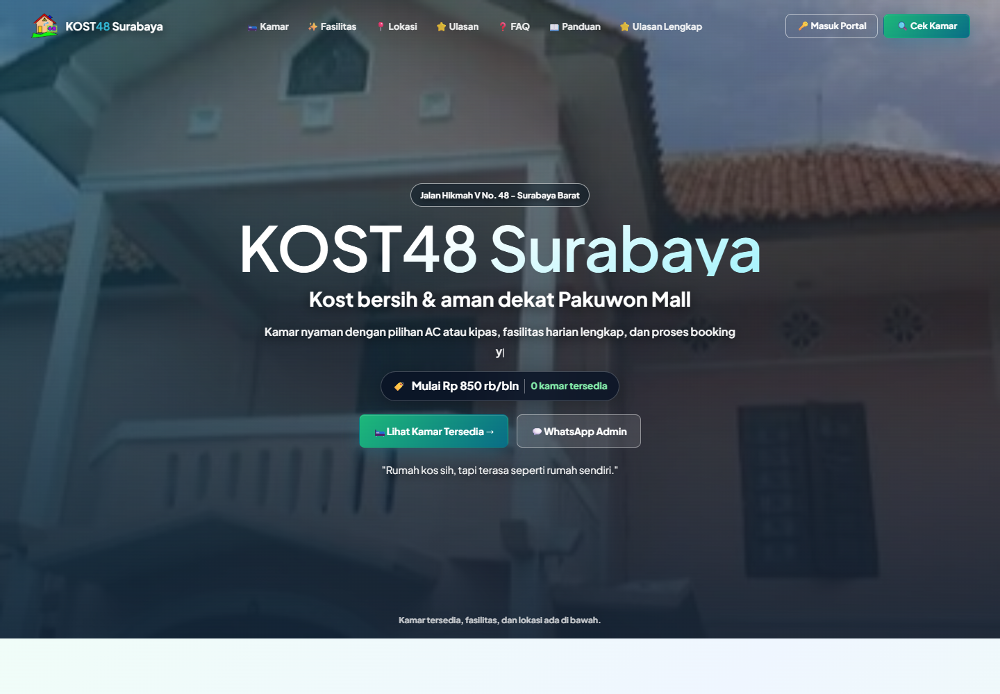
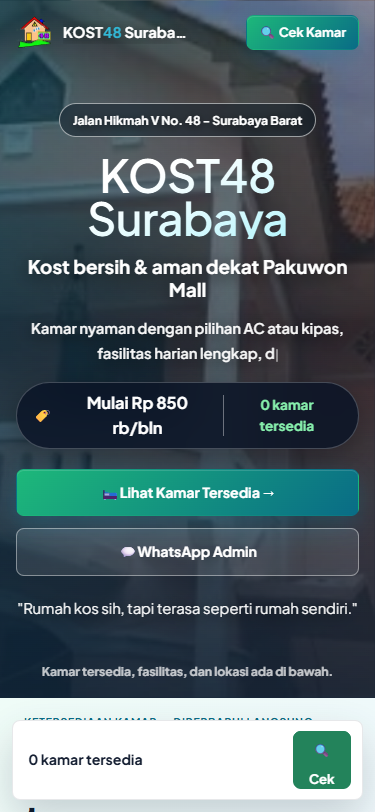
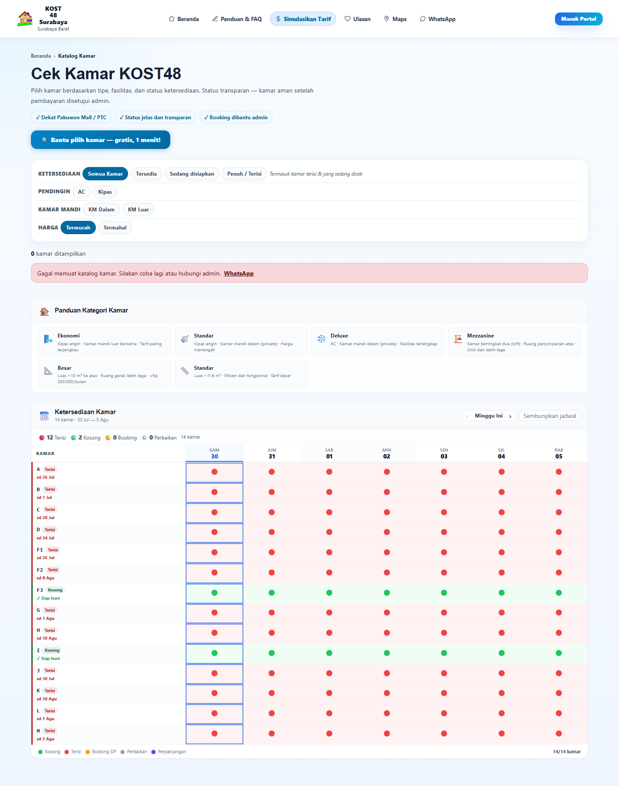
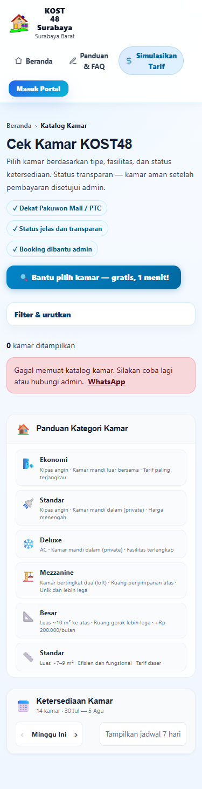

# M14 — Audit Mendalam UI/UX Lintas Portal

> **Rujukan arah aktif (6 Sep 2026):** [M02](M02_KEPUTUSAN_OWNER.md) untuk keputusan owner; [M12](M12_CHECKLIST_CHANGELOG.md#antrian-eksekusi-aktif) untuk satu checklist/urutan kerja; [M19](M19_EFISIENSI_HOSTING_512MB.md) untuk Fase EF. **EF diprioritaskan, satu proses API sebagai target, Fase MA ditunda.**
> Dokumen ini menyimpan spesifikasi domain dan bukti bertanggal. Status PASS/selesai pada audit lama hanya berlaku pada lingkup/waktu yang disebut, bukan bukti deployment atau runtime terbaru. Judul sumber pra-konsolidasi adalah riwayat; jangan membuat ulang file lama atau mengulang checklist selesai.

> **Status audit 30 Juli:** SELESAI · **Eksekusi:** backlog AO tetap terbuka; urutan terbaru mengikuti M12 (EF diprioritaskan)
> **Tanggal:** 30 Juli 2026 · **Target:** pra-go-live KOST48 V5
> **Sumber keputusan:** `M02_KEPUTUSAN_OWNER.md` tetap lebih tinggi daripada dokumen ini.
> **Antrean ringkas:** `M12_CHECKLIST_CHANGELOG.md` Fase AO.

Dokumen ini adalah sumber kerja bersama untuk audit dan perbaikan UI/UX berikutnya. Temuan lama yang dipindahkan dari CLAUDE.md ke lampiran historis dokumen ini tidak dianggap valid untuk runtime terbaru sebelum dibuktikan ulang.

---

## 1. Ringkasan Eksekutif

UI KOST48 sudah matang secara visual dan sebagian besar responsif, tetapi **UAT saat ini belum layak menjadi bukti kesiapan go-live**. Hambatan utama bukan kosmetik: database UAT tertinggal dua migration sehingga beberapa permukaan utama mengembalikan HTTP 500.

| Area | Hasil | Keputusan |
|---|---|---|
| Database UAT | 🔴 2 dari 23 migration belum diterapkan | Gate pertama sebelum audit ulang |
| Katalog publik | 🔴 Daftar kamar gagal, tetapi kalender tetap menunjukkan 14 kamar | State saling bertentangan |
| Notifikasi & pengumuman | 🔴 500 pada seluruh portal tenant | Disebabkan schema drift UAT |
| Tenant aktif | 🟡 Semua halaman merender, tetapi shell global selalu terkena 500 notifikasi/pengumuman | Audit visual sah; audit data belum bersih |
| Tenant tanpa stay aktif | 🟡 Empty state tersedia, tetapi onboarding global terlalu dominan | Perlu progressive disclosure |
| Loyalitas tenant | 🔴 Potensi ErrorBoundary karena conditional return di antara hooks | Perbaiki sebelum aktivasi fitur |
| Mobile | 🟡 Hanya `/profile` overflow global 7 px; beberapa kontrol/filter terlalu padat | Perbaikan terarah |
| Aksesibilitas | 🟡 Kontras serius di lima permukaan; label form tidak terasosiasi pada auth/profile | Target WCAG 2.1 AA |
| OWNER/ADMIN/STAFF | ⚪ Audit dinamis terblokir oleh drift kredensial UAT dan tidak adanya akun STAFF | Audit statis selesai; crawl nyata wajib diulang |

### Putusan release

**RED sampai AO-00 selesai.** Jangan menyimpulkan UI siap produksi dari screenshot atau build saja selama migration UAT belum sinkron dan crawl OWNER/ADMIN/STAFF belum dapat dijalankan.

---

## 2. Cakupan dan Bukti

### 2.1 Audit dinamis

Audit dijalankan pada aplikasi lokal yang benar-benar aktif dengan backend NestJS, frontend Vite, PostgreSQL UAT, Chrome, dan pemeriksaan Axe.

| Persona/state | Route | Viewport | Kombinasi |
|---|---:|---:|---:|
| Publik | 7 | desktop + mobile | 14 |
| Tenant tanpa stay aktif | 13 | desktop + mobile | 26 |
| Tenant dengan stay aktif | 13 | desktop + mobile | 26 |
| **Total** |  |  | **66** |

Viewport:

- Desktop: `1440 × 1000`.
- Mobile: `375 × 812`.

Route publik: `/`, `/rooms`, `/update-kamar`, `/panduan`, `/reviews`, `/login`, `/forgot-password`.

Route tenant: `/portal/stay`, `/portal/energy`, `/portal/bookings`, `/portal/invoices`, `/portal/tickets`, `/portal/loyalty`, `/portal/manual`, `/portal/checkout`, `/portal/renewal`, `/portal/wifi`, `/portal/announcements`, `/notifications`, `/profile`.

### 2.2 Audit statis

- 74 deklarasi route di `frontend/src/App.tsx` diperiksa.
- Pemetaan role dan menu di `frontend/src/config/navigation.ts` diperiksa.
- Guard STAFF untuk keuangan diverifikasi: invoice, finance, payment review, expense, WiFi sale, refund, dan reports ditolak.
- Komponen shell OWNER/ADMIN/STAFF/TENANT dan mobile bottom navigation diperiksa.
- Temuan dinamis ditelusuri ke file/simbol kode sebelum dimasukkan sebagai backlog.

### 2.3 Tingkat kepastian

| Label | Arti |
|---|---|
| `DYNAMIC` | Terlihat pada browser aktual dan dapat direproduksi |
| `PROD-DYNAMIC` | Terlihat read-only pada situs produksi dan dikonfirmasi dengan DOM/API produksi |
| `EXTERNAL-STATIC` | Masukan audit/screenshot pihak luar yang ditriage ke kode, tetapi belum dapat direproduksi pada sesi OWNER UAT |
| `CODE` | Dikonfirmasi langsung dari implementasi |
| `ENV` | Berasal dari keadaan UAT/deploy, bukan kesimpulan desain |
| `BLOCKED-UAT` | Belum dapat diuji dinamis karena akun/data/gate lingkungan |

### 2.4 Batas audit

- Browser terintegrasi tidak dapat dipakai karena kegagalan metadata sandbox; audit diteruskan dengan Chrome sistem dan dependency Playwright proyek.
- Error `ERR_NETWORK_ACCESS_DENIED` untuk resource eksternal dikeluarkan dari temuan produk.
- Posisi fixed bottom navigation pada screenshot full-page dapat muncul di tengah gambar; hal itu **bukan** bukti overlap. Kode sudah memberi `padding-bottom` 68 px.
- Tidak ada reset database, perubahan password, pembuatan akun, atau bypass autentikasi selama audit.
- Kredensial OWNER/ADMIN yang tercantum di docs tidak cocok dengan database UAT saat ini. Database juga tidak memiliki akun STAFF aktif. Karena itu audit dinamis ketiga role tersebut dinyatakan terbatas, bukan dipaksakan.

### 2.5 Benchmark eksternal: Baymard UX-Ray

Masukan owner berupa export Baymard UX-Ray untuk `kost48surabaya.com`, dipindai 30 Juli 2026. Export mentah tidak disalin ke repository karena berisi katalog riset berlisensi; dokumen ini hanya menyimpan ringkasan dan keputusan yang relevan.

Interpretasi wajib:

- UX-Ray menampilkan 317 guideline, tetapi hanya **5 guideline auto-rated**: 4 `Best-in-Class` dan 1 `Small Issue`; 2 lainnya `Not Applicable`.
- **310 guideline berstatus `Not Rated`**. Status itu bukan bukti lulus ataupun gagal.
- Cakupan penilaian otomatis sangat sempit: 5 guideline desktop dan hanya 1 guideline mobile.
- Industry belum dipilih, sehingga guideline cart, shipping, kartu kredit, gifting, dan pola e-commerce umum tidak otomatis cocok untuk bisnis kost.
- Benchmark ini melengkapi audit browser/Axe M14; tidak menggantikan pengujian API, state data, role, portal tenant, atau aksesibilitas.

| Sinyal Baymard | Kondisi kode KOST48 | Keputusan |
|---|---|---|
| Guided/thematic browsing — `Best-in-Class` | `GuestPreferenceWizard` menjadi bantuan opsional, bukan gerbang katalog | `PRESERVE` — jangan memaksa wizard sebelum pengguna dapat melihat kamar |
| Kategori pada navigasi utama — `Best-in-Class` | UX-Ray membaca tujuan publik KOST48 sebagai kategori; konteks KOST48 adalah katalog, panduan, ulasan, tarif, lokasi, dan WhatsApp, bukan taxonomy produk e-commerce | `PRESERVE` — pertahankan jalur utama, tetapi jangan menciptakan menu tipe kamar yang padat hanya demi mengikuti istilah e-commerce |
| Visibilitas menu akun — `Best-in-Class` | `Masuk Portal` terlihat pada topbar dan footer | `PRESERVE` — pertahankan CTA akun yang jelas pada desktop/mobile |
| Homepage tidak terasa seperti kumpulan iklan — `Best-in-Class` | CTA, panduan, kamar, ulasan, dan galeri memiliki hierarki konten | `PRESERVE` — konten bantuan tetap lebih dominan daripada promo dekoratif |
| Organisasi link footer — `Small Issue` | Footer mencampur anchor halaman, route publik, login, Maps, dan WhatsApp dalam daftar datar | Buka AO-15 P3 |

Guideline `Not Rated` yang tetap layak dijadikan **gate verifikasi**, bukan temuan baru:

- kejelasan harga dan total biaya awal pada card/detail/booking;
- status tersedia/terisi dan CTA yang sesuai status;
- filter aktif, jumlah hasil, persistensi filter, dan pemulihan posisi saat kembali dari detail;
- thumbnail serta kontrol galeri kamar;
- sorting ulasan dan ringkasan jumlah/rating;
- primary CTA booking yang konsisten serta input pengguna tetap tersimpan saat validasi gagal.

Fitur terkait sudah terlihat di kode (`PublicRoomsPage`, `PublicRoomDetailPage`, `ReviewsPublicPage`, `GuestPreferenceWizard`). Karena katalog UAT sedang 500, seluruh butir di atas diverifikasi ulang pada AO-14 setelah AO-00; jangan mengklaim lulus hanya dari inspeksi kode.

### 2.6 Page-level benchmark: katalog sebagai padanan Search Results Page

Masukan lanjutan owner memuat 20 guideline Baymard untuk Search Results Page: 5 telah assessed dan 15 belum dinilai. Nilai kelima assessment tidak ikut tercantum, sehingga dokumen ini **tidak** memberi label pass/fail. KOST48 juga tidak memiliki pencarian teks sitewide; padanan terdekat adalah katalog `/rooms` dengan filter dan sorting.

| Guideline assessed | Pemetaan KOST48 | Keputusan |
|---|---|---|
| Rating pada list item | Review KOST48 bersifat properti/pengelola, bukan rating per kamar | `N/A` — jangan menggandakan rating global pada setiap kamar seolah room-specific |
| Alternative search query | Tidak ada query teks; padanannya adalah saran melonggarkan/reset filter ketika hasil nol | AO-16 |
| Thumbnail list item | `RoomCardImage` sudah memuat foto, fallback, kontrol, dan indikator multi-foto | `CODE-PRESENT`, verifikasi mobile di AO-14 |
| Kejelasan harga | `RoomPriceTable` dan fallback `Hubungi admin untuk tarif` tersedia pada setiap card | `CODE-PRESENT`, verifikasi data/visual di AO-14 |
| Pemisahan visual informasi | `RoomCard` memisahkan status, kategori, spesifikasi, fasilitas, harga, dan CTA | `CODE-PRESENT`, verifikasi konsistensi di AO-14 |

Triage 15 guideline yang belum dinilai:

- **12 relevan/diadaptasi:** konsistensi atribut antar-card, informasi card mobile, jumlah hasil, dua guideline indikator/jumlah foto, sorting harga, filter khusus kamar, prioritas filter ketersediaan, pagination, relevansi filter, duplikasi filter, dan shortlist.
- **3 dikeluarkan:** combine product variations karena setiap kamar adalah unit inventaris unik; misspelling karena tidak ada input pencarian teks; featured promo mobile karena akan mengganggu scan katalog.
- **Adaptasi domain:** sitewide sorting/filter diterapkan pada katalog kamar; `Saving Items` diterjemahkan menjadi mempertahankan pilihan bandingkan maksimal tiga kamar dalam satu sesi, bukan membuat wishlist atau akun baru.

Inspeksi kode menemukan dua gap yang dapat ditindaklanjuti:

1. Empty state selalu menulis `Semua kamar sedang penuh` ketika `rooms.length === 0`, termasuk saat API sukses tetapi filter aktif menghasilkan nol kecocokan.
2. Filter dan posisi scroll sudah dipulihkan dari `sessionStorage`, tetapi `comparedRoomIds` hanya state lokal sehingga shortlist hilang setelah masuk detail lalu kembali.

### 2.7 Page-level benchmark: homepage produksi

Masukan owner berikutnya berisi 28 observasi visual untuk hero, katalog teaser, trust/value proposition, lokasi, galeri/brosur, FAQ, kontak, dan footer. Verifikasi read-only dilakukan pada `https://kost48surabaya.com/` tanggal 30 Juli 2026 pada viewport `1440 × 1000` dan `375 × 812`.

Bukti produksi:

- `GET /api/public/rooms/summary` → 200 dengan `bookable=0`, `occupied=13`, `total=13`; angka nol bukan error API.
- `GET /api/public/rooms?...` → 200 dan mengembalikan data kamar terisi.
- Hero memiliki tujuh blok anak langsung: lokasi, H1, headline, subcopy, badge harga/ketersediaan, CTA, dan tagline.
- CSS hero tidak memakai blur (`filter: blur(0px)`); kesan gelap berasal dari dua overlay gradient sampai opacity gelap `0.88`.
- Lima trust card tersusun empat kartu pada baris pertama dan satu kartu sendiri pada baris kedua.
- Cue galeri `Lihat` ada di DOM, tetapi opacity default `0`; pada perangkat sentuh cue tidak selalu terlihat.
- Tag FAQ memakai `text-transform: uppercase`.
- Empty-review section mengulang frasa `Belum ada ulasan` dua kali.
- Footer berisi satu navigation group dengan 11 link.





| Kelompok masukan | Putusan | Alasan/tujuan |
|---|---|---|
| Hero nol kamar, label/CTA negatif, warna hijau untuk nol | AO-17 P1 | Terkonfirmasi produksi; harus menangkap minat tanpa menyatakan kamar tersedia |
| Hero terlalu padat | AO-17 P1 | Tujuh blok pesan bersaing di atas fold |
| Foto hero “blur” | AO-17 parsial | Tidak ada CSS blur; audit opacity/crop overlay, bukan mengganti gambar secara spekulatif |
| Katalog teaser kosong, kategori kurang terlihat, CTA berjauhan | AO-17/AO-18 | Saat 13 kamar terisi dan 0 bookable, branch data sukses menghasilkan grid kosong karena hanya merender kamar bookable |
| Trust card angka 01–05 dan grid 4+1 | AO-18 P2 | Terkonfirmasi DOM/screenshot; perbaiki scanability dan keseimbangan |
| Security seal/verified badge | `REJECT AS WRITTEN` | Jangan membuat seal palsu; boleh menyebut fakta CCTV area bersama dari M02 secara privacy-safe |
| Kontras aksen lemah | Merge AO-08 | Wajib diukur, bukan dinilai dari selera warna saja |
| Empty review diberi label “exclusive/new” | `REJECT AS WRITTEN` | Menyesatkan; ringkas empty state tetapi tetap jujur bahwa belum ada ulasan |
| CTA lokasi/FAQ/contact dan hierarki alamat | AO-18 P2 | Optimasi scannability serta keseimbangan CTA |
| Google Maps info-window overload | `OUT-OF-CONTROL` | Konten iframe dikendalikan Google; KOST48 hanya menjamin fallback link |
| Kualitas foto/brosur dan cue thumbnail | AO-19 P2 | Perlu audit aset asli; cue hover-only tidak memadai untuk touch |
| CTA dekat fold edge | `NEEDS-VISUAL-VERIFY` | Full-page screenshot tidak membuktikan fold; cek viewport nyata pada AO-14 |
| Klaim respons cepat/24 jam | `REJECT WITHOUT OWNER SLA` | Jangan menjanjikan waktu respons yang belum diputuskan owner |
| Footer grouping dan Maps/WhatsApp prominence | Merge AO-15 | Sudah menjadi task struktur footer; tambah ikon/label utility |

### 2.8 Page-level review: dashboard Owner desktop

Masukan owner berupa export statis UX Audit untuk `/owner-dashboard` tanggal 30 Juli 2026. Skor otomatis dari layanan luar tidak dipakai sebagai metrik release karena metodologinya bukan gate KOST48; dokumen ini hanya menyimpan triage yang dapat diverifikasi. Audit dinamis OWNER masih `BLOCKED-UAT`, sehingga hover, focus, keyboard, ukuran target nyata, serta kontras terhitung tetap harus diuji pada AO-14.

Bukti kode:

- `OwnerDashboardPage.tsx` merender alert kondisi bulan langsung sebelum KPI, namun surface-nya masih putih dengan `border-left` dan tanpa CTA.
- Toolbar lokal mencampur tahun, bulan, toggle Ringkas/Lengkap, refresh, dan timestamp; control period saat ini memiliki `min-height: 34px`, belum keluarga desktop 40–44 px.
- `owner-signal-item` sudah merupakan `<button>` dengan navigasi dan hover/focus, tetapi hanya memuat judul, helper, dan chevron; payload aggregate belum memiliki owner, due date, atau risk object untuk ditampilkan secara jujur.
- KPI memakai accent top border dan panel/status memakai left border; radius aktif bercampur 6/8/9/12 px. Ini bukti inkonsistensi pattern, bukan alasan mengubah semua komponen global sekaligus.
- Status grade dan signal sudah punya label teks; dot hanya `aria-hidden`. Jadi temuan “makna hanya dari warna” bersifat parsial, bukan defect color-only yang sudah terbukti.
- Sidebar desktop sudah dapat diciutkan dari 260 px menjadi 60 px melalui `AppLayout`; rekomendasi membuat sidebar collapsible dinyatakan sudah ada. Kepadatan defaultnya tetap perlu verifikasi visual OWNER.
- Dashboard OWNER mempunyai akses sah ke `/settings?tab=ai`; empty state AI dapat diberi CTA konfigurasi langsung, bukan instruksi mati atau CTA “Ajukan ke Admin”.

| Kelompok masukan | Putusan | Alasan/tujuan |
|---|---|---|
| Alert `Bulan ini perlu perhatian lebih` tidak dominan/beraksi | AO-20 P1 | Terkonfirmasi `CODE`; perlu alert component dan CTA yang mengarah ke prioritas nyata |
| Toolbar padat dan tinggi control kecil | AO-20 P1 | Terkonfirmasi `CODE`; pisahkan scope data, mode density, dan status sistem |
| KPI nol mendapat bobot sama dengan data bermakna | AO-20 P1 | Bedakan nilai nol yang valid, belum ada data, stale, dan gagal muat tanpa menyembunyikan fakta |
| Baris `Akuntansi belum siap` kurang action-oriented | AO-20 P1, parsial | Seluruh baris sudah clickable; tambahkan intent CTA. Owner/due/risk hanya bila kontrak API menyediakannya |
| Teks mute diduga gagal AA | Merge AO-08 | `#64748b` tidak boleh disimpulkan gagal dari screenshot; ukur tiap foreground/surface dengan Axe/manual contrast |
| Status hanya dari warna | `PARTIAL / VERIFY` | Label teks sudah ada; pertahankan teks/ikon dan uji keyboard, jangan menambah chip dekoratif tanpa makna |
| Nama Kokpit Owner/Dashboard Owner berulang | AO-21 P2 | Perjelas pemisahan label workspace, breadcrumb, dan satu judul halaman agar tidak berlapis tanpa fungsi |
| Card, toggle, accent, dan helper tidak konsisten | AO-21 P2 | Inventaris desktop Owner diperlukan sebelum normalisasi token lokal |
| Sidebar terlalu lebar/tidak bisa diciutkan | `ALREADY IMPLEMENTED` | Collapse 260 → 60 px telah ada; hanya evaluasi kepadatan dan discoverability pada UAT OWNER |
| AI setup berupa dead end | AO-20 P1 | CTA langsung ke tab AI tersedia untuk OWNER; jelaskan manfaat singkat dan state konfigurasi |

**Handoff Figma/implementasi (bukan file Figma):** gunakan inventory `page-header`, `data-toolbar`, `alert/warning`, `kpi/metric`, `task-row/alert`, `ai/setup`, dan `nav-item/selected`. Usulan token lokal: card radius `12px`, pill `20–24px`, control sekunder `40px`, CTA primer `44px`, serta variant bernama `card/info`, `card/warning`, `card/metric`, `row/selected`, `row/alert`. Variasi `loading`, `error`, `empty`, `zero-valid`, dan `not-configured` harus menjadi state eksplisit, bukan turunan visual dari card berisi data.

### 2.9 Page-level review: dashboard Area Admin desktop

Masukan owner berupa export statis UX Audit untuk dashboard Area Admin tanggal 30 Juli 2026. Sama seperti review Owner, skor otomatis eksternal tidak dipakai sebagai metrik release. Kode menunjukkan dashboard Admin telah memiliki queue, direct action, icon status, dan sidebar collapse; masalah yang sah adalah urutan visual dan konsistensi action—notifikasi bukan ketiadaan fitur tersebut.

Bukti kode:

- Susunan overview saat ini adalah command header → `AssistantInsightLine` → warning kamar tersembunyi → `AdminHealthBar`/IoT → `Metrik Cepat` → AutoOps → `ActionQueueTable`. Queue lima item sudah ada, tetapi berada setelah visual KPI.
- `ActionQueueTable` sudah mengurutkan prioritas dan memuat subject, masalah, waktu masuk, deadline, status waktu, serta CTA. Payload saat ini tidak menjamin lokasi/assignee untuk setiap item, sehingga metadata itu tidak boleh direka.
- Warning kamar tersembunyi dan AutoOps memakai tombol `btn-sm btn-outline-warning`; `AssistantInsightLine` mendukung action, tetapi pemanggilan dashboard saat ini tidak memberikannya CTA.
- `AdminHealthBar` sudah memakai ikon Lucide + label teks untuk chip; `AssistantInsightLine` masih memakai dot `aria-hidden` tanpa label severity yang persisten. Jadi temuan color-only hanya berlaku parsial pada pattern tertentu.
- Header utilitas dan sidebar berada di `AppLayout` lintas role. Sidebar desktop telah memiliki collapse 260 → 60 px serta active indicator kiri; baris khusus Admin minimum 42 px. Pengubahan shell harus dikoordinasikan dengan AO-21, bukan dilakukan sebagai refactor Admin terpisah.

| Kelompok masukan | Putusan | Alasan/tujuan |
|---|---|---|
| Exception kritis/warning/KPI berebut bobot | AO-22 P1 | Terkonfirmasi urutan stack dan variasi surface; gunakan hierarchy berdasarkan severity/data nyata |
| `Cek kamar` dan `Detail kondisi` lemah | AO-22 P1 | CTA ada tetapi outline/text kecil; perkuat hanya saat ada remediasi jelas |
| Queue tidak tersedia di viewport awal | AO-22 P1, koreksi | Queue sudah ada; pindahkan/kompres lima prioritas ke atas metrik, jangan membuat queue duplikat |
| Kontras label/button diduga gagal AA | Merge AO-08 | Perlu pengukuran per surface; screenshot/score otomatis bukan rasio kontras |
| Status terlalu bergantung pada warna | `PARTIAL / AO-22` | Health chip sudah icon + teks; tambahkan label/ikon severity pada banner yang masih hanya dot warna |
| Header utility action tidak konsisten | AO-23 P2 | Shared AppLayout; perlu kontrak utility zone dan regresi lintas role |
| Sidebar terlalu card-like/padat | AO-23 P2, `EXISTING COLLAPSE` | Collapse/active indicator telah ada; nilai density/nav row dengan UAT, jangan menduplikasi fitur |
| KPI tidak punya direct action | `PARTIAL` | Snippet/queue sudah membawa route/CTA; samakan pattern action dan pilih KPI yang layak tampil di atas fold |

**Handoff Figma/implementasi (bukan file Figma):** inventory Admin: `nav-item/default-hover-active-collapsed`, `utility-header`, `status-badge/info-success-warning-critical`, `alert-banner/warning-critical`, `kpi/value-trend-status-action`, dan `queue-row`. Gunakan grid 8 px, gutter desktop 24 px, padding card 16 px, card radius 12 px, serta pill `999px` hanya untuk chip yang benar-benar ringkas. Variant `link`, `button/secondary`, dan `button/primary` harus menggantikan action outlined/text ad hoc. Semua token teks diuji pada white, blue-tint, dan warning surface.

---

## 3. Metode Penilaian

Audit memakai gabungan:

1. Heuristik Nielsen: visibility, match with real world, control, consistency, error prevention, recognition, efficiency, minimalism, recovery, help.
2. WCAG 2.1 A/AA melalui Axe dan pemeriksaan manual label, landmark, heading, fokus, serta target sentuh.
3. Responsive review pada desktop dan mobile.
4. State review: normal, loading, empty, error, data aktif, dan data tanpa stay aktif.
5. Business-fit terhadap keputusan owner di M02.
6. Role-fit terhadap permission backend/frontend dan larangan STAFF mengakses keuangan.

Severity:

| Level | Makna |
|---|---|
| P0 | Menghalangi UAT/go-live atau membuat permukaan inti tidak dapat dipercaya |
| P1 | Alur penting gagal, crash, atau membingungkan keputusan pengguna |
| P2 | Usability/a11y bermakna tetapi ada jalan lanjut |
| P3 | Polish dengan dampak rendah |

---

## 4. Temuan Terverifikasi

### AO-00 — P0 — Database UAT tertinggal dua migration

**Bukti:** `ENV`, `DYNAMIC`.

`npx prisma migrate status` menemukan 23 migration dan dua belum diterapkan:

1. `20260723000000_announcement_notification_delivery`
2. `20260724090000_public_room_availability`

Dampak aktual:

- `GET /api/me/notifications` → 500.
- `GET /api/announcements/active` → 500.
- `GET /api/public/rooms?...` → 500.
- Query notifikasi gagal karena kolom `AppNotification.category` belum ada di database.
- Semua 26 kombinasi halaman tenant aktif terkena 500 dari shell global, walau konten utama halaman masih dapat merender.

**Bukan solusi:** menambahkan optional chaining atau menyembunyikan error frontend.

**Solusi:** terapkan migration yang sudah ada melalui prosedur UAT/deploy resmi. Tidak membuat migration baru dan tidak memakai `db push`.

**Acceptance criteria:**

- `npx prisma migrate status` menyatakan database up to date.
- Tiga endpoint di atas tidak menghasilkan 5xx.
- Notifikasi dan pengumuman menampilkan data atau empty state sah.
- Katalog dan kalender menggunakan schema yang sama.

**Owner:** DEVOPS/OWNER. AI tidak boleh menjalankan migration tanpa otorisasi eksplisit.

---

### AO-01 — P1 — Katalog publik menampilkan dua kebenaran yang bertentangan

**Bukti:** `DYNAMIC`, desktop dan mobile.

Saat endpoint daftar kamar 500:

- halaman menulis `0 kamar ditampilkan`;
- alert menulis `Gagal memuat katalog kamar`;
- pada halaman yang sama kalender ketersediaan tetap menunjukkan `14 kamar`, termasuk kamar kosong dan terisi.

Ini lebih buruk daripada satu error tunggal karena calon tenant tidak tahu bagian mana yang benar.





**File utama:**

- `frontend/src/pages/rooms/PublicRoomsPage.tsx`
- komponen kalender/availability yang dipakai halaman tersebut
- `frontend/src/styles/11-public-pages.css`

**Acceptance criteria:**

- Bila katalog gagal tetapi kalender berhasil, tampilkan banner `Sebagian data tersedia` dan jangan menyatakan `0 kamar` sebagai fakta.
- Bila kedua sumber wajib konsisten, sembunyikan keduanya dalam satu error state dengan tombol coba lagi.
- Empty state hanya digunakan ketika request sukses dan `items.length === 0`.
- Desktop dan mobile memberi pesan yang sama.

---

### AO-02 — P1 — `MyLoyaltyPage` melanggar aturan urutan hooks

**Bukti:** `DYNAMIC`, `CODE`.

`frontend/src/pages/portal/MyLoyaltyPage.tsx` melakukan conditional `<Navigate>` setelah `configQuery`, tetapi sebelum hooks query/mutation lain. Jika config berubah dari loading menjadi loyalty-disabled, jumlah hooks antar-render berubah dan React dapat masuk ErrorBoundary.

Gejala tercatat sekali pada tenant tanpa stay aktif: halaman loyalitas berubah menjadi `Halaman belum dapat dimuat`. Pada run tenant aktif, config sudah ter-cache sehingga route langsung redirect; sifatnya intermiten.

**Root cause anchor:** `MyLoyaltyPage.tsx` sekitar conditional return `tenantLoyaltyEnabled` sebelum `loyaltyQuery`, `rewardsQuery`, dan hooks lainnya.

**Acceptance criteria:**

- Semua hooks selalu dipanggil dalam urutan yang sama.
- Query loyalty memakai `enabled` ketika fitur nonaktif, atau guard dipindah ke komponen wrapper/route.
- First visit, refresh, dan navigasi berulang saat loyalty disabled selalu redirect tanpa console React error.
- Tambahkan unit test untuk config loading → disabled dan loading → enabled.

---

### AO-03 — P1 — Kredensial dan data UAT tidak mendukung audit lintas role

**Bukti:** `ENV`, `BLOCKED-UAT`.

- Akun OWNER dan ADMIN di database UAT menggunakan identitas berbeda dari akun dev pada M01/M11/M08.
- Password dokumentasi tidak cocok dengan akun UAT tersebut.
- Tidak ada akun STAFF aktif di database UAT.
- Existing `admin-owner-crawl.spec.ts` gagal pada tahap login, sebelum crawl route.

Ini bukan alasan untuk mengubah password database secara diam-diam. Yang dibutuhkan adalah fixture UAT terkontrol atau kredensial audit yang diberikan owner.

**Acceptance criteria:**

- Ada lima akun audit eksplisit di lingkungan UAT non-produksi: OWNER, ADMIN, STAFF, TENANT dengan stay aktif, dan TENANT tanpa stay aktif.
- Password disimpan di env lokal/secret manager, bukan hard-code docs atau test.
- Crawl OWNER, ADMIN, dan STAFF dapat berjalan tanpa reset data produksi/UAT utama.
- M11 dan M08 membedakan `seed-dev` dari kredensial UAT aktual.

---

### AO-04 — P1 — Navigasi tenant mobile berlapis dan memakan area konten

**Bukti:** `DYNAMIC`, `CODE`.

Tenant occupied menampilkan:

- topbar akun;
- tujuh tab/chip menu utama;
- bottom navigation berisi tiga menu utama + `Lainnya`.

Pada lebar 375 px, pengguna melihat dua sistem navigasi yang mewakili tujuan sama. Halaman seperti energi, invoice, tiket, WiFi, notifikasi, dan profil baru mulai setelah area chrome yang besar.

Tenant tanpa stay aktif juga menerima `GettingStartedGuide` global pada hampir semua route, sehingga instruksi tiga langkah mengalahkan tujuan halaman yang sedang dibuka.

**File utama:**

- `frontend/src/components/tenant/TenantWorkspaceTabs.tsx`
- `frontend/src/components/tenant/GettingStartedGuide.tsx`
- `frontend/src/components/layout/MobileBottomNav.tsx`
- `frontend/src/config/navigation.ts`
- `frontend/src/styles/10-misc.css`

**Acceptance criteria:**

- Mobile memakai satu navigasi primer. Rekomendasi: bottom nav tetap primer; top tabs menjadi horizontal compact/`Lainnya`, atau disembunyikan pada ≤768 px.
- `GettingStartedGuide` lengkap hanya tampil pada `/portal/stay` atau `/portal/bookings`; route lain memakai banner ringkas yang dapat ditutup.
- Desktop tetap menyediakan tujuh tujuan tanpa kehilangan fitur.
- Active state, back behavior, dan deep link tetap benar.

---

### AO-05 — P1 — Status kontrak tenant menampilkan pesan semantik yang bertentangan

**Bukti:** `DYNAMIC`.

Pada tenant aktif yang masa sewanya sudah lewat empat hari, dashboard sekaligus menampilkan:

- `Lewat dari jadwal` / `100% terlewati`;
- periode berakhir 26 Juli 2026;
- badge `Masa Sewa Aktif`.

Secara data status dapat tetap `ACTIVE`, tetapi copy tenant tidak menjelaskan konsekuensinya: apakah sedang overstay, masa tenggang, wajib perpanjang, atau harus ajukan keluar.

**File utama:** `frontend/src/pages/portal/MyStayPage.tsx` dan helper label/progress stay.

**Acceptance criteria:**

- Gunakan label komposit seperti `Aktif — melewati jadwal` atau state bisnis khusus yang sudah disetujui backend.
- CTA berikutnya eksplisit: perpanjang, ajukan keluar, atau hubungi admin.
- Jangan menampilkan `aktif` sebagai sinyal hijau tunggal ketika tanggal sudah lewat.
- Test boundary: H-1, H, H+1, dan overstay beberapa hari.

---

### AO-06 — P1 — Label form auth/profile tidak terasosiasi secara programmatik

**Bukti:** `DYNAMIC`, `CODE`.

Scanner DOM menemukan:

- `/login`: 2 control tanpa hubungan label programmatik;
- `/forgot-password`: 1 control;
- `/profile`: 4 control pada kedua viewport.

Label terlihat secara visual, tetapi `Form.Group` tidak memakai `controlId`, `Form.Label` tidak memakai `htmlFor`, dan input/`PasswordInput` tidak menerima id yang cocok.

**File utama:**

- `frontend/src/pages/auth/LoginPage.tsx`
- `frontend/src/pages/auth/ForgotPasswordPage.tsx`
- `frontend/src/pages/profile/ProfilePage.tsx`
- `frontend/src/components/common/PasswordInput.tsx`

**Acceptance criteria:**

- Semua input/select/textarea memiliki accessible name yang berasal dari label terkait.
- Error inline terhubung dengan `aria-describedby`; invalid state memakai `aria-invalid`.
- Password visibility button memiliki nama yang berubah sesuai state.
- Axe tidak melaporkan pelanggaran form-label.

---

### AO-07 — P2 — Profile mobile overflow 7 px dan terlalu panjang

**Bukti:** `DYNAMIC`.

`/profile` adalah satu-satunya route dari 66 kombinasi yang memiliki overflow halaman global: `scrollWidth 382` pada viewport `375`.

Halaman juga memuat dalam satu aliran:

- informasi akun;
- ganti password;
- upload KTP;
- OCR KTP;
- tujuh field data penghuni;
- empat field tambahan opsional.

**File utama:** `frontend/src/pages/profile/ProfilePage.tsx` dan style profile/mobile terkait.

**Acceptance criteria:**

- `documentElement.scrollWidth <= innerWidth` pada 320, 360, 375, 390, dan 414 px.
- Pecah menjadi section/accordion: Akun, Keamanan, KTP, Data Wajib, Data Opsional.
- Ringkasan kelengkapan dan aksi utama selalu terlihat sebelum detail.
- Fokus dan error otomatis membuka section yang relevan.

---

### AO-08 — P2 — Kontras serius masih muncul pada lima permukaan

**Bukti:** `DYNAMIC` melalui Axe.

Observasi serious `color-contrast` muncul pada:

- katalog `/rooms`;
- wizard `/update-kamar`;
- `/notifications`;
- `/profile`;
- ErrorBoundary loyalitas pada run tenant tanpa stay aktif.

Run aktif mengulang temuan notifications/profile pada desktop dan mobile. Jangan menghitung observasi berulang sebagai issue baru.

**Acceptance criteria:**

- Axe serious/critical = 0 pada route di atas.
- Teks normal minimal 4.5:1; teks besar minimal 3:1.
- State disabled tetap terbaca tanpa tampak seperti aksi aktif.
- Verifikasi light theme desktop/mobile.

---

### AO-09 — P2 — Landmark dan heading belum konsisten

**Bukti:** `DYNAMIC`, `CODE`.

Public pages tanpa elemen `<main>` pada audit:

- `/`;
- `/panduan`;
- `/reviews`;
- `/login`;
- `/forgot-password`.

Dashboard `/portal/stay` tidak memiliki `<h1>`; title visual memakai struktur non-H1. Redirect `/portal/bookings` dan loyalty-disabled menuju halaman yang sama sehingga mewarisi masalah.

**Acceptance criteria:**

- Tepat satu `<main>` per halaman/shell.
- Tepat satu H1 yang menjelaskan tujuan route aktual.
- Skip link menuju main tersedia pada seluruh shell, termasuk public dan tenant.
- Heading tidak lompat level untuk sekadar styling.

---

### AO-10 — P2 — Manual tenant terlalu padat untuk layar kecil

**Bukti:** `DYNAMIC`.

`/portal/manual` merender sekitar 3.276 karakter pada mobile dalam satu aliran panjang. Kategori aturan terlihat sebagai card bertumpuk tetapi tidak cukup membantu pencarian cepat ketika tenant butuh jawaban operasional.

**Acceptance criteria:**

- Tambah indeks kategori atau accordion yang dapat dibuka per topik.
- Sediakan pencarian lokal sederhana bila tidak menambah dependency.
- Emergency/help/WhatsApp tetap mudah ditemukan.
- Deep link/anchor per kategori dapat dibagikan admin.

---

### AO-11 — P2 — Filter invoice dan target sentuh kurang memiliki affordance mobile

**Bukti:** `DYNAMIC` dan heuristic target-size.

- Filter status invoice berada dalam area horizontal; pilihan di kanan tampak terpotong tanpa petunjuk bahwa baris dapat digeser.
- Heuristic `<44 px` menemukan kandidat pada seluruh route, terutama link teks, tombol `size="sm"`, chip, dan back link 40 px. Angka mentah bukan jumlah defect karena sebagian elemen inline bukan target mandiri.

**Acceptance criteria:**

- Target aksi primer dan standalone minimal 44 × 44 CSS px.
- Filter horizontal mempunyai gradient/chevron/scroll-snap atau wrap yang jelas.
- Tab aktif selalu digulirkan ke area terlihat.
- Keyboard dan screen reader dapat membaca nama + state filter.

---

### AO-12 — P2 — `npm run dev` tidak terhubung ke backend tanpa env tambahan

**Bukti:** `ENV`, `CODE`.

`frontend/vite.config.ts` tidak mendefinisikan proxy `/api`. File `.env.example` memiliki `VITE_API_BASE_URL`, tetapi `npm run dev` biasa tidak otomatis menggunakannya. Gejala awal adalah login selalu gagal walau kredensial tenant benar.

**Acceptance criteria:** pilih satu kontrak dan dokumentasikan:

1. tambahkan proxy dev `/api` → `http://localhost:3000`; atau
2. sediakan `.env.development` aman tanpa secret dengan `VITE_API_BASE_URL=http://localhost:3000/api`.

Command pada AGENTS/CLAUDE harus berhasil tanpa langkah tersembunyi.

---

### AO-15 — P3 — Organisasi link footer publik belum membentuk kelompok tujuan

**Bukti:** benchmark eksternal `Small Issue`, lalu dikonfirmasi melalui `CODE`.

`GuestFooter` saat ini menempatkan anchor halaman, katalog, halaman panduan/ulasan, login, Maps, dan WhatsApp dalam kumpulan link yang datar. Semua tujuan tersedia, tetapi pengguna harus memindai terlalu banyak item tanpa kelompok informasi.

**File utama:**

- `frontend/src/pages/public/publicGuestShared.tsx`
- `frontend/src/styles/11-public-pages.css`

**Acceptance criteria:**

- Kelompokkan link dengan heading semantik, misalnya `Cari Kamar`, `Bantuan`, dan `Kontak & Akun`.
- Hilangkan tujuan duplikat atau anchor yang tidak valid pada route publik selain homepage.
- `Masuk Portal`, WhatsApp, alamat, dan Maps tetap mudah ditemukan.
- Urutan mobile mengikuti prioritas calon tenant: cari kamar → panduan/biaya → kontak → akun.
- Gunakan markup `<nav aria-label>` dan heading kelompok; keyboard/focus tetap jelas.
- Verifikasi footer pada `/`, `/rooms`, `/panduan`, `/reviews`, `/login`, serta mobile 320–414 px.

---

### AO-16 — P2 — Empty state filter menyesatkan dan shortlist perbandingan tidak persisten

**Bukti:** benchmark page-level, lalu dikonfirmasi melalui `CODE`.

`PublicRoomsPage` memakai satu empty state `Semua kamar sedang penuh` untuk seluruh kondisi `rooms.length === 0`. Dengan filter aktif, nol hasil tidak membuktikan semua kamar penuh. Pada saat yang sama, pengguna dapat membandingkan tiga kamar tetapi pilihan tersebut hilang setelah membuka detail dan kembali, sementara filter/scroll sudah dipersistensikan.

**File utama:**

- `frontend/src/pages/rooms/PublicRoomsPage.tsx`
- test katalog/room discovery; ubah `RoomCard.tsx` hanya jika indikator shortlist memang perlu

**Acceptance criteria:**

- Request sukses + filter aktif + nol hasil menampilkan `Tidak ada kamar sesuai filter`, daftar filter aktif, tombol `Reset filter`, dan opsi bantuan memilih/WhatsApp.
- Request sukses tanpa filter + nol item memakai pesan netral `Belum ada kamar yang dapat ditampilkan`, bukan menyimpulkan okupansi tanpa data pendukung.
- Error request tetap memakai error state AO-01; tidak pernah berubah menjadi empty state.
- Pilihan bandingkan maksimal tiga kamar bertahan selama sesi ketika membuka detail lalu kembali.
- ID shortlist yang tidak lagi ada pada response dibuang dengan aman; tidak menyimpan PII.
- Jumlah hasil, filter aktif, sorting, pagination, dan atribut card konsisten pada desktop/mobile.
- Rating global KOST48 tidak ditempel pada setiap kamar kecuali kelak tersedia model review per-kamar yang sah.

---

### AO-17 — P1 — Homepage nol ketersediaan memberi sinyal mati dan teaser katalog kosong

**Bukti:** `PROD-DYNAMIC`, `CODE`.

Produksi sedang memiliki 0 kamar bookable dari 13 kamar. Hero tetap menampilkan CTA `Lihat Kamar Tersedia`, angka `0 kamar tersedia` berwarna hijau, dan section katalog masuk branch `rooms.length > 0` tetapi grid-nya kosong karena hanya memetakan kamar bookable. Ini adalah state bisnis sah yang dipresentasikan seperti dead end sekaligus menyisakan ruang kosong besar.

**File utama:**

- `frontend/src/pages/public/PublicGuestDashboardPage.tsx`
- `frontend/src/styles/11-public-pages.css`
- helper WhatsApp publik yang sudah ada; tidak membuat model waitlist baru tanpa keputusan owner

**Acceptance criteria:**

- Loading/error tidak pernah dirender sebagai angka nol.
- Jika `bookable > 0`, pertahankan CTA `Lihat Kamar Tersedia` dan semantics positif.
- Jika request sukses dan `bookable === 0`, gunakan warna netral/caution dan copy jujur seperti `Semua kamar sedang terisi`.
- State nol menyediakan lead capture via WhatsApp berpesan awal `Kabari saya saat kamar tersedia`/waitlist serta CTA sekunder melihat jadwal atau seluruh kamar.
- Jangan membuat database/email/SMS waitlist baru sebelum owner menyetujui flow dan privasi lead.
- Teaser katalog tidak kosong: tampilkan kategori/alternatif relevan, kamar dengan proyeksi tersedia, atau satu compact waitlist state; jangan merender grid tanpa card.
- Ringkas hero menjadi satu pesan utama: pertahankan H1, value proposition, status/price, dan action; gabungkan atau hapus quote/next-copy yang berulang.
- Overlay/crop membuat bangunan dapat dinilai tanpa mengorbankan kontras AA; jangan menyebut gambar “blur” ketika `filter` memang nol.
- Test state loading, error, `bookable=0`, `bookable=1`, dan data summary/list yang sementara tidak sinkron pada desktop/mobile.

---

### AO-18 — P2 — Hierarki section homepage dan trust signal belum efisien

**Bukti:** `PROD-DYNAMIC`, `CODE`.

Homepage memiliki beberapa masalah kecil-menengah yang saling menumpuk: CTA katalog berjauhan dari heading, trust grid 4+1, mark angka 01–05 kurang semantik, empty review mengulang pesan negatif, FAQ tag uppercase dengan CTA kecil, serta CTA Maps lebih dominan daripada WhatsApp. Perbaikan harus tetap faktual dan tidak menambah badge/promosi palsu.

**File utama:**

- `frontend/src/pages/public/PublicGuestDashboardPage.tsx`
- `frontend/src/pages/public/publicGuestShared.tsx` bila shared copy/mark berubah
- `frontend/src/styles/11-public-pages.css`

**Acceptance criteria:**

- CTA `Lihat Katalog Lengkap` berada dekat heading/copy yang dijelaskannya pada desktop/mobile.
- Jika memakai quick category tiles, setiap tile mempunyai destination/filter yang benar dan memakai aset kamar nyata; jangan menambah kategori dekoratif tanpa fungsi.
- Trust grid seimbang pada desktop, misalnya 3+2 centered atau layout responsif lain tanpa satu card yatim.
- Ganti angka 01–05 dengan ikon semantik yang mempunyai `aria-hidden` dan teks card tetap menjadi accessible name.
- Trust keamanan hanya memakai fakta terverifikasi, misalnya CCTV area bersama dari M02; tidak memakai logo `Verified`, seal, atau klaim sertifikasi palsu.
- Empty-review menyebut ketiadaan ulasan satu kali, lalu mengarahkan ke manfaat faktual/CTA; jangan menyamarkannya sebagai properti “exclusive” atau “baru”.
- Ringkas paragraph intro yang panjang tanpa menghapus informasi biaya/status penting.
- Tag FAQ menggunakan sentence/title case dan CTA semua FAQ cukup terlihat serta target sentuh minimal 44 px.
- CTA Maps dan WhatsApp seimbang; address memakai ikon/lapis tipografi yang mudah dipindai.
- Tidak ada klaim `24/7`/`fast response` sampai owner menetapkan jam/SLA resmi.
- Kontras perubahan mengikuti AO-08 dan diuji pada desktop/mobile, bukan hanya dilihat secara subjektif.

---

### AO-19 — P2 — Audit kualitas aset publik dan interaction cue galeri

**Bukti:** review eksternal, `PROD-DYNAMIC`, `CODE`; kualitas sumber foto perlu pemeriksaan file asli.

Galeri/brosur sudah berupa button dengan label dan cue `Lihat`, sehingga klaim “tidak ada interaction cue” tidak sepenuhnya benar. Namun cue tersebut opacity `0` sampai hover dan tidak dapat diandalkan pada touch. Kualitas/resolusi hero, foto profil/properti, serta brochure artwork harus diaudit sebelum meminta penggantian.

**File utama:**

- `frontend/src/data/officialKost48Content.ts`
- `frontend/src/data/kost48Assets.ts`
- aset aktual di `frontend/public/room-images/` atau media registry
- renderer gallery di `PublicGuestDashboardPage.tsx`

**Acceptance criteria:**

- Inventaris tiap aset: sumber, pixel dimension, aspect ratio, ukuran file, crop desktop/mobile, alt text, dan status hak pakai.
- Foto properti harus foto KOST48 asli; jangan memakai AI-generated property image atau stock photo yang menyesatkan.
- Jika sumber tidak cukup tajam, tandai `BLOCKED:owner menyediakan foto asli resolusi tinggi`; jangan meng-upscale lalu mengklaim detail baru.
- Thumbnail brosur memakai cover/judul yang mudah dipindai, sementara dokumen penuh tetap tersedia di lightbox/download.
- Cue `Buka ukuran penuh`/zoom selalu terlihat pada touch dan keyboard, tidak hanya saat hover.
- Lightbox mempunyai close/focus behavior, caption, dan fallback gambar rusak yang dapat diakses.
- Verifikasi pada DPR 1/2 serta viewport 320–1440 px; optimasi ukuran tanpa membuat teks/gambar kabur.

---

### AO-20 — P1 — Dashboard Owner belum mengubah exception dan state data menjadi tindakan cepat

**Bukti:** `EXTERNAL-STATIC`, `CODE`, `BLOCKED-UAT` untuk validasi desktop OWNER nyata.

Alert bulanan ditempatkan sebelum KPI, tetapi masih surface putih beraksen kiri tanpa CTA. Toolbar lokal menempatkan scope periode, density view, refresh, dan timestamp dalam satu cluster 34 px. KPI tidak membedakan `Rp 0` yang valid dari data belum tersedia, sementara signal `Akuntansi belum siap` sudah clickable tetapi tidak menyatakan tindakan tujuan. State AI hanya memberi instruksi teks, padahal OWNER memiliki route konfigurasi yang sah.

**File utama:**

- `frontend/src/pages/dashboard/OwnerDashboardPage.tsx`
- `frontend/src/styles/12-owner.css`
- test komponen/dashboard Owner yang baru atau diperluas

**Acceptance criteria:**

- Alert grade `PERHATIAN`/`RISIKO`/`KRITIS` memakai variant warning/risk yang berbeda dari card biasa, mempunyai icon + label teks, headline ringkas, detail faktual, dan CTA `Buka prioritas` atau route spesifik yang benar.
- Alert ditempatkan sebelum KPI pada desktop; CTA tidak muncul bila tidak ada action yang benar-benar dapat dilakukan.
- Toolbar lokal dibagi secara semantik menjadi `Scope data` (tahun/bulan), `Tampilan` (Ringkas/Lengkap), dan `Status sistem` (refresh/terakhir diperbarui), dengan gap antarkelompok sekitar 16 px.
- Semua control toolbar lokal tingginya minimum 40 px; CTA primer bila ditambahkan minimum 44 px. Tidak mengubah ukuran global AppLayout tanpa task AO-21.
- Mode `Ringkas`/`Lengkap` memakai setter eksplisit, tombol aktif idempotent, dan semantics radio/pressed yang konsisten; keyboard/focus visible diverifikasi.
- KPI menyatakan perbedaan antara nilai nol yang valid, data belum ada, stale, loading, dan error. Jangan mengganti angka bisnis nol dengan placeholder yang menyembunyikan kondisi nyata.
- Priority item memiliki label tindakan eksplisit, misalnya `Buka setup akuntansi`, serta hover/focus/target klik seluruh baris yang jelas. Jangan membuat owner, tenggat, atau ringkasan risiko palsu; perluas API lebih dulu bila metadata tersebut memang dibutuhkan.
- AI `not configured` menjelaskan satu manfaat bisnis yang faktual dan memberi CTA OWNER ke `/settings?tab=ai`; jangan memberi CTA konfigurasi kepada role yang tidak berwenang.
- Perubahan warna/status memenuhi AO-08: label teks tidak dihapus dan state tidak dibedakan dengan warna saja.
- Uji loading/error/zero-valid/no-data/stale/not-configured dan satu signal accounting pada desktop 1440 px + laptop touch/hybrid.

---

### AO-21 — P2 — Sistem visual dan penamaan workspace Owner perlu dinormalisasi tanpa merombak shell lintas role

**Bukti:** `EXTERNAL-STATIC`, `CODE`, `BLOCKED-UAT` untuk observasi visual OWNER desktop.

Owner workspace mencampur radius 6/8/9/12 px, top-border KPI, left-border alert, pill terseleksi, dan beberapa label konteks `Kokpit Owner`/`Dashboard Owner`. Sidebar dapat diciutkan, sehingga problem yang tersisa adalah konsistensi density dan kejelasan label, bukan ketiadaan fitur collapse.

**File utama:**

- `frontend/src/pages/dashboard/OwnerDashboardPage.tsx`
- `frontend/src/styles/12-owner.css`
- `frontend/src/components/layout/AppLayout.tsx`
- `frontend/src/config/navigation.ts`
- `frontend/src/config/routeTitles.ts`
- `frontend/src/styles/02-layout.css` hanya bila hasil review menunjukkan perubahan shell lintas role memang perlu

**Acceptance criteria:**

- Buat inventory komponen desktop Owner pada M14/review: page header, data toolbar, alert, KPI, task row, AI setup, dan selected navigation; tetapkan token/variant sebelum mengubah CSS.
- Gunakan satu sistem radius, stroke, accent placement, dan control-height untuk komponen Owner yang disentuh. Jangan melakukan replace global tanpa visual regression role lain.
- Pisahkan secara eksplisit label workspace (`Kokpit Owner`) dari satu judul page bisnis; hapus pengulangan berdekatan pada sidebar, breadcrumb/topbar, dan H1 tanpa menghilangkan orientasi pengguna.
- Global search, profil, notifikasi, dan logout tetap berada di app shell. Scope periode/view tetap toolbar lokal; jangan memindahkan kontrol antarlayer hanya karena screenshot tampak padat.
- Sidebar collapse existing tetap keyboard-accessible, discoverable, dan menyimpan preferensi. Nilai ulang lebar default/teks konteks hanya dengan screenshot OWNER UAT 1280/1440 px.
- Style terpilih, alert, metric, dan empty/setup state mempunyai token/variant bernama, bukan kombinasi border/fill ad hoc.
- Verifikasi kontras semua token yang berubah pada white/pale-blue surface sesuai AO-08; ukur, jangan memakai skor otomatis eksternal sebagai bukti AA.
- Dokumentasikan before/after bebas PII dan uji desktop 1280/1440 px, 1024 px, serta keyboard-only.

---

### AO-22 — P1 — Dashboard Area Admin belum menempatkan exception dan antrean aksi sebelum metrik ringkasan

**Bukti:** `EXTERNAL-STATIC`, `CODE`, `BLOCKED-UAT` untuk validasi interaksi ADMIN/OWNER mode Admin.

Dashboard saat ini sudah memiliki `ActionQueueTable` lima prioritas dengan deadline dan CTA, tetapi menaruhnya setelah alert, health chip, IoT strip, dan `Metrik Cepat`. Warning fasilitas/AutoOps memiliki CTA, namun masih outline kecil; `AssistantInsightLine` bahkan tidak menerima action meski komponennya mendukung. Hasilnya adalah action hierarchy datar, bukan tidak adanya queue.

**File utama:**

- `frontend/src/pages/dashboard/DashboardAdmin.tsx`
- `frontend/src/components/workspace/AssistantInsightLine.tsx`
- `frontend/src/components/command-center/AdminHealthBar.tsx`
- `frontend/src/components/command-center/ActionQueueTable.tsx`
- `frontend/src/styles/08-admin.css`
- `frontend/src/components/command-center/AdminHealthBar.module.css`

**Acceptance criteria:**

- Pada overview desktop, stack pertama mengikuti data: maksimal satu banner critical/blocker, lalu satu warning remediasi, lalu antrean lima prioritas, baru KPI/visual insight. Jangan tampilkan banner severity tinggi bila data tidak mendukungnya.
- `ActionQueueTable` yang sudah ada digunakan ulang dan diletakkan sebelum `Metrik Cepat` atau disajikan sebagai strip queue yang memakai sumber/sorting sama; jangan membuat sumber antrean kedua.
- Queue ringkas menampilkan subject, severity berlabel, umur/deadline/status waktu, dan satu CTA nyata per row. Lokasi/assignee hanya ditambahkan ketika payload menjamin field tersebut; API/kontrak harus diperluas lebih dulu bila diperlukan.
- Warning kamar tersembunyi memiliki judul ringkas, maksimal tiga fakta yang terverifikasi, CTA primer filled `Cek kamar` minimum 40 px, serta link sekunder ke daftar lengkap bila memang ada.
- AutoOps dan assistant memiliki CTA adjacent hanya jika target remediasi tersedia. `AssistantInsightLine` warning/danger membawa label severity dan ikon selain dot warna.
- `Detail kondisi` tetap collapse yang dapat dioperasikan keyboard atau dinaikkan menjadi secondary button/link yang jelas; state expanded memiliki `aria-expanded` dan focus visible.
- KPI di first viewport ringkas dan konsisten: label, nilai, trend/status berlabel, serta optional action yang tidak bersaing dengan exception. Jangan menampilkan gauge dekoratif sebelum pekerjaan blocker bila viewport tidak cukup.
- Loading, error data pendukung, queue kosong, satu warning, dan multiple blocker diuji; tidak ada action yang mengarah ke route role-terlarang.
- Kontras warning/outlined/fill mengikuti AO-08 dan state tidak dibedakan hanya dengan warna.

---

### AO-23 — P2 — Sistem komponen dan shell desktop Area Admin perlu dikonsolidasikan lintas role

**Bukti:** `EXTERNAL-STATIC`, `CODE`, `BLOCKED-UAT` untuk visual/keyboard screenshot nyata.

Admin menggunakan banyak surface rounded, pill status, action outlined, dan utilitas shell bersama. Sidebar sudah collapse serta active indicator; fokus task ini adalah density, hierarchy, dan kontrak komponen—notifikasi bukan penambahan collapse baru. Karena `AppLayout` dipakai OWNER/ADMIN, setiap perubahan shell harus dikoordinasikan dengan AO-21.

**File utama:**

- `frontend/src/components/layout/AppLayout.tsx`
- `frontend/src/styles/02-layout.css`
- `frontend/src/styles/03-components.css`
- `frontend/src/pages/dashboard/DashboardAdmin.tsx`
- `frontend/src/styles/08-admin.css`
- `frontend/src/components/common/StatusBadge.tsx` bila contract badge berubah

**Acceptance criteria:**

- Tetapkan inventory/variant shared untuk nav item, utility header, status badge, alert banner, KPI, dan queue row sebelum mengubah style; pakai token named, bukan override satu-off.
- Header mengelompokkan breadcrumb/title, search, dan utility action tanpa memindahkan global search atau logout secara spekulatif. Perubahan pola logout/profile memerlukan review security/product owner karena memengaruhi seluruh role.
- Role switch tetap menjelaskan perpindahan workspace Owner/Admin dan dapat dioperasikan keyboard; jangan menyamakan dengan density toggle halaman.
- Sidebar mempertahankan collapse/persistensi/active indicator yang sudah ada. Tetapkan target density desktop setelah UAT (target klik minimum 44 px; tinggi visual boleh berbeda jika hit area aman), bukan mengadopsi angka screenshot tanpa uji.
- Status `info/success/warning/critical` selalu memiliki label teks dan/atau ikon semantik; warna melengkapi, bukan satu-satunya pembeda.
- Radius card, pill, border, spacing grid, dan action hierarchy mengikuti inventory 2.9; pill `999px` dibatasi untuk metadata ringkas, bukan seluruh container.
- Verifikasi semua token yang berubah pada white, blue-tint, warning surface melalui AO-08; fokus visible dan hover diuji keyboard/mouse.
- Screenshot before/after bebas PII mencakup ADMIN desktop 1280/1440 px dan regression OWNER shell sebelum task ditutup.

---

## 5. Hal yang Sudah Baik

- 66 kombinasi route–viewport tidak menghasilkan halaman root kosong.
- Hanya profile memiliki overflow halaman global; public landing, katalog, energi, invoice, tiket, WiFi, dan manual tetap muat pada 375 px.
- Empty state tenant tanpa stay aktif jelas dan menyediakan CTA ke katalog.
- Error state katalog/notifikasi memberi pesan manusiawi dan tombol tindak lanjut.
- Halaman energi membedakan monitoring sensor dari dasar tagihan.
- Ticket mobile memiliki CTA jelas, daftar perbaikan gratis, dan empty state yang informatif.
- Role guard STAFF untuk keuangan sesuai keputusan owner; tidak ada link invoice di navigasi STAFF.
- Top-level route OWNER/ADMIN/TENANT/STAFF dipisahkan dengan `RequireRoles` dan pesan denied khusus role.
- Public landing memiliki hierarki dan CTA yang konsisten pada desktop/mobile.
- Benchmark Baymard memberi sinyal `Best-in-Class` pada guided browsing, kategori navigasi, visibilitas akun, dan hierarki homepage. Keempat pola ini menjadi regression guard, bukan alasan menghentikan audit.

---

## 6. Matriks Status per Role

| Role | Audit visual nyata | Audit route/permission | Status |
|---|---|---|---|
| PUBLIC | 7 route × 2 viewport | Ya | Selesai, terdegradasi migration |
| TENANT tanpa stay | 13 route × 2 viewport | Ya | Selesai |
| TENANT aktif | 13 route × 2 viewport | Ya | Selesai, shell terkena 500 |
| STAFF | Belum | Ya | `BLOCKED-UAT` — akun tidak ada |
| ADMIN | Login gagal dengan kredensial docs | Ya | `BLOCKED-UAT` |
| OWNER | Login gagal dengan kredensial docs | Ya | `BLOCKED-UAT` |

---

## 7. Antrean Eksekusi Kolaboratif

### 7.1 Status task

Gunakan status berikut di tabel:

- `OPEN`
- `CLAIMED:<nama-agent>`
- `IN_PROGRESS:<nama-agent>`
- `REVIEW`
- `DONE:<commit>`
- `BLOCKED:<alasan>`

| Task | Prioritas | Status | Ownership file utama | Gate |
|---|---|---|---|---|
| AO-00 Sinkronkan dua migration UAT | P0 | `BLOCKED:otorisasi owner/devops` | `backend/prisma/migrations/*` hanya deploy, tanpa edit | migrate status + 3 endpoint |
| AO-01 State terdegradasi katalog publik | P1 | `OPEN` | `PublicRoomsPage.tsx`, komponen availability, `11-public-pages.css` | desktop/mobile + API failure mock |
| AO-02 Perbaiki hook-order loyalitas | P1 | `OPEN` | `MyLoyaltyPage.tsx`, test loyalty | unit test loading→disabled/enabled |
| AO-03 Fixture/kredensial audit lintas role | P1 | `BLOCKED:owner pilih mekanisme akun UAT` | docs/env/test only | crawl 3 role login |
| AO-04 Ramping navigasi tenant mobile | P1 | `OPEN` | `TenantWorkspaceTabs.tsx`, `GettingStartedGuide.tsx`, `MobileBottomNav.tsx`, `navigation.ts` | 320–414 px + deep link |
| AO-05 Semantik kontrak overstay | P1 | `OPEN` | `MyStayPage.tsx`, helper/test stay | H-1/H/H+1/overstay |
| AO-06 Label auth/profile | P1 | `OPEN` | auth pages, `ProfilePage.tsx`, `PasswordInput.tsx` | Axe + keyboard |
| AO-07 Profile overflow + disclosure | P2 | `OPEN` | `ProfilePage.tsx`, style profile | 5 viewport mobile |
| AO-08 Kontras lintas surface | P2 | `OPEN` | CSS sesuai route; klaim per file | Axe 0 serious/critical |
| AO-09 Landmark/H1 | P2 | `OPEN` | public shell, auth shell, tenant stay | semantic smoke test |
| AO-10 Manual tenant scanability | P2 | `OPEN` | `MyManualPage.tsx`, style manual | mobile visual + keyboard |
| AO-11 Filter/tap target mobile | P2 | `OPEN` | invoice + shared mobile controls | 44 px + active-visible |
| AO-12 Kontrak API dev | P2 | `OPEN` | `vite.config.ts` atau `.env.development`, docs command | login dev tanpa langkah tersembunyi |
| AO-13 Crawl OWNER/ADMIN/STAFF | P0 gate | `BLOCKED:AO-00+AO-03` | `frontend/e2e/admin-owner-crawl.spec.ts` + staff crawl | 0 crash/5xx/blank/guard salah |
| AO-15 Struktur footer publik | P3 | `OPEN` | `publicGuestShared.tsx`, `11-public-pages.css` | 6 route publik + 320–414 px |
| AO-16 Empty result + persistensi shortlist | P2 | `OPEN` | `PublicRoomsPage.tsx`, test katalog | filtered-zero + detail/back |
| AO-17 Hero/teaser state nol | P1 | `OPEN` | `PublicGuestDashboardPage.tsx`, `11-public-pages.css` | prod-like 0/1/error/loading |
| AO-18 Hierarki homepage/trust | P2 | `OPEN` | `PublicGuestDashboardPage.tsx`, `publicGuestShared.tsx`, CSS publik | desktop/mobile + truthfulness |
| AO-19 Audit aset/galeri publik | P2 | `OPEN` | data aset, `room-images`, gallery renderer | inventory + touch/keyboard |
| AO-20 Dashboard Owner: exception/actionability | P1 | `OPEN` | `OwnerDashboardPage.tsx`, `12-owner.css` | data state + desktop/touch/keyboard |
| AO-21 Sistem visual/terminologi Owner | P2 | `OPEN` | Owner dashboard + AppLayout/nav/title/CSS shell | 1024/1280/1440 + regression role |
| AO-22 Admin dashboard: queue-first action hierarchy | P1 | `OPEN` | `DashboardAdmin.tsx`, queue/alert components, `08-admin.css` | ADMIN desktop + keyboard/data states |
| AO-23 Sistem komponen/shell Area Admin | P2 | `OPEN` | AppLayout/shared CSS + Admin dashboard | ADMIN + OWNER shell regression |
| AO-14 Re-audit final 5 role | P0 gate | `BLOCKED:AO-01..AO-13+AO-15..AO-23` | QA only | seluruh Definition of Done + gate Baymard relevan |

### 7.2 Gelombang kerja

**Wave 0 — wajib lebih dulu**

- AO-00 migration UAT, hanya setelah otorisasi owner/devops.
- AO-03 mekanisme akun audit.
- AO-12 kontrak API dev dapat dikerjakan paralel karena file terpisah.

**Wave 1 — dapat paralel setelah AO-00**

- Agent Public Catalog: AO-01 + bagian public AO-08/AO-09, lalu AO-16.
- Agent Public Homepage: AO-17 → AO-18 → AO-15 secara serial karena berbagi `PublicGuestDashboardPage`/CSS publik.
- Agent Asset: AO-19 dapat mulai dari inventory, tetapi koordinasikan perubahan renderer/CSS dengan Agent Public Homepage.
- Agent Owner Dashboard: AO-20 dapat dimulai tanpa mengubah AppLayout; fokus `OwnerDashboardPage.tsx` + `12-owner.css`.
- Agent Admin Dashboard: AO-22 dapat dimulai pada `DashboardAdmin.tsx` + komponen queue/alert; jangan mengubah AppLayout.
- Agent Tenant Shell: AO-04; jangan menyentuh `MyStayPage`/`ProfilePage`.
- Agent Tenant Logic: AO-02 + AO-05; jangan menyentuh shell/CSS global.
- Agent A11y Form: AO-06 + AO-07; jangan menyentuh navigation.

**Wave 2 — integrasi**

- AO-10 dan AO-11 setelah shell mobile stabil.
- AO-16 setelah AO-01 selesai/review karena sama-sama menyentuh `PublicRoomsPage.tsx`.
- AO-17, AO-18, dan AO-15 harus serial; jangan dikerjakan paralel pada `11-public-pages.css`.
- AO-19 menunggu owner hanya jika sumber foto pengganti memang dibutuhkan; inventory dan audit interaction cue dapat dikerjakan lebih dulu.
- AO-21 setelah AO-20 direview; koordinasikan dulu bila AppLayout, navigation, route title, atau CSS shell akan disentuh.
- AO-23 setelah AO-22 direview; serial dengan AO-21 bila menyentuh AppLayout, `02-layout.css`, atau `03-components.css`.
- AO-13 crawl role.
- AO-14 audit final dan penutupan checklist.

### 7.3 Aturan anti-konflik antar-AI

1. Klaim task di tabel sebelum edit.
2. Satu task = satu commit berbahasa Indonesia.
3. Jangan menyentuh file milik task lain yang `CLAIMED`/`IN_PROGRESS`.
4. Jika membutuhkan file shared yang sudah diklaim, kirim catatan dependency; jangan edit paralel.
5. Jangan menyalin klaim audit lama tanpa reproduksi.
6. Jangan menambah dependency npm tanpa approval owner.
7. Jangan menjalankan migration, reseed, reset password, atau `db push` tanpa otorisasi.
8. Setelah commit: update status di M14, centang M12, dan prepend satu baris M13.
9. Simpan screenshot hanya jika tidak memuat PII tenant.
10. Jangan menyentuh file untracked milik agent lain (`A`, `AUDIT_L`, `AUDIT_LAPOR`, `.claude/`).

---

## 8. Definition of Done Fase AO

- [ ] Database UAT up to date; tidak ada pending migration.
- [ ] Endpoint katalog, notifikasi, dan pengumuman bebas 5xx.
- [ ] Katalog tidak lagi menampilkan `0 kamar` bersamaan dengan kalender 14 kamar.
- [ ] Loyalitas enabled/disabled tidak memicu React ErrorBoundary.
- [ ] Crawl OWNER, ADMIN, STAFF, TENANT, dan PUBLIC selesai.
- [ ] 0 blank page, 0 page crash, 0 unexpected redirect-login.
- [ ] 0 Axe serious/critical pada route audit.
- [ ] 0 overflow halaman pada 320–1440 px; scroller lokal harus punya affordance.
- [ ] Semua form memiliki label programmatik dan error association.
- [ ] Tepat satu main dan satu H1 bermakna per route/shell.
- [ ] Navigasi tenant mobile tidak diduplikasi sebagai dua menu primer.
- [ ] Status kontrak lewat tanggal memiliki copy + CTA yang tidak kontradiktif.
- [ ] Footer publik dikelompokkan secara semantik dan tetap mudah dipindai pada enam route publik utama.
- [ ] Gate Baymard yang relevan terverifikasi: harga/biaya awal, status kamar, filter/back-state, galeri, ulasan, dan CTA booking.
- [ ] Empty result membedakan filter-nol, data benar-benar kosong, dan request error; shortlist perbandingan bertahan selama sesi detail/back.
- [ ] Homepage `bookable=0` tidak memakai sinyal hijau/CTA palsu, tetap menangkap minat, dan tidak menyisakan teaser grid kosong.
- [ ] Hierarki homepage ringkas, trust claim faktual, review empty-state jujur, serta CTA/FAQ/contact mudah dipindai.
- [ ] Aset publik terinventarisasi dan cue galeri dapat ditemukan pada touch/keyboard.
- [ ] Dashboard Owner mengubah exception menjadi CTA yang benar, membedakan state data KPI, dan toolbar lokal dapat dipindai pada desktop/touch/keyboard.
- [ ] Komponen Owner memakai sistem visual/terminologi yang konsisten tanpa regresi AppLayout atau role lain.
- [ ] Dashboard Area Admin menampilkan exception dan antrean aksi yang berurutan sebelum metrik dekoratif, dengan CTA/label status yang benar.
- [ ] Shell/komponen Area Admin konsisten dan regresi Owner tervalidasi bila shared header/sidebar berubah.
- [ ] `npm run build` frontend lulus.
- [ ] `npx vitest run` lulus.
- [ ] Backend `npx tsc --noEmit` lulus jika ada perubahan backend/deploy.
- [ ] Screenshot before/after bebas PII dilampirkan pada commit/review.

---

## 9. Perintah Verifikasi

```powershell
# Status migration — read-only
cd backend
npx prisma migrate status

# Gate frontend
cd ../frontend
npm run build
npx vitest run

# Dev frontend harus terhubung ke API tanpa langkah tersembunyi setelah AO-12
npm run dev -- --host 127.0.0.1 --port 5174

# Crawl existing OWNER/ADMIN setelah fixture UAT tersedia
$env:E2E_BASE='http://127.0.0.1:5174'
npx playwright test e2e/admin-owner-crawl.spec.ts --workers=1
```

Kredensial audit tidak boleh ditulis ke dokumen ini. Gunakan env lokal atau secret manager.

---

## 10. Handoff untuk Agent Berikutnya

Mulai dari urutan berikut:

1. Baca M14 bagian AO-00 dan cek `npx prisma migrate status`.
2. Jika migration masih pending, jangan melakukan audit visual final.
3. Klaim satu task `OPEN` yang file ownership-nya tidak bertabrakan.
4. Reproduksi temuan sebelum edit.
5. Implementasi + test + screenshot bebas PII.
6. Commit task, lalu update M14/M12/M13.

Audit dinyatakan selesai hanya saat Definition of Done terpenuhi, bukan saat semua halaman terlihat “bagus” pada satu screenshot.


## Lampiran historis — Audit portal tenant 2 Juli 2026

Dipindahkan dari CLAUDE.md saat sinkronisasi 6 September 2026. Isi berikut
dipertahankan sebagai catatan lama, termasuk contoh kode/usulan dan hasil saat itu.
Ini bukan instruksi agent atau daftar pekerjaan aktif. Status eksekusi mengikuti
M12; hasil M17 dan perbaikan Agustus harus diperiksa sebelum mengulang temuan Juli.

<details>
<summary>Riwayat audit lama (bukan baseline runtime terbaru)</summary>

- 📋 LAPORAN AUDIT UI/UX — PORTAL PENGHUNI KOST48
## Hasil Audit + Penerapan Perbaikan

**Auditor:** Hermes Agent (DeepSeek V4 Pro)
**Akun Test:** Maya Pratiwi (Kamar A) — `maya.tenant@kost48.test` / `Tenant#2026`
**Tanggal Audit:** 2 Juli 2026
**Base URL:** http://localhost:5174 (Frontend Vite + React)
**Backend:** ✅ http://localhost:3000 (NestJS)
**Console JS Errors:** ✅ **0 errors** di semua halaman

---

## DAFTAR HALAMAN YANG DIAUDIT

| Halaman | URL | Status |
|---------|-----|--------|
| Login | `/login` | ✅ Berfungsi |
| Lupa Password | `/forgot-password` | ✅ Berfungsi |
| Dashboard Penghuni | `/portal/stay` | ✅ Berfungsi |
| Bayar Tagihan | `/portal/invoices` | ✅ Berfungsi |
| Lapor Masalah | `/portal/tickets` | ✅ Berfungsi |
| Pengumuman | `/portal/announcements` | ❌ Kosong |
| Panduan | `/portal/guide` | ❌ 404 |
| Pesan WiFi | `/portal/wifi` | ❌ Kosong |

---

---

# BAGIAN A: HASIL AUDIT PER HALAMAN

---

## 1. HALAMAN LOGIN (`/login`)

### ✅ Temuan Positif

| No | Temuan | Detail |
|----|--------|--------|
| 1 | **Password visibility toggle** | Tombol "Tampilkan password" berfungsi mengganti `type="password"` → `type="text"` |
| 2 | **Tab context-aware** | Tab "Penghuni" vs "Admin / Operasional" mengubah placeholder, deskripsi, dan subjudul |
| 3 | **Label semantics** | Input fields punya `<label>` yang terasosiasi dengan benar |
| 4 | **Layout konsisten** | Dua kolom (info kos kiri + form login kanan) konsisten dengan halaman lupa password |
| 5 | **No JS errors** | Console bersih, tidak ada error saat render |

### 🔴 Issues Ditemukan

| # | Issue | Severity | Dampak |
|---|-------|----------|--------|
| I1 | Missing `autocomplete` attribute | 🟡 Medium | Password manager browser tidak bisa auto-fill |
| I2 | Input email pakai `type="text"` | 🟡 Medium | Keyboard mobile tidak optimal, tidak ada validasi format email browser |
| I3 | Form `novalidate` + no error feedback | 🔴 High | Submit kosong → tidak terjadi apa-apa, user bingung |
| I4 | `browser_click` tidak trigger submit | 🟡 Medium | SPA event handler mungkin tidak terdeteksi aksesibilitas API |

---

## 2. LUPA PASSWORD (`/forgot-password`)

### ✅ Temuan Positif

- Dua metode reset: **Email** + **Nomor HP** dengan tab switching
- Tombol "Kirim Email Reset" **disabled** sampai form diisi — UX baik
- WhatsApp direct link: `wa.me/6285648887628?text=Halo admin...` — pre-filled message
- Link "Kembali ke login" → `/login`
- Layout dua kolom konsisten dengan halaman login

### 🔴 Issues

| # | Issue | Severity | Dampak |
|---|-------|----------|--------|
| I5 | Link "Hubungi Admin via WhatsApp" disabled di tab Nomor HP | 🟡 Medium | User tidak bisa klik langsung dari tab Nomor HP |

---

## 3. DASHBOARD PENGHUNI (`/portal/stay`)

### ✅ Temuan Positif

| No | Temuan | Detail |
|----|--------|--------|
| 1 | **Progress bar masa sewa** | Visual "100% terlewati" — jelas informatif |
| 2 | **Info kamar lengkap** | Lantai, KM, ukuran, pendingin, akhir sewa, cuci AC terakhir |
| 3 | **Fasilitas (10 item)** | Accordion expandable — AC, Kasur, Lemari, KM dalam, Mezzanine, dll |
| 4 | **Tagihan + Laporan cards** | Ringkasan visual dengan status "Perlu dibayar" / "Aktif" |
| 5 | **Tombol Catat Meter** | Muncul di dashboard + section listrik |
| 6 | **Riwayat Sewa** | Timeline kronologis lengkap: masuk → invoice → perpanjangan |
| 7 | **Notifikasi badge** | "99+" untuk overflow, informatif |
| 8 | **Dana titipan progress bar** | Progress 100% visual jelas |

### 🔴 Issues

| # | Issue | Severity |
|---|-------|----------|
| I6 | Chart width/height = -1 (console warning ×2) | 🟡 Medium |
| I7 | Tombol "Perpanjang" & "Ajukan Keluar" disabled tanpa tooltip | 🟢 Low |
| I8 | PWA install prompt "Pasang / Nanti" muncul di semua halaman | 🟢 Low |

---

## 4. BAYAR TAGIHAN (`/portal/invoices`)

### ✅ Temuan Positif

- **Filter status:** Belum Dibayar (1), Sedang Diperiksa (0), Selesai (1), Semua (2)
- **Chart pie "Tingkat Pelunasan 97%"** + ringkasan "Terbayar Rp1.7jt / Sisa Rp45rb"
- **Chart bar "Tagihan per Status"**
- **Tabel lengkap:** Tagihan, Masa Sewa, Jatuh Tempo, Total, Status, Aksi
- **Alert overdue** jelas: "Ada 1 tagihan melewati jatuh tempo"
- **Tombol "Bayar & Kirim Bukti"** per baris tagihan

### 🔴 Issues

| # | Issue | Severity |
|---|-------|----------|
| I9 | Loading state "Memuat halaman…" tanpa timeout/error handling | 🟡 Medium |

---

## 5. LAPOR MASALAH (`/portal/tickets`) ⭐ Halaman Terbaik

### ✅ Temuan Positif

| No | Temuan |
|----|--------|
| 1 | **Form dengan 15 kategori** — Bantuan umum, Listrik, Air/Plumbing, AC, WiFi, Kunci/Pintu, Furniture, Kebersihan, Hama, Keamanan, Keributan, Bantuan Masuk/Keluar, Tagihan/Admin, **Darurat**, Lainnya |
| 2 | **Upload foto** — 2× Choose File + Ambil Foto + Pilih dari Galeri |
| 3 | Tombol "Kirim Laporan" **disabled** sampai form lengkap |
| 4 | Daftar **kerusakan gratis** transparan — lampu, kran, shower, kebocoran, kloset, stop kontak |
| 5 | **Timeline status tiket** — Dibuat → Ditugaskan → Selesai → Ditutup |
| 6 | **Command Center / Asisten Laporan** — AI-powered (fitur standout 🔥) |
| 7 | **Fitur Review + Tip staf** — GoPay, DANA, ShopeePay, BCA — unik! |
| 8 | Data seed: "AC kamar A kurang dingin" — status Selesai, menunggu review |

### 🔴 Issues

| # | Issue | Severity |
|---|-------|----------|
| I10 | **Tombol "Batal" di dialog form tidak menutup modal** | 🔴 High |

---

## 6. PENGUMUMAN (`/portal/announcements`) ❌

| # | Issue | Severity | Detail |
|---|-------|----------|--------|
| I11 | **Halaman kosong** | 🔴 High | Hanya header tanpa konten. Sidebar navigasi **hilang** — layout berbeda dari halaman lain |

---

## 7. PANDUAN (`/portal/guide`) ❌

| # | Issue | Severity | Detail |
|---|-------|----------|--------|
| I12 | **404 — Halaman tidak ditemukan** | 🔴 High | Route `/portal/guide` dan `/portal/guides` keduanya 404. Link di sidebar mengarah ke halaman yang belum dibuat |

---

## 8. PESAN WiFi (`/portal/wifi`) ❌

| # | Issue | Severity | Detail |
|---|-------|----------|--------|
| I13 | **Halaman kosong** | 🔴 High | Hanya heading "Pesan WiFi". Padahal data harga WiFi sudah ada (Rp50.000/bulan/perangkat di OperationalSetting) |

---

## 📊 SCORECARD

| Kategori | Skor | Keterangan |
|----------|------|------------|
| ⚡ **JavaScript Errors** | ✅ **100%** | 0 errors di semua halaman |
| 🧭 **Navigasi & Routing** | ⚠️ **55%** | 3/6 menu navigasi tidak berfungsi penuh |
| 📝 **Form & Validasi** | ✅ **90%** | 15 kategori, upload foto, disabled logic |
| 💡 **Fitur Inovatif** | ✅ **95%** | Tip staf, Command Center AI, timeline tiket |
| ♿ **Aksesibilitas** | ⚠️ **70%** | Missing autocomplete, feedback validasi |
| 🎨 **Konsistensi Layout** | ⚠️ **70%** | Sidebar hilang di Pengumuman |
| 🖥️ **Console Health** | ✅ **100%** | 2 warnings (chart size) |

---

---

# BAGIAN B: PENERAPAN PERBAIKAN

---

## 🔴 PRIORITAS TINGGI (HIGH) — Harus Diperbaiki Segera

---

### FIX I3: Form Login — Validasi + Error Feedback

**File:** `src/pages/auth/LoginPage.tsx`

**Masalah:** Form punya `novalidate` dan submit kosong tidak kasih feedback.

```tsx
// ❌ SEBELUM (current)
<form noValidate onSubmit={handleSubmit}>
  <input type="text" placeholder="Contoh: nama@email.com atau 0812..." />
  <input type="password" placeholder="Masukkan password" />
  <button type="submit">Masuk</button>
</form>
```

```tsx
// ✅ SESUDAH (perbaikan)
import { useState } from 'react';

// Tambahkan state error
const [errors, setErrors] = useState<{ email?: string; password?: string }>({});

// Validasi sebelum submit
const handleSubmit = async (e: React.FormEvent) => {
  e.preventDefault();
  const newErrors: { email?: string; password?: string } = {};

  if (!email.trim()) {
    newErrors.email = 'Email atau No. HP harus diisi';
  }
  if (!password.trim()) {
    newErrors.password = 'Password harus diisi';
  }

  if (Object.keys(newErrors).length > 0) {
    setErrors(newErrors);
    return;
  }

  setErrors({});
  // ... lanjut ke API call login
};

// Di JSX:
<form onSubmit={handleSubmit} noValidate>
  <div>
    <input
      type="email"                              // 🆕 ganti ke email
      autoComplete="email"                      // 🆕 autocomplete
      className={errors.email ? 'is-invalid' : ''}
      placeholder="Contoh: nama@email.com atau 0812..."
      value={email}
      onChange={(e) => { setEmail(e.target.value); setErrors(prev => ({ ...prev, email: undefined })); }}
    />
    {errors.email && <span className="error-text">{errors.email}</span>}
  </div>

  <div>
    <input
      type="password"
      autoComplete="current-password"           // 🆕 autocomplete
      className={errors.password ? 'is-invalid' : ''}
      placeholder="Masukkan password"
      value={password}
      onChange={(e) => { setPassword(e.target.value); setErrors(prev => ({ ...prev, password: undefined })); }}
    />
    {errors.password && <span className="error-text">{errors.password}</span>}
  </div>

  <button type="submit">Masuk</button>
</form>
```

**CSS tambahan** (`login.css`):
```css
.is-invalid {
  border-color: #dc3545 !important;
  box-shadow: 0 0 0 0.2rem rgba(220, 53, 69, 0.25);
}
.error-text {
  color: #dc3545;
  font-size: 0.85rem;
  margin-top: 4px;
  display: block;
}
```

---

### FIX I1 + I2: Tambah `autocomplete` + Ganti `type="email"`

Tergabung dalam fix I3 di atas. Ringkasan perubahan pada `<input>`:

| Atribut | Sebelum | Sesudah |
|---------|---------|---------|
| `type` (email) | `"text"` | `"email"` |
| `autocomplete` (email) | *(kosong)* | `"email"` |
| `autocomplete` (password) | *(kosong)* | `"current-password"` |

> **Kenapa ini penting:** `autocomplete="email"` + `autocomplete="current-password"` membuat Chrome/Safari/Edge bisa auto-fill dari password manager. `type="email"` memunculkan keyboard dengan tombol @ dan .com di mobile.

---

### FIX I10: Tombol "Batal" di Form Laporan Harus Menutup Dialog

**File:** `src/pages/portal/TicketsPage.tsx` (atau `src/components/tickets/CreateTicketModal.tsx`)

**Masalah:** Klik "Batal" tidak menutup modal — harus klik Close (X).

```tsx
// ❌ SEBELUM — handler tidak disetel dengan benar
<button onClick={() => console.log('batal')}>Batal</button>

// ✅ SESUDAH
<button
  type="button"
  onClick={() => {
    setShowCreateModal(false);   // tutup modal
    resetForm();                   // reset form state
  }}
>
  Batal
</button>
```

**Pastikan juga:**
- `setShowCreateModal(false)` adalah state yang mengontrol visibilitas dialog
- Reset semua field form (judul, kategori, deskripsi, file upload)

---

### FIX I11: Implementasi Halaman Panduan (`/portal/guide`)

**Masalah:** Route `/portal/guide` 404 — halaman belum dibuat.

**Langkah 1 — Tambah route di `src/router.tsx` atau `src/App.tsx`:**

```tsx
// 🆕 Tambahkan import
import GuidePage from './pages/portal/GuidePage';

// 🆕 Tambahkan route dalam grup /portal
<Route path="/portal/guide" element={<GuidePage />} />
```

**Langkah 2 — Buat file `src/pages/portal/GuidePage.tsx`:**

```tsx
import TenantLayout from '../../components/layout/TenantLayout';

const GUIDES = [
  {
    title: 'Cara Mencatat Meter Listrik',
    category: 'Listrik',
    steps: [
      'Buka halaman "Panduan Kos Saya"',
      'Klik tombol "Catat Meter"',
      'Masukkan angka yang tertera di meteran listrik kamarmu',
      'Foto meteran sebagai bukti',
      'Klik "Simpan"',
    ],
  },
  {
    title: 'Cara Membayar Tagihan',
    category: 'Tagihan',
    steps: [
      'Buka halaman "Bayar Tagihan"',
      'Lihat daftar tagihan yang perlu dibayar',
      'Transfer ke rekening yang tertera',
      'Upload bukti transfer',
      'Tunggu verifikasi admin (maks 1×24 jam)',
    ],
  },
  {
    title: 'Cara Melaporkan Kerusakan',
    category: 'Laporan',
    steps: [
      'Buka halaman "Lapor Masalah"',
      'Klik "Buat Laporan Baru"',
      'Isi judul dan pilih kategori kerusakan',
      'Jelaskan masalahnya',
      'Upload foto jika perlu',
      'Kirim laporan — staf akan menindaklanjuti',
    ],
  },
  {
    title: 'Aturan & Kebijakan Kos',
    category: 'Aturan',
    items: [
      'Kos berlaku untuk 1 orang per kamar (default). Penghuni tambahan dikenakan biaya 20%',
      'Tamu diperbolehkan sampai jam 10 malam',
      'Dilarang membawa hewan peliharaan tanpa izin (ada deposit Rp100.000)',
      'Kerusakan wajar ditangani gratis. Kerusakan akibat kelalaian dikenakan biaya',
      'Listrik gratis 30 kWh/bulan, lebihnya Rp2.500/kWh',
    ],
  },
  {
    title: 'Cara Memesan WiFi',
    category: 'WiFi',
    steps: [
      'Buka halaman "Pesan WiFi"',
      'Klik "Tambah Perangkat"',
      'Masukkan nama perangkat (contoh: "Laptop Maya")',
      'Lakukan pembayaran Rp50.000',
      'WiFi akan diaktifkan admin',
    ],
  },
  {
    title: 'Cara Perpanjang Sewa',
    category: 'Sewa',
    steps: [
      'Buka "Panduan Kos Saya"',
      'Klik "Perpanjang" (aktif saat mendekati akhir sewa)',
      'Pilih durasi perpanjangan',
      'Lakukan pembayaran',
      'Status sewa otomatis diperpanjang',
    ],
  },
];

export default function GuidePage() {
  return (
    <TenantLayout activeMenu="Panduan">
      <div className="guide-page">
        <h1>📖 Panduan Portal Penghuni</h1>
        <p className="guide-subtitle">
          Semua yang perlu kamu tahu tentang menggunakan portal KOST48.
        </p>

        <div className="guide-grid">
          {GUIDES.map((guide, idx) => (
            <div key={idx} className="guide-card">
              <span className="guide-category">{guide.category}</span>
              <h3>{guide.title}</h3>
              {guide.steps ? (
                <ol>
                  {guide.steps.map((step, i) => (
                    <li key={i}>{step}</li>
                  ))}
                </ol>
              ) : (
                <ul>
                  {guide.items!.map((item, i) => (
                    <li key={i}>{item}</li>
                  ))}
                </ul>
              )}
            </div>
          ))}
        </div>
      </div>
    </TenantLayout>
  );
}
```

**Langkah 3 — CSS minimal** (`guide.css`):
```css
.guide-page { padding: 2rem; max-width: 1200px; }
.guide-subtitle { color: #666; margin-bottom: 2rem; }
.guide-grid { display: grid; grid-template-columns: repeat(auto-fill, minmax(340px, 1fr)); gap: 1.5rem; }
.guide-card { background: white; border-radius: 12px; padding: 1.5rem; box-shadow: 0 2px 8px rgba(0,0,0,0.08); }
.guide-category { background: #e8f4fd; color: #0066cc; padding: 2px 10px; border-radius: 12px; font-size: 0.8rem; font-weight: 600; }
.guide-card h3 { margin: 0.75rem 0; }
.guide-card ol, .guide-card ul { padding-left: 1.25rem; }
.guide-card li { margin-bottom: 0.4rem; line-height: 1.6; }
```

---

### FIX I12: Implementasi Halaman Pesan WiFi (`/portal/wifi`)

**Masalah:** Halaman hanya punya heading "Pesan WiFi" tanpa konten.

**Langkah 1 — Tambah route (jika belum ada):**
```tsx
import WifiPage from './pages/portal/WifiPage';
<Route path="/portal/wifi" element={<WifiPage />} />
```

**Langkah 2 — Buat `src/pages/portal/WifiPage.tsx`:**

```tsx
import { useState, useEffect } from 'react';
import TenantLayout from '../../components/layout/TenantLayout';
import api from '../../services/api';

interface WifiDevice {
  id: string;
  deviceName: string;
  status: 'active' | 'pending' | 'inactive';
  activatedAt?: string;
  monthlyFee: number;
}

export default function WifiPage() {
  const [devices, setDevices] = useState<WifiDevice[]>([]);
  const [showAddForm, setShowAddForm] = useState(false);
  const [newDeviceName, setNewDeviceName] = useState('');
  const [loading, setLoading] = useState(false);

  const WIFI_PRICE = 50000; // Rp50.000 dari OperationalSetting

  useEffect(() => {
    fetchDevices();
  }, []);

  const fetchDevices = async () => {
    try {
      const res = await api.get('/tenant/wifi-devices');
      setDevices(res.data);
    } catch (err) {
      console.error('Gagal memuat perangkat WiFi:', err);
    }
  };

  const handleAddDevice = async () => {
    if (!newDeviceName.trim()) return;
    setLoading(true);
    try {
      await api.post('/tenant/wifi-devices', { deviceName: newDeviceName });
      setNewDeviceName('');
      setShowAddForm(false);
      fetchDevices();
    } catch (err) {
      console.error('Gagal menambah perangkat:', err);
    } finally {
      setLoading(false);
    }
  };

  return (
    <TenantLayout activeMenu="Pesan WiFi">
      <div className="wifi-page">
        <div className="wifi-header">
          <div>
            <h1>📶 Pesan WiFi</h1>
            <p className="wifi-subtitle">
              Tambah perangkat untuk akses internet. Rp{WIFI_PRICE.toLocaleString('id-ID')}/perangkat/bulan.
            </p>
          </div>
          <button className="btn btn-primary" onClick={() => setShowAddForm(true)}>
            + Tambah Perangkat
          </button>
        </div>

        {/* Info card */}
        <div className="wifi-info-card">
          <strong>ℹ️ Info WiFi KOST48</strong>
          <ul>
            <li>Biaya: <strong>Rp50.000</strong>/perangkat/bulan</li>
            <li>Maksimal <strong>3 perangkat</strong> per kamar</li>
            <li>Aktivasi oleh admin dalam 1×24 jam setelah pembayaran</li>
            <li>Kecepatan stabil untuk browsing, streaming, dan video call</li>
          </ul>
        </div>

        {/* Form tambah */}
        {showAddForm && (
          <div className="wifi-add-form">
            <h3>Tambah Perangkat Baru</h3>
            <input
              type="text"
              placeholder="Nama perangkat (contoh: Laptop Maya)"
              value={newDeviceName}
              onChange={(e) => setNewDeviceName(e.target.value)}
            />
            <div className="wifi-form-actions">
              <button
                className="btn btn-secondary"
                onClick={() => { setShowAddForm(false); setNewDeviceName(''); }}
              >
                Batal
              </button>
              <button
                className="btn btn-primary"
                onClick={handleAddDevice}
                disabled={!newDeviceName.trim() || loading}
              >
                {loading ? 'Menyimpan...' : `Pesan (Rp${WIFI_PRICE.toLocaleString('id-ID')})`}
              </button>
            </div>
          </div>
        )}

        {/* Daftar perangkat */}
        {devices.length === 0 ? (
          <div className="wifi-empty">
            <p>🔌 Belum ada perangkat terdaftar.</p>
            <p>Klik "Tambah Perangkat" untuk mulai.</p>
          </div>
        ) : (
          <div className="wifi-device-list">
            <h3>Perangkat Kamu</h3>
            {devices.map((device) => (
              <div key={device.id} className={`wifi-device-card status-${device.status}`}>
                <div>
                  <strong>{device.deviceName}</strong>
                  <span className={`wifi-badge badge-${device.status}`}>
                    {device.status === 'active' ? '🟢 Aktif' :
                     device.status === 'pending' ? '🟡 Menunggu' : '⚫ Nonaktif'}
                  </span>
                </div>
                <div className="wifi-device-info">
                  <span>Rp{device.monthlyFee.toLocaleString('id-ID')}/bulan</span>
                  {device.activatedAt && <span>• Aktif sejak {device.activatedAt}</span>}
                </div>
              </div>
            ))}
          </div>
        )}
      </div>
    </TenantLayout>
  );
}
```

---

### FIX I11 (Tambahan): Implementasi Halaman Pengumuman

**File:** `src/pages/portal/AnnouncementsPage.tsx`

```tsx
import { useState, useEffect } from 'react';
import TenantLayout from '../../components/layout/TenantLayout';
import api from '../../services/api';

interface Announcement {
  id: string;
  title: string;
  content: string;
  category: 'info' | 'urgent' | 'maintenance';
  createdAt: string;
}

export default function AnnouncementsPage() {
  const [announcements, setAnnouncements] = useState<Announcement[]>([]);
  const [loading, setLoading] = useState(true);

  useEffect(() => {
    fetchAnnouncements();
  }, []);

  const fetchAnnouncements = async () => {
    try {
      const res = await api.get('/tenant/announcements');
      setAnnouncements(res.data);
    } catch (err) {
      console.error('Gagal memuat pengumuman:', err);
    } finally {
      setLoading(false);
    }
  };

  const categoryEmoji: Record<string, string> = {
    info: '📢',
    urgent: '🚨',
    maintenance: '🔧',
  };

  return (
    <TenantLayout activeMenu="Pengumuman">
      <div className="announcements-page">
        <h1>📋 Pengumuman</h1>
        <p className="announcements-subtitle">
          Info penting dari pengelola KOST48 untuk seluruh penghuni.
        </p>

        {loading ? (
          <p>Memuat pengumuman...</p>
        ) : announcements.length === 0 ? (
          <div className="announcements-empty">
            <p>🎉 Belum ada pengumuman baru.</p>
          </div>
        ) : (
          <div className="announcements-list">
            {announcements.map((ann) => (
              <div key={ann.id} className={`announcement-card card-${ann.category}`}>
                <div className="announcement-header">
                  <span className="announcement-emoji">{categoryEmoji[ann.category]}</span>
                  <span className="announcement-category">{ann.category}</span>
                  <span className="announcement-date">
                    {new Date(ann.createdAt).toLocaleDateString('id-ID', {
                      day: 'numeric', month: 'long', year: 'numeric'
                    })}
                  </span>
                </div>
                <h3>{ann.title}</h3>
                <p>{ann.content}</p>
              </div>
            ))}
          </div>
        )}
      </div>
    </TenantLayout>
  );
}
```

---

## 🟡 PRIORITAS SEDANG (MEDIUM)

---

### FIX I6: Chart Width/Height Warning

**File:** `src/pages/portal/StayPage.tsx` (dashboard)

**Masalah:** Chart konsumsi listrik di-render walau tidak ada data → width/height = -1.

```tsx
// ❌ SEBELUM
<ElectricityChart data={electricityData} />

// ✅ SESUDAH — conditional rendering
{electricityData && electricityData.length > 0 ? (
  <ElectricityChart data={electricityData} />
) : (
  <div className="chart-empty-state">
    <p>📊 Belum ada pemakaian tercatat untuk periode ini.</p>
    <p>Catat angka meter agar estimasi biaya muncul.</p>
  </div>
)}
```

---

### FIX I2: Input Tab Admin — Tambah `autocomplete`

**File:** `src/pages/auth/LoginPage.tsx` (bagian tab Admin)

```tsx
// ✅ Untuk tab Admin:
<input
  type="email"
  autoComplete="email"        // 🆕
  placeholder="admin@kost48.com"
/>
<input
  type="password"
  autoComplete="current-password"  // 🆕
  placeholder="Masukkan password admin"
/>
```

---

### FIX I4: `browser_click` Tidak Trigger Form Submit

**File:** `src/pages/auth/LoginPage.tsx`

**Masalah:** Tombol `<button type="submit">` pakai onClick handler React yang mencegah default submit browser.

```tsx
// ❌ JIKA SEPERTI INI — onClick mencegah submit normal
<button type="submit" onClick={(e) => e.preventDefault()}>Masuk</button>

// ✅ PERBAIKAN — biarkan submit behavior normal
<button type="submit">Masuk</button>

// ⚠️ Atau jika harus pakai preventDefault, pastikan handleSubmit dipanggil:
const handleSubmit = async (e: React.FormEvent) => {
  e.preventDefault();
  // ... validasi + API call
};

<form onSubmit={handleSubmit}>  {/* ✅ onSubmit di form, bukan onClick di button */}
  <button type="submit">Masuk</button>
</form>
```

---

### FIX I5: Link WhatsApp di Tab Nomor HP — Jangan Disabled

**File:** `src/pages/auth/ForgotPasswordPage.tsx`

```tsx
// ❌ SEBELUM
<a href="https://wa.me/..." className="disabled" onClick={(e) => e.preventDefault()}>
  Hubungi Admin via WhatsApp
</a>

// ✅ SESUDAH — selalu aktif, dengan teks yang memasukkan nomor HP
const waLink = phoneNumber.trim()
  ? `https://wa.me/6285648887628?text=Halo admin, saya lupa password. Nomor HP saya: ${phoneNumber}`
  : `https://wa.me/6285648887628?text=Halo admin, saya lupa password akun Kost48. Mohon bantu reset password saya.`;

<a
  href={waLink}
  target="_blank"
  rel="noopener noreferrer"
  className="whatsapp-link"
>
  Hubungi Admin via WhatsApp 📱
</a>
```

---

## 🟢 PRIORITAS RENDAH (LOW)

---

### FIX I7: Tooltip untuk Tombol Disabled

**File:** `src/pages/portal/StayPage.tsx`

```tsx
// ✅ Tambah title untuk tombol disabled
<button
  disabled
  title="Perpanjangan hanya tersedia saat mendekati akhir masa sewa"
>
  Perpanjang
</button>

<button
  disabled
  title="Pengajuan keluar hanya tersedia saat tidak ada tagihan tertunda"
>
  Ajukan Keluar
</button>
```

---

### FIX I8: PWA Install Prompt — Simpan Preferensi

**File:** `src/components/common/PwaInstallPrompt.tsx`

```tsx
// ✅ Simpan ke localStorage setelah user klik "Nanti"
const handleDismiss = () => {
  localStorage.setItem('pwa-prompt-dismissed', Date.now().toString());
  setShow(false);
};

// ✅ Jangan tampilkan lagi selama 7 hari
useEffect(() => {
  const dismissed = localStorage.getItem('pwa-prompt-dismissed');
  if (dismissed) {
    const daysSinceDismissed = (Date.now() - parseInt(dismissed)) / (1000 * 60 * 60 * 24);
    if (daysSinceDismissed < 7) {
      setShow(false);
    }
  }
}, []);
```

---

## ⚡ RINGKASAN PERUBAHAN FILE

| File | Perubahan | Prioritas |
|------|-----------|-----------|
| `src/pages/auth/LoginPage.tsx` | `autocomplete` + `type="email"` + validasi error | 🔴 HIGH |
| `src/pages/auth/ForgotPasswordPage.tsx` | Link WhatsApp selalu aktif + `autocomplete` | 🟡 MEDIUM |
| `src/pages/portal/TicketsPage.tsx` | Fix tombol "Batal" tutup modal | 🔴 HIGH |
| `src/pages/portal/GuidePage.tsx` | **🆕 File baru** — halaman panduan | 🔴 HIGH |
| `src/pages/portal/WifiPage.tsx` | **🆕 File baru** — form pesan WiFi | 🔴 HIGH |
| `src/pages/portal/AnnouncementsPage.tsx` | **🆕 File baru** — halaman pengumuman | 🔴 HIGH |
| `src/pages/portal/StayPage.tsx` | Conditional chart render + tooltip disabled | 🟡 MEDIUM |
| `src/router.tsx` / `src/App.tsx` | Tambah route `/portal/guide`, `/portal/wifi`, `/portal/announcements` | 🔴 HIGH |
| `src/components/common/PwaInstallPrompt.tsx` | Dismiss persistence 7 hari | 🟢 LOW |
| `src/assets/css/*.css` | Style untuk halaman baru + error form | 🟡 MEDIUM |

---

## 📈 ESTIMASI WAKTU IMPLEMENTASI

| Kategori | Estimasi |
|----------|----------|
| Fix bug (autocomplete, validasi, batal dialog) | **1-2 jam** |
| Implementasi halaman Panduan | **2-3 jam** |
| Implementasi halaman Pesan WiFi | **3-4 jam** |
| Implementasi halaman Pengumuman | **2-3 jam** |
| Polish (chart, tooltip, PWA) | **1-2 jam** |
| **Total** | **±10-14 jam** |

---

*Laporan dibuat oleh Hermes Agent · 2 Juli 2026*

</details>
