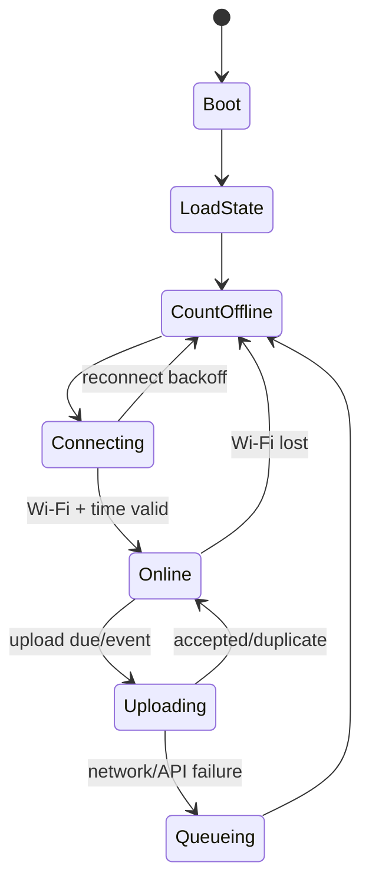

# M15B - Spesifikasi Meter Air ESP32-C3 + Flow Sensor D20

> Status: **PROTOTYPE SPECIFICATION**
> Tanggal: 2026-07-16
> Master plan: `M15_IOT_KWH_WATER_IMPLEMENTATION_PLAN.md`
> Target awal: monitoring konsumsi dan kebocoran, belum menjadi alat billing otomatis

## 1. Tujuan perangkat

Satu node ESP32-C3 membaca 1-4 flow sensor, mempertahankan total kumulatif setiap
channel walau reboot, dan mengirim telemetri yang terautentikasi ke backend
KOST48. Setiap sensor diregistrasikan sebagai logical device tersendiri agar
mapping kamar, secret, counter, dan histori tidak tercampur.

Node harus tetap berguna ketika Wi-Fi atau API sementara mati:

- pulse tetap dihitung;
- total kumulatif tidak kembali nol;
- data yang belum terkirim masuk queue lokal;
- pengiriman ulang tidak menggandakan data di server.

## 2. Asumsi yang harus diverifikasi sebelum membeli/merakit

Istilah "water flow D20" dipakai banyak vendor untuk sensor yang karakteristiknya dapat berbeda. Jangan memesan PCB final atau menentukan GPIO protection sebelum datasheet unit yang tepat tersedia.

Checklist datasheet:

- [ ] merek dan model lengkap;
- [ ] ukuran ulir dan arah aliran;
- [ ] operating voltage;
- [ ] konsumsi arus;
- [ ] tipe output: open collector, NPN, push-pull, atau lainnya;
- [ ] level tegangan HIGH output;
- [ ] pulse constant/formula vendor;
- [ ] rentang flow minimum, nominal, dan maksimum;
- [ ] tekanan kerja dan burst pressure;
- [ ] suhu air;
- [ ] akurasi dan repeatability;
- [ ] orientation requirement;
- [ ] bahan yang bersentuhan dengan air;
- [ ] sertifikasi/kelayakan untuk air bersih;
- [ ] kebutuhan straight pipe sebelum/sesudah sensor.

Jika datasheet tidak jelas, anggap output **tidak aman untuk GPIO 3.3 V** sampai diukur dan diberi level shifting/protection yang sesuai.

## 3. Bill of materials untuk satu prototype

| Komponen | Kriteria minimum | Catatan |
|---|---|---|
| ESP32-C3 board | Wi-Fi 2.4 GHz, flash cukup, USB programming | Model board harus dicatat sebelum pilih GPIO |
| Flow sensor D20 | 1-4 unit; model/datasheet terverifikasi | Jangan mengandalkan listing marketplace saja |
| Isolated DC power supply | Bersertifikasi dan sesuai instalasi | Sumber listrik jauh dari sambungan air |
| Buck converter | Bila sensor/board membutuhkan rail berbeda | Pilih dengan margin dan proteksi |
| Level shifter/opto/input conditioner | Satu channel per sensor | Wajib bila output dapat melebihi 3.3 V |
| Fuse/polyfuse | Sesuai daya prototype | Proteksi cabang supply |
| IP-rated enclosure | Minimal tahan cipratan dan kondensasi sesuai lokasi | Cable gland menghadap aman dari aliran air |
| Terminal/connector | Locking, berlabel, tahan lingkungan | Hindari kabel lepas terbuka |
| Isolation valve | Satu sebelum setiap sensor | Memudahkan servis tanpa mematikan seluruh bangunan |
| Union fitting | Sebelum/sesudah setiap sensor | Memudahkan pelepasan sensor |
| Strainer | Jika direkomendasikan sensor/plumber | Mencegah impeller macet oleh kotoran |
| Seal/fitting plumbing | Sesuai material pipa dan tekanan | Dikerjakan teknisi/plumber |
| Reference container/meter | Volume diketahui | Untuk kalibrasi |

Satu sensor hanya boleh dipetakan ke satu jalur pipa yang eksklusif untuk kamar
atau area tersebut. Satu ESP32-C3 boleh mengagregasi 1-4 sensor yang berdekatan,
misalnya satu cluster manifold/lantai. Survey pipa adalah gate sebelum rollout.

## 4. Arsitektur hardware

```text
AC mains
  -> certified isolated DC supply
      -> protected low-voltage rail
          -> ESP32-C3
          -> 1-4 flow sensor supply (sesuai datasheet)

Setiap flow sensor pulse output
  -> protection / level conditioning terpisah
  -> GPIO edge-interrupt ESP32-C3 yang unik
```

Aturan electrical:

- GPIO ESP32-C3 tidak boleh menerima level di atas batas board/chip;
- ground bersama hanya jika desain sensor mengharuskannya dan aman;
- gunakan pull-up sesuai tipe output dan datasheet;
- gunakan glitch filter software/hardware secara terukur, bukan nilai acak;
- kabel pulse dijauhkan dari kabel AC dan sumber noise;
- enclosure elektronik tidak ditempatkan di bawah titik yang berpotensi menetes;
- tidak ada koneksi mains terbuka dalam enclosure prototype basah;
- commissioning plumbing dan mains dilakukan orang yang kompeten.

Pin assignment belum ditetapkan karena varian board ESP32-C3 memiliki pin bootstrap, USB/JTAG, dan pin yang diekspos berbeda. Pilih setelah board final diketahui dan dokumentasikan:

```text
Board model       :
Board revision    :
Pulse GPIO ch 1   :
Pulse GPIO ch 2   :
Pulse GPIO ch 3   :
Pulse GPIO ch 4   :
Status LED GPIO   :
Provision button  :
Sensor voltage    :
Output type       :
Pull-up voltage   :
Protection circuit:
```

## 5. Arsitektur firmware

Modul yang disarankan:

```text
src/
  pulse_counter.*       # 1-4 GPIO ISR + counter terpisah per channel
  flow_calculator.*     # pulse -> liter dan L/min
  cumulative_store.*    # NVS checkpoint + recovery
  telemetry_queue.*     # persistent bounded queue
  wifi_manager.*        # reconnect dan provisioning
  time_sync.*           # SNTP + quality state
  api_client.*          # HTTPS + signed request
  device_config.*       # config version dan safe defaults
  health_monitor.*      # watchdog/reset diagnostics
  main.*
```

State machine:



Counting tidak boleh berhenti hanya karena firmware sedang reconnect atau mengirim HTTP.

## 6. Pulse counting pada ESP32-C3

ESP32-C3 **tidak memiliki peripheral hardware PCNT**. Implementasi tidak boleh mengimpor atau merancang berdasarkan driver `pulse_cnt.h`/PCNT untuk target ini.

Prioritas implementasi:

1. GPIO rising/falling-edge interrupt dengan ISR sesingkat mungkin;
2. counter volatile/atomic 64-bit atau critical section yang sesuai framework;
3. task terpisah mengambil snapshot count dan menghitung agregat;
4. RMT RX boleh dievaluasi untuk mengukur pulse duration dan menyaring noise, tetapi penerima harus dire-arm dan diuji agar tidak memiliki gap antar transaksi;
5. bila frekuensi pulse maksimum dari sensor tidak dapat dihitung andal ketika Wi-Fi/TLS aktif, gunakan IC external pulse counter atau ganti board ke keluarga ESP32 yang memiliki PCNT.

ISR tidak boleh melakukan JSON, logging, HTTP, NVS write, atau floating point berat.

Counter logical 64-bit:

```text
logicalPulseTotal = persistedPulseBase + volatilePulseDelta
```

Gunakan mekanisme atomic/critical section saat task membaca dan mereset delta agar pulse yang datang bersamaan tidak hilang. Jangan menonaktifkan interrupt lebih lama dari yang diperlukan.

Glitch filter:

- mulai dari datasheet pulse width/frequency maksimum;
- ukur sinyal prototype dengan logic analyzer/oscilloscope jika tersedia;
- filter terlalu agresif dapat menghilangkan pulse valid dan membuat volume kurang;
- filter terlalu longgar dapat menghitung noise sebagai air.

Dengan listing `F = 8.1Q - 3` dan maksimum 45 L/min, frekuensi maksimum teoritis
adalah 361,5 Hz per sensor atau sekitar 1.446 interrupt/detik untuk empat sensor.
Ini tetap harus dibuktikan melalui stress test sambil Wi-Fi reconnect, TLS
handshake, upload, NVS checkpoint, dan logging aktif. Bila ada pulse loss,
masalah diselesaikan di arsitektur hardware/board, bukan dikompensasi dengan
faktor kalibrasi palsu.

## 7. Perhitungan volume dan flow

Jangan hard-code formula generik D20. Gunakan konstanta hasil kalibrasi per sensor:

```text
pulsesPerLiter = calibration factor per physical sensor
deltaLiter     = deltaPulse / pulsesPerLiter
totalLiter     = totalPulse / pulsesPerLiter
flowLpm        = (deltaPulse / pulsesPerLiter) * (60 / sampleWindowSeconds)
```

Simpan:

- `pulseTotal` sebagai integer 64-bit, sumber kebenaran perangkat;
- `pulsesPerLiter` sebagai decimal config;
- `calibrationVersion` dan tanggal kalibrasi;
- `volumeTotalLiter` sebagai hasil turunan;
- perubahan faktor kalibrasi sebagai event, tidak menulis ulang histori mentah.

Jika faktor kalibrasi berubah, backend tetap dapat menghitung ulang volume dari pulse mentah per versi kalibrasi.

## 8. Prosedur kalibrasi

Gunakan sensor pada orientasi dan instalasi yang sama dengan kondisi final.

### 8.1 Persiapan

- pastikan tidak ada udara terjebak;
- pastikan fitting tidak bocor;
- basahi sensor dan jalur terlebih dahulu;
- gunakan wadah ukur/reference meter yang layak;
- reset hanya counter sesi kalibrasi, bukan identity/secret;
- catat suhu/tekanan bila relevan menurut datasheet.

### 8.2 Pengujian

Uji minimal:

| Flow band | Repetisi | Volume referensi minimum |
|---|---:|---:|
| Rendah | 3 | 10 L atau sesuai kemampuan sensor |
| Sedang | 3 | 20 L |
| Tinggi yang aman | 3 | 20 L |

Untuk tiap run:

```text
runId              :
sensorSerial       :
flowBand           : low/medium/high
referenceLiter     :
observedPulses     :
pulsesPerLiter     : observedPulses / referenceLiter
calculatedLiter    :
errorPercent       : abs(calculated - reference) / reference * 100
notes              :
```

Faktor awal dapat memakai weighted total:

```text
pulsesPerLiter = sum(allObservedPulses) / sum(allReferenceLiters)
```

Lalu hitung error per run dengan faktor tersebut. Jangan hanya mengejar rata-rata bila error pada flow rendah sangat buruk; kebocoran kecil justru berada di flow rendah.

Target engineering pilot yang disarankan:

- repeatability stabil;
- error absolut <= 2% pada flow operasional utama;
- flow minimum yang benar-benar terdeteksi terdokumentasi;
- tidak ada pulse ketika aliran benar-benar nol;
- hasil di luar target berarti alat masih monitoring eksperimental.

Target ini bukan pengganti persyaratan tera/metrologi untuk penagihan komersial.

## 9. Persistence dan ketahanan reboot

Menulis NVS setiap pulse akan mempercepat keausan flash. Gunakan checkpoint terkontrol:

- checkpoint setiap kenaikan volume tertentu, rekomendasi awal 1 liter;
- atau setiap 60 detik ketika ada flow;
- selalu checkpoint saat flow berhenti bila aman;
- gunakan dua-slot/versioned record dengan checksum;
- simpan `pulseTotal`, `sequence`, `configVersion`, dan checksum;
- setelah boot, pilih record valid dengan generation tertinggi.

Acceptable loss akibat power cut harus ditentukan setelah pengujian. Dengan checkpoint per 1 liter, target monitoring awal adalah kehilangan kurang dari 1 liter saat power cut mendadak. Jika kelak dibutuhkan akurasi billing yang mendekati tanpa kehilangan, tambah FRAM/external non-volatile storage atau backup power; jangan sekadar menulis NVS setiap pulse karena keausan flash.

Persistent outbound queue:

- bounded ring buffer;
- message lama dikirim berurutan;
- cumulative counter terbaru tetap diprioritaskan agar server dapat pulih;
- queue overflow menaikkan diagnostic flag;
- jangan menghapus item sampai server membalas accepted/duplicate.

## 10. Waktu perangkat

- sinkronkan waktu via SNTP setelah Wi-Fi tersambung;
- simpan `observedAt` hanya sebagai trusted jika time sync valid;
- sebelum time sync, tetap hitung pulse dan queue event dengan monotonic uptime;
- setelah time sync, kirim event dengan `timeQuality: "estimated"` bila waktu direkonstruksi;
- backend selalu menambahkan `receivedAt` sendiri;
- timezone firmware dapat UTC; payload ISO 8601 harus memiliki `Z` atau offset eksplisit.

Billing candidate tidak boleh memakai data dengan waktu tidak dapat dipercaya tanpa review.

## 11. Wi-Fi dan provisioning

Mode normal adalah station/client 2.4 GHz.

Provisioning awal yang disarankan:

1. perangkat masuk provisioning mode hanya ketika tombol fisik ditahan saat boot;
2. SoftAP sementara memiliki password unik atau setup melalui serial;
3. halaman provisioning hanya menerima SSID/password, API base, device ID, dan secret;
4. mode provisioning timeout setelah 10 menit;
5. access point dimatikan setelah commissioning;
6. factory reset membutuhkan aksi fisik yang lama dan jelas.

Wi-Fi credential dan device secret disimpan di NVS terenkripsi bila platform/build mendukung. Jangan memakai SSID/password hard-coded di source atau binary yang dibagikan.

Reconnect:

- exponential backoff dengan jitter;
- counting dan persistence tetap berjalan;
- reboot bukan strategi utama untuk setiap Wi-Fi gagal;
- watchdog hanya menangani deadlock/hang, bukan sinyal lemah biasa.

## 12. HTTPS dan device signature

Implementasi Arduino siap salin tersedia di:

`firmware/esp32-c3-water-meter/esp32-c3-water-meter.ino`

Firmware hanya memerlukan satu file `.ino`. Semua nilai yang boleh diedit
pengguna dipusatkan pada blok `USER CONFIGURATION` di bagian atas file tersebut.

Endpoint:

```http
POST /api/iot/v1/readings
```

Wajib:

- HTTPS dengan certificate verification;
- hostname verification aktif;
- root CA bundle atau certificate bundle yang dapat diperbarui;
- tidak memakai insecure TLS mode dalam production;
- timeout koneksi dan response terbatas;
- payload JSON maksimal 16 KB;
- HMAC-SHA256 sesuai canonical request di `M15`;
- `X-Device-Id` tetap sesuai registry perangkat;
- request baru memakai `X-Nonce` baru;
- retry mempertahankan body dan `X-Nonce`, tetapi memperbarui timestamp dan signature agar tetap berada dalam toleransi waktu API.

Payload yang diterima backend saat ini:

```json
{
  "observedAt": "2026-07-16T03:30:00.000Z",
  "sequence": 1042,
  "pulseTotal": 128994,
  "volumeTotalLiters": 270.428,
  "flowRateLpm": 4.21,
  "rssiDbm": -62,
  "firmwareVersion": "water-c3-1.0.0",
  "diagnostics": {
    "uptimeSec": 86420,
    "pulsesPerLiter": 477,
    "counterEpoch": 1
  }
}
```

`X-Nonce` adalah message/idempotency ID. Karena itu field `messageId` terpisah
tidak dikirim di body. Jika request gagal tanpa respons, firmware mempertahankan
body dan nonce, lalu membuat ulang timestamp dan signature pada retry.

Device tidak pernah mengirim `roomId`, tenant ID, tarif, invoice amount, atau role user.

## 13. Upload policy

Default prototype:

| Kondisi | Upload |
|---|---|
| Ada flow | agregat tiap 60 detik |
| Flow berubah menjadi nol | kirim event akhir sesi |
| Tidak ada flow | heartbeat tiap 15 menit |
| Request tertunda | simpan satu body+nonce di NVS dan retry tiap 30 detik |

Satu pending request cukup untuk prototype karena `pulseTotal` dan volume bersifat
kumulatif. Setelah pending diterima, snapshot terbaru akan dikirim pada interval
berikutnya. Queue multi-event dapat ditambahkan jika grafik tanpa celah menjadi
kebutuhan produksi.

Jangan upload per pulse. Ini boros network/server dan tidak menambah akurasi total kumulatif.

## 14. Leak detection data

Firmware hanya melaporkan fakta sensor. Keputusan alert utama berada di backend agar threshold dapat berubah tanpa reflashing.

Data yang perlu tersedia:

- flow rate saat ini;
- durasi sesi aliran kontinu;
- delta liter sesi;
- pulse total;
- last pulse age;
- device health dan RSSI.

Firmware boleh memiliki fail-safe local flag seperti `continuousFlowMinutes`, tetapi tidak boleh menutup valve otomatis pada fase awal.

## 15. Device lifecycle

### Commissioning

- buat `deviceCode` yang tidak berubah, contoh `water-room-a-01`;
- beri `displayName` firmware yang mudah dibaca, misalnya `Kamar A`; nilai ini
  hanya untuk log/diagnostics dan bukan sumber mapping kamar;
- generate secret acak unik per device;
- flash firmware release dan catat checksum/version;
- provision network dan secret;
- kalibrasi sensor fisik;
- tempel label QR/teks tanpa secret;
- mapping device ke kamar dilakukan backend;
- uji heartbeat dan volume;
- rotate secret setelah proses commissioning bila secret pernah terlihat banyak pihak.

### Penggantian sensor

- jangan reuse identitas sensor lama tanpa event penggantian;
- catat pulse total terakhir, volume baseline, alasan, foto, actor, dan waktu;
- sensor baru mendapat calibration version/factor sendiri;
- histori lama tetap immutable;
- billing candidate sekitar waktu penggantian wajib review manual.

### Pindah kamar

Device tidak boleh hanya mengirim room ID baru. Backend menutup mapping lama dan membuka mapping baru dengan effective timestamp serta audit log.

### Decommission

- disable device di backend;
- revoke/rotate secret;
- tandai tanggal dilepas;
- simpan histori untuk audit;
- hapus Wi-Fi credential dari hardware sebelum digunakan ulang/dibuang.

## 16. Test plan firmware

### Unit/host tests

- pulse-to-liter dengan beberapa calibration factor;
- sequence dan `X-Nonce` generation;
- HMAC canonical request fixture;
- NVS record checksum/version selection;
- queue wrap-around dan overflow;
- exponential backoff bounds;
- JSON schema serialization.

### Bench tests

| Test | Expected |
|---|---|
| Pulse generator known frequency | Count sesuai toleransi |
| Flow rendah/sedang/tinggi | Error tercatat dan repeatable |
| Zero flow 2 jam | Tidak ada phantom pulse |
| Power cut saat flow | Reboot pulih; loss di bawah target |
| 20 reboot berulang | Total tidak rollback |
| Wi-Fi mati 1 jam | Counting lanjut dan queue replay |
| API 500/timeout | Retry bounded, watchdog tidak loop |
| Duplicate response lost | Server menerima ulang sebagai duplicate |
| TLS cert invalid | Device menolak koneksi |
| Clock belum sync | Data ditandai time quality rendah |
| Secret salah/revoked | Auth gagal, data tidak diterima |
| Counter mendekati batas | Tidak overflow ke angka kecil |

### Field pilot tests

- 7-14 hari satu kamar;
- bandingkan volume harian dengan reference reading;
- catat RSSI minimum/median;
- catat reboot dan queue depth;
- uji keran menetes/flow rendah yang aman;
- cek false positive night-flow;
- inspeksi fisik kebocoran fitting dan kondensasi enclosure.

## 17. Release dan OTA

Prototype pertama boleh di-flash via kabel. OTA baru ditambahkan setelah pipeline dasar stabil.

Jika OTA diterapkan:

- image harus signed;
- HTTPS certificate verification aktif;
- gunakan dual partition/rollback bila tersedia;
- jangan update semua kamar sekaligus;
- canary satu device, lalu batch kecil;
- firmware lama tetap dapat mengirim schema version yang didukung;
- failed boot otomatis rollback;
- update tidak boleh mereset cumulative pulse atau secret.

## 18. Go/no-go instalasi satu kamar

Go bila:

- [ ] datasheet sensor exact tersedia;
- [ ] output signal aman untuk GPIO 3.3 V melalui circuit yang diverifikasi;
- [ ] board dan pin assignment final;
- [ ] kalibrasi tiga flow band selesai;
- [ ] total tahan reboot dan power cut;
- [ ] TLS dan HMAC lulus test;
- [ ] queue offline dan idempotency terbukti;
- [ ] jalur pipa eksklusif ke kamar pilot;
- [ ] valve isolasi dan akses servis tersedia;
- [ ] owner menerima mode monitoring-only;
- [ ] plumber/teknisi menyetujui instalasi fisik.

No-go bila:

- output sensor/tegangan tidak diketahui;
- pipa satu sensor melayani lebih dari satu kamar;
- error flow rendah belum diketahui;
- phantom pulse muncul saat zero flow;
- total reset setelah reboot;
- request memakai HTTP atau insecure TLS;
- device secret sama untuk semua unit;
- rencana langsung menagih tenant tanpa shadow billing dan review metrologi.

## 19. Referensi resmi

- [ESP32-C3 getting started](https://docs.espressif.com/projects/esp-idf/en/latest/esp32c3/get-started/index.html)
- [ESP32-C3 API reference](https://docs.espressif.com/projects/esp-idf/en/stable/esp32c3/api-reference/index.html)
- [ESP32-C3 RMT receiver](https://docs.espressif.com/projects/esp-idf/en/release-v5.4/esp32c3/api-reference/peripherals/rmt.html)
- [Espressif FAQ: ESP32-C3 tidak mendukung PCNT](https://docs.espressif.com/projects/esp-faq/en/latest/software-framework/peripherals/pcnt.html)
- [ESP-IDF HTTP Client dan HTTPS](https://docs.espressif.com/projects/esp-idf/en/stable/esp32c3/api-reference/protocols/esp_http_client.html)
- [Arduino ESP32 Wi-Fi API](https://docs.espressif.com/projects/arduino-esp32/en/latest/api/wifi.html)
- [Arduino ESP32 Preferences/NVS](https://docs.espressif.com/projects/arduino-esp32/en/latest/api/preferences.html)
- [Permendag 24 Tahun 2024 - Kegiatan Tera dan Tera Ulang Metrologi Legal](https://jdih.kemendag.go.id/peraturan/peraturan-menteri-perdagangan-nomor-24-tahun-2024-tentang-kegiatan-tera-dan-tera-ulang-alat-ukur-alat-timbang-dan-alat-perlengkapan-metrologi-legal-1)
