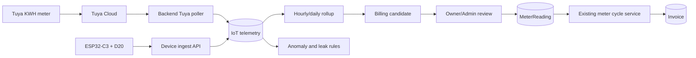
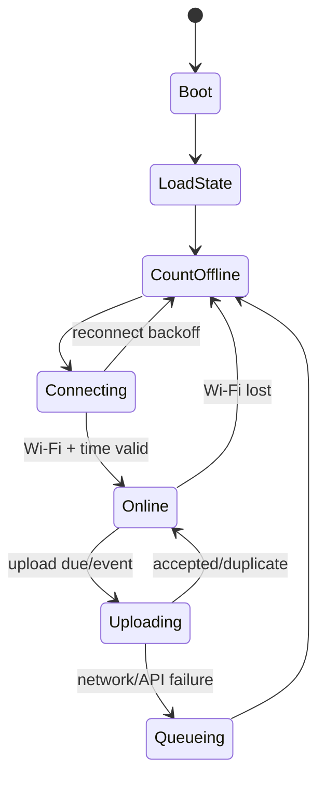

# M15 — IoT KOST48 (Spesifikasi Lengkap)

> **Sumber:** Tuya IoT Console ekspor 2026-07-10 · ESP32-C3 firmware  
> **Total perangkat:** 27 Tuya (17 Online, 10 Offline) + 2-3 ESP32-C3  
> **Status implementasi:** foundation done (2026-07-23), telemetry monitoring-only, no auto-billing  
> **Terkait:** memory `iot-water-kwh-spec` · `M06_OPERASIONAL.md` · `M10_PETA_SCOPE.md`

---

## Daftar Isi
- **[Part A — Inventaris Perangkat Tuya](#part-a--inventaris-perangkat-tuya)** — 27 device, KWH meter 13 kamar, CCTV, AC, Smart Lock
- **[Part B — Rencana Implementasi](#part-b--rencana-implementasi)** — arsitektur, Prisma model, cron, API, frontend
- **[Part C — Runbook Setup Tuya KWH](#part-c--runbook-setup-tuya-kwh)** — credential, polling, mapping device, troubleshooting
- **[Part D — Spesifikasi ESP32-C3 Water Meter](#part-d--spesifikasi-esp32-c3-water-meter)** — firmware, wiring D20, ingest API, provisioning
- **[Part E — Handoff Backend & Frontend](#part-e--handoff-backend--frontend)** — deploy checklist, verifikasi, yang sudah siap

---


---

## Part A — Inventaris Perangkat Tuya


> **Sumber:** Tuya IoT Console — ekspor 2026-07-10  
> **Total perangkat:** 27 (17 Online, 10 Offline)  
> **Terkait:** memory `iot-water-kwh-spec` (ESP32 water flow) · `M06_OPERASIONAL.md` · `M10_PETA_SCOPE.md`

> **Update implementasi 2026-07-23:** fondasi IoT sudah dibuat dan masuk paket deploy. Telemetry tetap monitoring-only; tidak pernah otomatis menerbitkan tagihan. Status perangkat fisik pada tabel di bawah tetap snapshot Tuya 2026-07-10 dan wajib diverifikasi lagi saat go-live.

---

#### A. Ringkasan

| Kategori | Jumlah | Online | Offline | Produk Tuya |
|---|---|---|---|---|
| **KWH Meter per kamar** | 14* | 11 | 3 | WIFI 智能计量开关 / 保护款 |
| **CCTV BARDI IP Camera** | 5 | 3 | 2 | BARDI IP Camera Static Outdoor |
| **AC / 空调** | 3 | 0 | 3 | 空调 |
| **Smart IR Remote** | 2 | 0 | 2 | 万能遥控器WIFI+BLE / 佼茂T1 |
| **Smart Plug** | 1 | 0 | 1 | Smart plug |
| **Human Presence Sensor** | 1 | 0 | 1 | 000HPS01_5.8G |
| **Smart Lock** | 1 | 1 | 0 | SmartLock |

> \* 13 kamar unik — "KWH Kamar D" (offline) adalah unit lama yang digantikan "KWH Kmr D" (online).

---

#### B. KWH Meter — Per Kamar

**Produk:** WIFI 智能计量开关 (Smart Metering Switch WiFi)  
**Integrasi:** Tuya Cloud API → backend polling cron tiap 10 menit (lihat `iot-water-kwh-spec`)  
**Fungsi:** pantau pembacaan kWh terbaru per kamar; billing listrik bulanan tetap memakai `MeterReading` terverifikasi

| # | Device Name | Device ID | Status | Activated | Kamar |
|---|---|---|---|---|---|
| 1 | KWH Kmr A | `ebb45dcb6878c96529vjfe` | ✅ Online | 2025-12-27 | A |
| 2 | KWH Kmr B | `eb978d316fb9be79a1ed9k` | ✅ Online | 2025-12-27 | B |
| 3 | KWH Kmr C | `ebd46b4d391f079e2b4akm` | ✅ Online | 2025-12-20 | C |
| 4 | KWH Kmr D | `ebcafb5450a35bdaeciyii` | ✅ Online | 2025-12-20 | D |
| 5 | KWH Kmr G | `ebe076481e1e344ce95dkb` | ✅ Online | 2025-12-09 | G |
| 6 | KWH Kmr H | `eb693507851acf697fnmhj` | ✅ Online | 2025-12-09 | H |
| 7 | KWH Kmr i | `ebf39e59e1bb788173rzal` | ✅ Online | 2025-12-09 | I |
| 8 | KWH Kmr J | `eb8bc29c48b31bc433achz` | ✅ Online | 2025-12-09 | J |
| 9 | KWH Kmr K | `eb62ad9276b9da9c93hf8c` | ✅ Online | 2025-12-09 | K |
| 10 | KWH Kamar L | `eb2b7769c20fab47c2v8um` | ✅ Online | 2025-12-09 | L |
| 11 | Kamar M | `eb54cf1ee1dba020d6kfuy` | ✅ Online | 2025-12-09 | M |
| 12 | KWH Kmr F1 | `ebd9f624a02848fc8c8ift` | ⚠️ Offline | 2025-11-28 | F1 |
| 13 | KWH Kmr F2 | `eb7087736aa53084b8uxmd` | ⚠️ Offline | 2026-06-20 | F2 |
| ~ | ~~KWH Kamar D~~ | `ebac057249dcb85a58l0qc` | ❌ Offline | 2025-06-30 | D (lama) |

##### Catatan KWH

- **11 kamar online** (A, B, C, D, G, H, I, J, K, L, M) — siap di-polling via Tuya API
- **F1 & F2 offline** — perlu dicek fisik (mungkin mati daya / rusak), kedua device di lantai F
- **KWH Kamar D** adalah unit lama (2025-06-30) — sudah diganti `KWH Kmr D` (2025-12-20), abaikan saat integrasi
- **Naming inconsistency:** `KWH Kmr K` vs `KWH Kamar L` vs `Kamar M` — bersihkan saat mapping ke database (gunakan Room.code: A/B/C/D/.../M)

---

#### C. CCTV — BARDI IP Camera

**Produk:** BARDI IP Camera Static Outdoor  
**Fungsi:** keamanan 24/7, bisa diintegrasikan ke dashboard owner nanti (live view / snapshot)

| # | Device Name | Device ID | Status | Activated | Posisi |
|---|---|---|---|---|---|
| 1 | CCTV depan Jalan | `eb54211162106e4c5fvkoc` | ✅ Online | 2026-01-13 | Depan jalan (pintu gerbang) |
| 2 | CCTV Depan Hadap Rumah | `eb277da893cc2ddc6eoytp` | ✅ Online | 2026-01-13 | Depan hadap rumah |
| 3 | CCTV Dpn Kamar E | `eb7aa5dc361c36ac6dgfvw` | ✅ Online | 2025-06-30 | Depan kamar E |
| 4 | Kamera Belakang Kmr Mandi | `eb2617383fbef1393d6b7s` | ✅ Online | 2025-12-04 | Belakang kamar mandi |
| 5 | CCTV Belakang Lorong | `eb53d03570c2fe2669aj8i` | ⚠️ Offline | 2025-06-30 | Belakang lorong |

##### Catatan CCTV

- 4 dari 5 kamera online — cakupan depan (jalan, rumah), samping (kamar E), belakang (kamar mandi)
- CCTV Belakang Lorong offline sejak 2025-06-30 — perlu dicek
- **Belum prioritas integrasi** — simpan sebagai referensi untuk fase lanjutan

---

#### D. Perangkat Lain

##### AC / 空调 (3 device — semua offline)

| Device Name | Device ID | Activated | Catatan |
|---|---|---|---|
| Air | `ebaaf37c4b32a834e869cx` | 2025-12-27 | Mungkin AC kamar, offline |
| Air Conditioning 4 | `eb9eda6e21d7229255gnx7` | 2025-12-27 | Mungkin AC kamar, offline |
| Daikin Rumah Sememi | `ebd3001bee98f90304omea` | 2025-12-20 | AC rumah owner, offline |

> Semua AC offline — tidak perlu diintegrasikan. AC kos dikelola manual / via Smart IR.

##### Smart IR Remote (2 device — semua offline)

| Device Name | Device ID | Activated |
|---|---|---|
| Smart IR (万能遥控器WIFI+BLE) | `eb9bbd2f2f913c35a5bswp` | 2025-12-27 |
| Smart IR (佼茂T1 万能遥控器) | `eb32ffe1015cab80dbsohb` | 2025-12-20 |

> Keduanya offline — rencana awal untuk kontrol AC via IR, tapi belum jalan.

##### Lain-lain

| Device Name | Device ID | Produk | Status | Activated |
|---|---|---|---|---|
| Smart plug | `ebea186c0c10b05b840lby` | Smart plug | Offline | 2025-12-07 |
| Human Presence Sensor | `ebbe9e52b394d97029yyja` | 000HPS01_5.8G | Offline | 2025-11-28 |
| Smart_Lock | `57514000d8bfc056e66a` | SmartLock | ✅ Online | 2022-02-26 |

> **Smart Lock** online sejak 2022 — potensi integrasi akses pintu otomatis (fase lanjutan).

---

#### E. Rencana Integrasi — Prioritas

##### Fase 1: KWH Meter (PRIORITAS UTAMA)
- **Target:** 11 KWH meter online (A–M, kecuali F1/F2)
- **Metode:** Tuya Cloud API → polling cron tiap 10 menit → simpan ke `IotTelemetry`; `MeterReading` tetap snapshot billing terpisah.
- **Backend:** `backend/src/modules/iot/` sudah ada: `TuyaClientService`, `IotPollingService`, `IotService`, controller OWNER/ADMIN, dan polling tenant terikat.
- **Endpoint ops:** `POST /api/iot/tuya/cron` dengan `X-Iot-Cron-Token`; endpoint manual `POST /api/iot/tuya/sync-all` untuk OWNER/ADMIN.
- **Mapping room:** Device ID → Room.code via table di atas

##### Fase 2: Water Flow (ESP32-C3 + D20)
- **Target:** 2-3 unit ESP32-C3 dengan sensor D20 per kamar
- **Metode:** ESP32 → signed HTTP POST `/api/iot/v1/readings` (HMAC per device, bukan JWT pengguna)
- **Backend:** modul yang sama (`backend/src/modules/iot/`), `WaterIngestController` + `WaterIngestService` + registry/rotasi secret perangkat
- **Tidak terkait Tuya** — water flow via ESP32 terpisah

##### Fase 3 (nanti): CCTV + Smart Lock
- CCTV: embed snapshot di dashboard owner (Tuya API screenshot)
- Smart Lock: remote unlock / access log (Tuya API)

##### Tidak diintegrasikan
- AC (semua offline) — tidak bisa di-polling
- Smart IR (offline) — tidak berfungsi
- Smart Plug, Human Presence Sensor (offline) — tidak berfungsi

---

#### F. Credentials & Konfigurasi

**Tuya IoT Cloud** — credential disimpan di `backend/.env` (gitignored):

| Env Var | Keterangan |
|---|---|
| `TUYA_ACCESS_KEY` | Access ID / Client ID dari Tuya IoT Console |
| `TUYA_SECRET_KEY` | Access Secret / Client Secret |
| `TUYA_API_BASE` | `https://openapi.tuyaus.com` (US West, default) |

> ✅ Credentials sudah di-set di `backend/.env`. Template ada di `backend/.env.production.example`.

**Implementasi backend tersedia:**
- Prisma: `IotDevice`, `IotIngestMessage`, `IotTelemetry` serta enum provider/quality.
- Tuya: `TuyaClientService` (HMAC-SHA256, token cache, normalisasi) dan `IotPollingService`.
- API: `IotController` untuk overview/device/sync/probe/backfill dan `WaterIngestController` untuk ESP32 signed ingest. Portal tenant mengambil pembaruan secara berkala.
- Cron Tuya memakai `POST /api/iot/tuya/cron` + `X-Iot-Cron-Token`; aktifkan hanya setelah credential dan mapping device diverifikasi.

---

#### G. Cross-Reference

| Topik | Dokumen |
|---|---|
| Spek implementasi IoT | memory `iot-water-kwh-spec` |
| Peta scope role | `M10_PETA_SCOPE.md` § IoT & Monitoring |
| Operasional | `M06_OPERASIONAL.md` § IoT Monitoring |
| Auto-ops / cron | `M06_OPERASIONAL.md` § Auto-Ops |
| Default data seed | `M11_DEFAULT_DATA.md` |
| Keamanan JWT device | memory `iot-water-kwh-spec` (beda dari user JWT) |

---

*Dibuat 2026-07-10 dari data Tuya IoT Console.*

---

## Part B — Rencana Implementasi


> Status: **Fondasi backend/firmware sudah diimplementasikan; rollout perangkat, mapping, dan UAT produksi masih diperlukan.**
> Tanggal: 2026-07-16
> Dokumen terkait: `M14_IOT_TUYA_DEVICES.md`, `M04_KEUANGAN.md`, `M05_SIKLUS_HUNI.md`, `M06_OPERASIONAL.md`
> Runbook Tuya: `M15A_TUYA_KWH_SETUP_RUNBOOK.md`
> Spesifikasi meter air: `M15B_ESP32_C3_WATER_METER_SPEC.md`

#### Update implementasi 2026-07-23

- `backend/src/modules/iot/` tersedia dengan registry `IotDevice`, `IotIngestMessage`, `IotTelemetry`, Tuya HMAC client/polling, signed ESP32 ingest, dan pembaruan tenant terikat.
- Endpoint cron Tuya adalah `POST /api/iot/tuya/cron` dengan header `X-Iot-Cron-Token`; telemetry tetap terpisah dari `MeterReading` dan tidak menerbitkan invoice otomatis.
- Firmware water meter ada di `firmware/esp32-c3-water-meter/`. Aktivasi perangkat fisik dan alert kebocoran tetap menunggu instalasi, mapping, serta UAT.
- Siklus quota listrik sudah memakai periode sewa awal/perpanjangan yang **lunas** sebagai sumber utama. Renewal tiga bulan mendapatkan tiga quota bulanan; invoice DP renewal tidak memulai ulang quota. Logika yang sama dipakai pada meter cycle, settlement renewal, dan tampilan Energy tenant.

#### 1. Hasil yang ingin dicapai

KOST48 memiliki satu pipeline IoT yang aman untuk:

1. membaca total energi kWh dan status kesehatan smart meter Tuya per kamar;
2. menerima pulse dan volume air dari ESP32-C3 + flow sensor D20;
3. menampilkan konsumsi dan kondisi perangkat kepada owner/admin;
4. mendeteksi perangkat offline, konsumsi tidak wajar, dan dugaan kebocoran;
5. menyiapkan angka kandidat billing tanpa merusak alur `MeterReading` dan invoice yang sudah aktif.

Target awal bukan kontrol jarak jauh. Integrasi Tuya fase pertama bersifat **read-only** dan perangkat air hanya mengirim telemetri. Relay listrik atau katup air tidak boleh dimatikan otomatis oleh sistem pada fase ini.

#### 2. Ground state aplikasi saat ini

| Area | Kondisi saat ini | Implikasi |
|---|---|---|
| Billing meter | Model `MeterReading` sudah aktif untuk `ELECTRICITY` dan `WATER` | Jangan simpan polling 10-menit langsung ke tabel ini |
| Penerbitan invoice | `POST /api/meter-readings/cycle` menghitung selisih, kuota gratis, tarif, lalu menerbitkan invoice | Angka IoT harus melalui tahap kandidat dan konfirmasi dahulu |
| Tarif | `OperationalSetting` memiliki tarif, kuota gratis, dan toggle water metering | Water billing tetap OFF selama pilot |
| Tuya | Inventaris device ID tersedia di `M14_IOT_TUYA_DEVICES.md`; konfigurasi lokal saat ini memakai endpoint US | Region harus dibuktikan dengan live connectivity test, bukan ditebak dari negara |
| Backend IoT | `backend/src/modules/iot/` sudah ada | Registry device, telemetry generik, Tuya polling, signed water ingest, dan pembaruan tenant terikat; rollout env/mapping tetap perlu |
| ESP32 | Firmware dan protokol device tersedia | Gunakan `firmware/esp32-c3-water-meter/` + kontrak di `M15B` sebagai sumber kebenaran |

#### 3. Keputusan arsitektur

##### 3.1 Pisahkan telemetri dari billing

`MeterReading` adalah snapshot bisnis yang dapat memicu tagihan. Telemetri adalah data mesin yang datang sering, bisa duplikat, terlambat, atau salah. Keduanya tidak boleh dicampur.



Aturan mutlak:

- polling atau upload device **tidak boleh langsung menerbitkan invoice**;
- payload device tidak boleh menentukan `roomId`; mapping device-ke-kamar dilakukan backend;
- promosi kandidat ke `MeterReading` memakai service domain yang menjaga urutan dan audit trail;
- data dengan kualitas buruk tetap boleh disimpan sebagai telemetri, tetapi tidak layak menjadi kandidat billing.

##### 3.2 Satu model telemetri untuk dua sumber

Gunakan model generik agar Tuya dan ESP32 memiliki pipeline observability yang sama.

Model Prisma yang disarankan:

```prisma
enum IotProvider {
  TUYA
  KOST48_ESP32
}

enum IotDeviceType {
  ELECTRICITY_METER
  WATER_FLOW_METER
}

enum IotReadingQuality {
  GOOD
  SUSPECT
  REJECTED
}

model IotDevice {
  id                     Int       @id @default(autoincrement())
  deviceCode             String    @unique
  provider               IotProvider
  deviceType             IotDeviceType
  roomId                 Int?
  externalDeviceId       String?
  productId              String?
  enabled                Boolean   @default(true)
  lastSeenAt             DateTime?
  lastSuccessfulSyncAt   DateTime?
  firmwareVersion        String?
  configVersion          Int       @default(1)
  metadata               Json?
  credentialCiphertext   String?
  credentialVersion      Int       @default(1)
  createdAt              DateTime  @default(now())
  updatedAt              DateTime  @updatedAt

  room                   Room?     @relation(fields: [roomId], references: [id], onDelete: SetNull)
  ingestMessages         IotIngestMessage[]

  @@unique([provider, externalDeviceId])
  @@index([roomId, deviceType])
}

model IotIngestMessage {
  id                 BigInt       @id @default(autoincrement())
  deviceId           Int
  messageId          String
  observedAt         DateTime
  receivedAt         DateTime     @default(now())
  sequence           BigInt?
  rawPayload         Json?
  diagnostics        Json?

  device             IotDevice    @relation(fields: [deviceId], references: [id], onDelete: Restrict)
  telemetry          IotTelemetry[]

  @@unique([deviceId, messageId])
  @@index([deviceId, observedAt])
}

model IotTelemetry {
  id                 BigInt            @id @default(autoincrement())
  ingestMessageId    BigInt
  metric             String
  valueDecimal       Decimal?          @db.Decimal(18, 6)
  valueText          String?
  unit               String
  observedAt         DateTime
  quality            IotReadingQuality @default(GOOD)
  qualityReason      String?

  ingestMessage      IotIngestMessage   @relation(fields: [ingestMessageId], references: [id], onDelete: Restrict)

  @@unique([ingestMessageId, metric])
  @@index([metric, observedAt])
}
```

Model lanjutan setelah pilot:

- `IotDailyRollup`: min/max/avg/delta per metric per hari;
- `IotAlert`: lifecycle alert `OPEN`, `ACKNOWLEDGED`, `RESOLVED`;
- `IotBillingCandidate`: angka meter yang diusulkan untuk suatu stay dan siklus;
- `IotDeviceCommand`: hanya jika suatu hari kontrol relay/valve benar-benar disetujui.

`IotIngestMessage` menyimpan envelope/raw payload satu kali, sedangkan `IotTelemetry` menyimpan metric terindeks. Jangan membuat `KwhReading` dan `FlowReading` yang menduplikasi struktur sama. Perbedaan domain diwakili oleh `deviceType` dan `metric`. Raw payload Tuya harus disanitasi dari token, `local_key`, lokasi, dan field sensitif sebelum disimpan.

##### 3.3 Nama metric kanonik

| Metric | Unit tersimpan | Sumber | Catatan |
|---|---|---|---|
| `electricity.energy_total_kwh` | `kWh` | Tuya | Angka kumulatif utama kandidat billing |
| `electricity.power_w` | `W` | Tuya | Telemetri, bukan billing |
| `electricity.voltage_v` | `V` | Tuya | Diagnostik |
| `electricity.current_a` | `A` | Tuya | Diagnostik |
| `water.pulse_total` | `pulse` | ESP32 | Kumulatif, tidak boleh reset diam-diam |
| `water.volume_total_l` | `L` | ESP32 | Kumulatif hasil kalibrasi |
| `water.flow_rate_lpm` | `L/min` | ESP32 | Deteksi kebocoran/aliran kontinu |
| `device.rssi_dbm` | `dBm` | keduanya bila tersedia | Kesehatan koneksi |

Nilai finansial tetap memakai `Decimal`, bukan floating point JavaScript.

#### 4. Jalur integrasi Tuya KWH

##### 4.1 Pola akses

1. Backend meminta access token Tuya dan menyimpannya di memory cache sampai mendekati expiry.
2. Poller membaca detail/status hanya untuk device aktif yang sudah dimapping.
3. Adapter per `productId` memetakan Tuya Data Point (DP) ke metric kanonik.
4. Nilai mentah, skala, unit, dan nilai normalisasi disimpan agar hasil dapat diaudit.
5. Gagal pada satu device tidak membatalkan polling device lain.

Endpoint dasar yang perlu diuji:

- `GET /v1.0/token?grant_type=1`
- `GET /v1.0/devices/{device_id}`
- `GET /v1.0/devices/{device_id}/status`

Kode DP seperti `add_ele`, `cur_power`, `cur_voltage`, atau `cur_current` hanya **kandidat umum**. Mapping final harus berasal dari respons aktual dan metadata product masing-masing; jangan hard-code sebelum discovery.

##### 4.2 Region Tuya

Konfigurasi lokal saat dokumen dibuat:

```dotenv
TUYA_API_BASE=https://openapi.tuyaus.com
```

Indonesia dipetakan ke Singapore Data Center untuk app account baru sejak 3 Juni 2025, tetapi account lama dapat tetap berada di data center sebelumnya. Karena itu:

- jangan otomatis mengganti endpoint lokal ke Singapore;
- uji endpoint yang tercatat di cloud project;
- keberhasilan `GET device detail` terhadap minimal satu device adalah bukti region benar;
- `1106 permission deny` harus diperiksa sebagai kemungkinan salah link account, service authorization, device ID, atau endpoint.

Endpoint Singapore saat diperlukan adalah `https://openapi-sg.iotbing.com`.

##### 4.3 Jadwal polling

Rekomendasi awal:

- status energi: setiap 10 menit;
- backoff saat Tuya error/rate limit: 1, 2, 5, 10, maksimal 30 menit dengan jitter;
- status offline: tidak dianggap `0 kWh`; simpan state offline dan pertahankan angka terakhir;
- alert offline: setelah 30 menit untuk meter listrik yang seharusnya selalu menyala;
- polling manual owner/admin tersedia, tetapi diberi cooldown 60 detik;
- setelah stabil, pertimbangkan Tuya Message Service untuk event cepat, sementara polling tetap sebagai rekonsiliasi.

##### 4.4 Proteksi billing

Kandidat kWh layak review hanya jika:

- device terhubung ke kamar yang benar;
- metric berasal dari DP yang tervalidasi;
- angka kumulatif tidak turun dari pembacaan sebelumnya;
- data tidak lebih tua dari batas yang disetujui, rekomendasi 30 menit;
- lonjakan masih dalam batas masuk akal atau telah dikonfirmasi;
- stay kamar aktif dan baseline meter sudah dipromosikan.

#### 5. Jalur integrasi meter air ESP32-C3

##### 5.1 Pola akses

ESP32 mengirim agregat via HTTPS ke backend KOST48. Perangkat tidak perlu masuk ekosistem Tuya.

```text
Sensor D20 -> pulse input -> ESP32 counter -> local cumulative state
           -> HTTPS signed payload -> IoT ingest -> telemetry -> alert/rollup
```

Default pengiriman:

- hitung pulse secara kontinu dengan GPIO edge interrupt yang sangat ringan; ESP32-C3 tidak memiliki peripheral PCNT;
- RMT RX dapat dievaluasi untuk pengukuran bentuk/durasi pulse, tetapi bukan diasumsikan sebagai pengganti drop-in PCNT;
- bila frekuensi pulse aktual terlalu tinggi untuk dihitung andal bersamaan dengan Wi-Fi, gunakan external hardware counter atau ganti ke varian ESP32 yang memiliki PCNT;
- hitung flow rate dalam window 1 detik;
- kirim agregat setiap 60 detik saat ada aliran;
- kirim event segera ketika aliran berhenti;
- heartbeat setiap 5 menit saat tidak ada aliran;
- simpan queue lokal ketika Wi-Fi/API tidak tersedia;
- retry dengan exponential backoff dan `messageId` yang sama agar idempoten.

##### 5.2 Device authentication

Jangan gunakan JWT user OWNER/ADMIN/TENANT di ESP32. Gunakan identitas device terpisah:

```text
X-Device-Id: water-A-01
X-Timestamp: 1784192400
X-Nonce: 2d3d...
X-Signature: hex(HMAC-SHA256(deviceSecret, canonicalRequest))
```

Canonical request versi 1:

```text
POST
/api/iot/v1/readings
<timestamp>
<nonce>
<lowercase sha256 hex of exact raw body>
```

Backend wajib:

- mengambil device berdasarkan `X-Device-Id`;
- mendekripsi secret memakai `IOT_MASTER_KEY`;
- memakai constant-time comparison;
- menolak skew waktu lebih dari 300 detik;
- menolak nonce yang pernah dipakai dalam jendela replay;
- rate-limit per device, bukan hanya per IP;
- tidak pernah menulis secret atau signature penuh ke log.

Provisioning secret dilakukan sekali melalui kabel/serial atau halaman admin lokal yang hanya aktif saat commissioning. Secret tidak dikirim kembali oleh API aplikasi.

#### 6. Kontrak ingest device

Endpoint yang disarankan:

```http
POST /api/iot/v1/readings
Content-Type: application/json
```

Contoh payload:

```json
{
  "schemaVersion": 1,
  "messageId": "water-A-01:8f1c4b:1042",
  "bootId": "8f1c4b",
  "sequence": 1042,
  "observedAt": "2026-07-16T10:30:00+07:00",
  "firmwareVersion": "0.1.0",
  "readings": [
    { "metric": "water.pulse_total", "value": "128994", "unit": "pulse" },
    { "metric": "water.volume_total_l", "value": "2579.880", "unit": "L" },
    { "metric": "water.flow_rate_lpm", "value": "4.210", "unit": "L/min" }
  ],
  "diagnostics": {
    "rssiDbm": -62,
    "uptimeSec": 86420,
    "queueDepth": 0,
    "resetReason": "power_on"
  }
}
```

Contoh respons:

```json
{
  "accepted": true,
  "duplicate": false,
  "serverTime": "2026-07-16T10:30:01+07:00",
  "configVersion": 3,
  "nextUploadSeconds": 60
}
```

Aturan validasi:

- maksimal body 16 KB;
- maksimal 20 readings per request;
- `messageId` wajib unik per device, tetapi request duplikat mengembalikan sukses idempoten;
- `value` dikirim sebagai string desimal;
- nilai kumulatif yang turun diberi `SUSPECT`, kecuali reset meter telah disetujui;
- `observedAt` adalah waktu perangkat, `receivedAt` selalu waktu server;
- `roomId`, tenant, tarif, dan nominal tagihan tidak diterima dari device.

#### 7. Aturan alert awal

Semua rule fase pertama membuat notifikasi/tiket; tidak melakukan pemutusan otomatis.

| Rule | Default awal | Aksi |
|---|---|---|
| Device offline | Tidak ada heartbeat/poll sukses 30 menit | Alert owner/admin |
| Continuous water flow | Flow > 0.3 L/min selama 30 menit | Dugaan keran terbuka/kebocoran |
| Night flow | Flow > 0.3 L/min selama 15 menit pada 23:00-05:00 | Alert dengan prioritas lebih tinggi |
| Empty-room flow | Flow > 0.1 L/min saat tidak ada stay aktif | Alert kritis operasional |
| Counter rollback | Total kumulatif turun | Tandai data `SUSPECT`; blok kandidat billing |
| KWH spike | Delta interval > batas teknis kamar atau > 2x baseline adaptif | Alert, jangan koreksi otomatis |
| Sensor stuck | Flow selalu nol tetapi pola hunian menunjukkan penggunaan, atau pulse tidak berubah 24 jam | Inspeksi perangkat |

Threshold harus owner-settable setelah data pilot tersedia. Nilai di atas adalah default observability, bukan bukti final kebocoran atau kecurangan.

#### 8. Billing dan aspek operasional

##### 8.1 Fase shadow billing

Selama minimal satu siklus penuh:

- `waterMeteringEnabled` tetap `false`;
- angka IoT dibandingkan dengan pembacaan manual;
- selisih dan alasan koreksi dicatat;
- invoice tetap memakai flow manual yang sekarang;
- UI menampilkan label **Estimasi IoT**, bukan angka final tagihan.

Promosi otomatis baru boleh dipertimbangkan jika:

- mapping kamar 100% benar;
- tidak ada counter rollback yang tidak terjelaskan;
- error meter air memenuhi target pilot pada beberapa laju aliran;
- loss data harian di bawah target;
- owner menyetujui SOP koreksi dan sengketa;
- persyaratan tera/metrologi untuk penggunaan komersial sudah dikonfirmasi dengan pihak berwenang/kompeten.

Sensor DIY ESP32 + D20 sebaiknya dianggap alat monitoring sampai kelayakan untuk billing dipastikan. Permendag 24 Tahun 2024 yang berstatus berlaku mengatur UTTP untuk konteks usaha/penentuan pungutan dan mencantumkan meter air dalam daftar tera/tera ulang. Konsultasikan apakah rancangan dan penggunaan aktual KOST48 memenuhi ketentuan tersebut kepada Unit Metrologi Legal setempat; dokumen teknis ini bukan opini hukum.

##### 8.2 Retensi data

Default yang disarankan:

- raw telemetry 10-menit/60-detik: 90 hari;
- hourly rollup: 2 tahun;
- daily rollup dan billing candidate: selama histori stay/invoice dibutuhkan;
- payload yang memuat diagnostik: tanpa data pribadi tenant;
- delete job berjalan bertahap dan teraudit.

#### 9. Tahapan implementasi dan exit gate

##### Fase 0 - Survey dan keputusan owner

- [ ] Pastikan topologi pipa: satu jalur air benar-benar hanya melayani satu kamar.
- [ ] Catat model lengkap, datasheet, tegangan, tipe output, dan pulse constant sensor D20.
- [ ] Tentukan board ESP32-C3 yang dipakai dan GPIO aman.
- [ ] Konfirmasi cloud project Tuya, data center, dan masa aktif service plan.
- [ ] Putuskan mode awal: **monitoring + shadow billing** (rekomendasi).

Exit gate: tidak ada perangkat yang ambigu kamar atau spesifikasinya.

##### Fase 1 - Tuya connectivity spike

- [ ] Implementasi client sign/token cache tanpa database mutation.
- [ ] Buktikan endpoint region dengan satu device online.
- [ ] Discovery DP untuk setiap `productId` meter.
- [ ] Ambil status 11 meter online dan simpan fixture tersanitasi untuk test.
- [ ] Dokumentasikan F1/F2 offline tanpa menganggap nilai nol.

Exit gate: total kWh terbaca konsisten dari minimal 3 kamar dan mapping skala tervalidasi.

##### Fase 2 - Fondasi backend IoT

- [ ] Migration additive `IotDevice` + `IotTelemetry`.
- [ ] Modul `backend/src/modules/iot/`.
- [ ] Adapter Tuya, poller, idempotency, quality flags, dan audit log.
- [ ] Endpoint read-only owner/admin untuk status dan histori.
- [x] Timer internal default OFF melalui `IOT_TUYA_POLL_ENABLED=false`; modul monitoring tetap tersedia. Tidak ada global `IOT_ENABLED`.

Exit gate: test unit, integration, dan migration lulus; modul dapat dimatikan tanpa mengganggu meter manual.

##### Fase 3 - Pilot polling KWH

- [ ] Mapping seluruh device aktif ke `Room.code`.
- [ ] Poll setiap 10 menit selama 7 hari.
- [ ] Dashboard kesehatan device dan last seen.
- [ ] Bandingkan dengan aplikasi Tuya dan pembacaan manual.

Exit gate: tidak ada salah kamar, counter rollback palsu, atau skala unit salah.

##### Fase 4 - Prototype ESP32 bench

- [ ] Wiring aman 3.3 V dan enclosure belum dipasang ke jalur kamar.
- [ ] GPIO pulse counting, NVS state, Wi-Fi reconnect, HTTPS verify, dan signed payload.
- [ ] Kalibrasi volume pada sedikitnya tiga laju aliran.
- [ ] Uji mati listrik, reboot, Wi-Fi putus, API down, dan retry duplikat.

Exit gate: cumulative total pulih setelah reboot dan request duplikat tidak menggandakan data.

##### Fase 5 - Pilot satu kamar

- [ ] Instalasi oleh teknisi/plumber dengan valve isolasi dan akses servis.
- [ ] Jalankan monitoring 7-14 hari tanpa billing.
- [ ] Bandingkan volume dengan wadah ukur/meter referensi.
- [ ] Tuning alert; ukur false positive.

Exit gate: instalasi tidak bocor, koneksi stabil, error terukur, dan SOP servis tersedia.

##### Fase 6 - Shadow billing satu siklus

- [ ] Buat kandidat meter tetapi owner/admin tetap input/konfirmasi.
- [ ] Jalankan rekonsiliasi 30 hari.
- [ ] Dokumentasikan koreksi, downtime, dan reset.
- [ ] Review metrologi dan komunikasi tenant.

Exit gate: owner menandatangani keputusan apakah data boleh menjadi basis tagihan.

##### Fase 7 - Rollout bertahap

- [ ] Maksimal 3-5 kamar per batch.
- [ ] Pantau 7 hari sebelum batch berikutnya.
- [ ] Rotate secret per device setelah commissioning.
- [ ] Update inventaris dan diagram jalur pipa.

#### 10. Struktur kode yang direncanakan

```text
backend/src/modules/iot/
  iot.module.ts
  controllers/
    iot-device-ingest.controller.ts
    iot-admin.controller.ts
  guards/
    device-signature.guard.ts
  services/
    iot-device.service.ts
    telemetry-ingest.service.ts
    telemetry-quality.service.ts
    billing-candidate.service.ts
  tuya/
    tuya-client.service.ts
    tuya-signature.service.ts
    tuya-token-cache.service.ts
    tuya-dp-adapter.service.ts
  dto/
    ingest-readings.dto.ts
    iot-query.dto.ts

backend/src/modules/auto-ops/sweeps/
  iot-polling-sweep.service.ts
  iot-alert-sweep.service.ts

frontend/src/api/
  iot.ts

frontend/src/pages/iot/
  IotOverviewPage.tsx
  IotDeviceDetailPage.tsx
```

Polling dapat dijalankan melalui scheduler yang sudah ada, tetapi harus memakai advisory lock berbeda dan jangan membuat kegagalan Tuya menggagalkan sweep uang/booking. Lebih aman menjalankan IoT sweep terisolasi dari `runAll()` utama.

#### 11. Test minimum

Backend:

- signature Tuya memakai known fixture;
- token cache refresh sebelum expiry;
- endpoint/region dapat dikonfigurasi;
- DP scale dan unit normalization;
- satu device gagal tidak membatalkan batch;
- duplicate `messageId` idempoten;
- replay nonce ditolak;
- out-of-order, rollback, future timestamp, dan stale data diberi quality yang benar;
- tenant tidak dapat mengakses device kamar lain;
- telemetri tidak pernah membuat invoice tanpa review service.

Firmware:

- pulse count pada tiga flow rate;
- reboot/power loss tanpa kehilangan cumulative total di atas toleransi;
- Wi-Fi reconnect;
- TLS certificate verification aktif;
- API down dan queue replay;
- secret tidak tercetak ke serial log produksi;
- watchdog pulih dari network hang.

End-to-end:

- Tuya status -> normalized metric -> chart;
- ESP payload -> idempotent telemetry -> alert;
- kandidat -> owner approval -> existing `MeterReading` -> invoice test environment;
- hentikan cron IoT, pastikan `IOT_TUYA_POLL_ENABLED=false`, lalu disable perangkat melalui registry bila integrasi perlu dihentikan; flow meter manual tetap normal.

#### 12. Definition of done

Integrasi dianggap siap produksi hanya jika:

- [ ] setiap device memiliki kode fisik, room mapping, foto pemasangan, dan tanggal commissioning;
- [ ] secret tidak ada di git, frontend bundle, URL query, atau log;
- [ ] health dashboard menunjukkan last seen dan error yang dapat ditindaklanjuti;
- [ ] raw telemetry dan billing snapshot terpisah;
- [ ] retry idempoten dan counter kumulatif tahan reboot;
- [ ] SOP offline, reset, ganti sensor, pindah kamar, dan koreksi tersedia;
- [ ] shadow billing satu siklus selesai;
- [ ] owner menyetujui kebijakan billing dan aspek metrologi;
- [x] rollback terdokumentasi tanpa flag fiktif: stop cron + timer internal OFF + disable device bila perlu; bundle LKG wajib sudah bebas SSE dan flow manual tetap aktif.

#### 13. Keputusan yang masih diperlukan dari owner

| Keputusan | Rekomendasi awal |
|---|---|
| Tujuan meter air | Monitoring + deteksi bocor dahulu |
| Billing air | OFF sampai shadow billing dan review metrologi selesai |
| Jumlah pilot | 1 kamar yang jalur pipanya paling mudah diisolasi |
| Interval upload ESP32 | 60 detik saat mengalir; heartbeat 5 menit |
| Konfirmasi meter | Owner/admin review dahulu |
| Kontrol relay/valve | Tidak termasuk fase awal |
| Retensi raw data | 90 hari |
| Framework firmware | ESP-IDF stabil direkomendasikan; Arduino dapat dipakai untuk prototype cepat |

#### 14. Referensi resmi

Tuya:

- [Cloud project dan linking device](https://developer.tuya.com/en/docs/iot/Platform_Configuration_smarthome?id=Kamcgamwoevrx)
- [Request structure dan endpoint data center](https://developer.tuya.com/en/docs/iot/api-request?id=Ka4a8uuo1j4t4)
- [Cloud request signing HMAC-SHA256](https://developer.tuya.com/en/docs/iot/new-singnature?id=Kbw0q34cs2e5g)
- [Device management API](https://developer.tuya.com/en/docs/cloud/device-management?id=K9g6rfntdz78a)
- [Mapping app account dan data center](https://developer.tuya.com/en/docs/iot/oem-app-data-center-distributed?id=Kafi0ku9l07qb)
- [Tuya Message Service](https://developer.tuya.com/en/docs/iot/manage-messages?id=Ka49p7loog3ze)

Espressif:

- [ESP32-C3 getting started](https://docs.espressif.com/projects/esp-idf/en/latest/esp32c3/get-started/index.html)
- [ESP32-C3 API reference](https://docs.espressif.com/projects/esp-idf/en/stable/esp32c3/api-reference/index.html)
- [ESP32-C3 RMT receiver](https://docs.espressif.com/projects/esp-idf/en/release-v5.4/esp32c3/api-reference/peripherals/rmt.html)
- [Espressif FAQ: ESP32-C3 tidak mendukung PCNT](https://docs.espressif.com/projects/esp-faq/en/latest/software-framework/peripherals/pcnt.html)
- [ESP HTTP client dan TLS](https://docs.espressif.com/projects/esp-idf/en/stable/esp32c3/api-reference/protocols/esp_http_client.html)
- [Arduino ESP32 Wi-Fi API](https://docs.espressif.com/projects/arduino-esp32/en/latest/api/wifi.html)
- [Arduino ESP32 Preferences/NVS](https://docs.espressif.com/projects/arduino-esp32/en/latest/api/preferences.html)

Metrologi:

- [Permendag 24 Tahun 2024 - Kegiatan Tera dan Tera Ulang Metrologi Legal](https://jdih.kemendag.go.id/peraturan/peraturan-menteri-perdagangan-nomor-24-tahun-2024-tentang-kegiatan-tera-dan-tera-ulang-alat-ukur-alat-timbang-dan-alat-perlengkapan-metrologi-legal-1)

---

## Part C — Runbook Setup Tuya KWH


> Status: **PRE-IMPLEMENTATION RUNBOOK**
> Tanggal: 2026-07-16
> Master plan: `M15_IOT_KWH_WATER_IMPLEMENTATION_PLAN.md`
> Inventaris perangkat: `M14_IOT_TUYA_DEVICES.md`

#### 1. Tujuan runbook

Runbook ini dipakai untuk membuktikan bahwa backend KOST48 dapat membaca total kWh meter Tuya secara aman dan konsisten. Hasil fase ini adalah konektivitas, mapping Data Point (DP), dan data uji tersanitasi. Belum ada auto-billing atau perintah ON/OFF relay.

#### 2. Prinsip keselamatan

- Integrasi fase awal **read-only**.
- Jangan mengirim command relay dari backend, Postman, atau Tuya API Explorer.
- Jangan pernah menyalin Access Secret, access token, atau `local_key` ke dokumentasi, issue, screenshot, log, atau fixture test.
- Device ID boleh disimpan di database/backend, tetapi tidak perlu dikirim ke frontend publik.
- Gunakan project dan akun Tuya milik KOST48, bukan akun personal developer sementara.
- Uji satu meter lebih dahulu sebelum batch seluruh kamar.

#### 3. Checklist Tuya Developer Platform

Di Tuya Developer Platform:

- [ ] Cloud project yang benar sudah dipilih.
- [ ] Development Method (`Smart Home` atau `Custom`) tercatat.
- [ ] Data Center project tercatat persis seperti yang tampil di console.
- [ ] Authorization Key memiliki Access ID/Client ID dan Access Secret/Client Secret aktif.
- [ ] Service plan/API yang dibutuhkan masih aktif.
- [ ] Minimal layanan device/basic IoT dan authorization tersedia.
- [ ] Akun aplikasi Tuya/Smart Life yang memiliki perangkat sudah di-link ke project jika memakai Smart Home.
- [ ] `Devices > All Devices` menampilkan meter yang sama dengan inventaris `M14`.
- [ ] Device online dapat dibuka dengan fitur Debug Device.
- [ ] Tidak ada device lama/duplikat yang akan ikut dipolling.

Catat metadata tanpa secret:

```text
Project name        :
Project type        :
Data center         :
App account linked  : yes/no
Service expiry      :
Verified by         :
Verified at         :
```

#### 4. Verifikasi data center

Endpoint resmi saat ini:

| Data center | Base URL |
|---|---|
| Western America | `https://openapi.tuyaus.com` |
| Eastern America | `https://openapi-ueaz.tuyaus.com` |
| Central Europe | `https://openapi.tuyaeu.com` |
| Western Europe | `https://openapi-weaz.tuyaeu.com` |
| India | `https://openapi.tuyain.com` |
| Singapore | `https://openapi-sg.iotbing.com` |
| China | `https://openapi.tuyacn.com` |

Kondisi repo saat runbook dibuat:

```dotenv
TUYA_API_BASE=https://openapi.tuyaus.com
```

Indonesia dipetakan ke Singapore untuk app account baru sejak 3 Juni 2025, tetapi akun yang lebih lama dapat tetap berada di Western America. Ikuti data center project dan hasil live test. Jangan mengganti endpoint hanya berdasarkan alamat properti.

Definition of verified region:

1. token berhasil diperoleh;
2. `GET /v1.0/devices/{known_online_device_id}` sukses;
3. respons nama/product ID sesuai device di console;
4. `GET .../status` mengembalikan DP yang masuk akal.

Jika token sukses tetapi device `permission deny`, periksa link akun/project, service authorization, device ID, dan endpoint sebelum mengubah kode signature.

#### 5. Environment backend

Gunakan nama environment yang sudah ada agar perubahan awal minimal:

```dotenv
##### Access ID / Client ID
TUYA_ACCESS_KEY=

##### Access Secret / Client Secret
TUYA_SECRET_KEY=

##### Metadata project; opsional bila endpoint yang dipakai tidak membutuhkannya
TUYA_PROJECT_CODE=

##### Harus sesuai data center project
TUYA_API_BASE=https://openapi.tuyaus.com

##### Scheduler internal harus OFF pada Passenger; polling dilakukan cron HTTP.
IOT_TUYA_POLL_ENABLED=false
IOT_TUYA_POLL_MINUTES=10
IOT_TUYA_CRON_TOKEN=<random-panjang>
```

Aturan:

- nilai nyata hanya berada di secret manager atau `.env` server yang gitignored;
- `.env.production.example` hanya berisi placeholder;
- `IOT_TUYA_POLL_ENABLED` hanya mengatur timer internal, bukan seluruh modul/route IoT;
- error startup tidak boleh mencetak nilai credential;
- Access Secret tidak boleh tersedia melalui endpoint settings aplikasi.

#### 6. Request signing yang harus diimplementasikan

Tuya Cloud API memakai HMAC-SHA256. Implementasi wajib mengikuti dokumentasi Tuya terbaru karena canonical string token request berbeda dari business request.

Komponen service:

```text
TuyaSignatureService
  - sha256Body(rawBody)
  - buildStringToSign(method, pathWithQuery, bodyHash, signedHeaders)
  - signTokenRequest(clientId, timestamp, nonce, stringToSign)
  - signBusinessRequest(clientId, accessToken, timestamp, nonce, stringToSign)

TuyaTokenCacheService
  - getValidToken()
  - refresh before expiry
  - collapse concurrent refresh into one request
  - clear token after auth failure
```

Header minimum mengikuti API Tuya:

```text
client_id
sign
sign_method: HMAC-SHA256
t: 13-digit Unix timestamp in milliseconds
access_token: required for business API, omitted for token API
nonce: recommended
```

Test wajib:

- known fixture menghasilkan signature identik;
- query parameter disortir/dikanonisasi sesuai spesifikasi;
- body kosong memakai hash SHA-256 body kosong yang benar;
- access token hanya masuk formula business request;
- jam server meleset menghasilkan error operasional yang mudah dikenali;
- concurrent polling tidak meminta banyak token sekaligus.

Prefer official SDK bila kompatibel dan terpelihara. Jika signature dibuat sendiri, fixture sanitasi dari Tuya API Explorer/Postman harus menjadi regression test.

#### 7. Urutan connectivity spike

Jalankan dengan satu device online, misalnya salah satu meter kamar yang telah diverifikasi di `M14`.

##### Step 1 - Token

```http
GET {TUYA_API_BASE}/v1.0/token?grant_type=1
```

Simpan di memory:

- `access_token`;
- `expire_time`;
- waktu refresh aman, misalnya 60 detik sebelum expiry.

Jangan simpan token ke database atau log aplikasi.

##### Step 2 - Device detail

```http
GET {TUYA_API_BASE}/v1.0/devices/{device_id}
```

Validasi:

- `id` sama dengan device yang diminta;
- `name` sesuai console;
- `online` masuk akal;
- `product_id` dicatat untuk pemilihan adapter;
- jangan menyimpan/menampilkan `local_key` jika field tersebut muncul.

##### Step 3 - Device status

```http
GET {TUYA_API_BASE}/v1.0/devices/{device_id}/status
```

Simpan fixture tersanitasi per product ID:

```json
{
  "deviceId": "REDACTED_DEVICE_ID",
  "productId": "example-product-id",
  "capturedAt": "2026-07-16T10:00:00+07:00",
  "status": [
    { "code": "example_energy_dp", "value": 12345 },
    { "code": "example_power_dp", "value": 321 }
  ]
}
```

Fixture tidak boleh memuat Access ID, secret, access token, IP publik device, koordinat, UUID, atau local key.

##### Step 4 - Instruction/status metadata

Gunakan Debug Device/API metadata untuk menentukan:

- nama DP;
- tipe nilai;
- `scale`;
- unit;
- min/max;
- apakah energy total dapat reset;
- kapan device memperbarui nilai.

Jangan menyimpulkan skala hanya dari besar angka. Contoh nilai `12345` bisa berarti 123.45, 12.345, atau 12345 tergantung metadata produk.

#### 8. Lembar mapping DP

Isi satu tabel per `productId`, bukan hanya per nama device.

| Product ID | DP code aktual | Makna | Raw type | Scale | Unit raw | Metric kanonik | Verified |
|---|---|---|---|---:|---|---|---|
| TBD | TBD | Total energi | Integer | TBD | TBD | `electricity.energy_total_kwh` | [ ] |
| TBD | TBD | Daya aktif | Integer | TBD | TBD | `electricity.power_w` | [ ] |
| TBD | TBD | Tegangan | Integer | TBD | TBD | `electricity.voltage_v` | [ ] |
| TBD | TBD | Arus | Integer | TBD | TBD | `electricity.current_a` | [ ] |

Candidate DP yang sering ditemui seperti `add_ele`, `cur_power`, `cur_voltage`, dan `cur_current` bukan kontrak universal. Adapter harus menolak product ID yang belum memiliki mapping tervalidasi.

Contoh konfigurasi adapter yang disarankan:

```json
{
  "productId": "actual-product-id",
  "metrics": {
    "electricity.energy_total_kwh": {
      "dpCode": "actual_dp_code",
      "scale": 2,
      "unit": "kWh",
      "cumulative": true
    }
  }
}
```

Nilai normalisasi:

```text
normalized = rawValue / (10 ^ scale)
```

Formula hanya dipakai jika metadata menyatakan integer berskala. Bila API sudah memberi nilai desimal/structured value, adapter mengikuti tipe aktual.

#### 9. Device mapping dan commissioning

Sumber mapping awal ada di `M14`, tetapi database menjadi sumber runtime.

Setiap `IotDevice` harus memiliki:

| Field | Contoh | Wajib |
|---|---|---|
| `deviceCode` | `kwh-room-a-01` | ya |
| `provider` | `TUYA` | ya |
| `deviceType` | `ELECTRICITY_METER` | ya |
| `externalDeviceId` | Tuya device ID | ya |
| `productId` | hasil device detail | ya |
| `roomId` | mapping backend | ya sebelum pilot |
| `metadata.installationLabel` | label fisik panel | ya |
| `metadata.retiredAt` | device lama | bila retired |

Commissioning dua-orang untuk mencegah salah kamar:

1. teknisi berdiri di panel/kamar target;
2. operator membuka device pada Tuya console;
3. cocokkan label dan perubahan daya yang aman;
4. catat foto label/serial secara internal;
5. reviewer kedua menyetujui mapping;
6. device lama ditandai disabled/retired, tidak dihapus dari histori.

#### 10. Algoritma polling

```text
acquire IoT-specific advisory lock
load enabled TUYA electricity meters
get one valid Tuya access token

for each device with bounded concurrency:
  fetch device status
  resolve adapter by productId
  normalize known metrics
  validate cumulative energy monotonicity
  insert idempotent telemetry
  update lastSeenAt / lastSuccessfulSyncAt
  record per-device error without aborting batch

release lock
publish summarized health result
```

Rekomendasi:

- concurrency awal 2-3 request;
- timeout 8-10 detik per request;
- satu retry hanya untuk network/5xx, lalu backoff di batch berikutnya;
- 4xx auth memicu satu token refresh terkoordinasi;
- jangan retry `permission deny` berulang cepat;
- masukkan jitter agar semua instance tidak polling pada detik yang sama;
- unique key telemetri harus membuat rerun batch aman.

#### 11. Quality rules

| Kondisi | Quality | Tindakan |
|---|---|---|
| DP dikenal, skala valid, angka monotonic | `GOOD` | Simpan dan boleh ikut rollup |
| Device offline/stale | tidak membuat reading nol | Update health state |
| Product ID belum dimapping | `REJECTED` | Alert konfigurasi |
| Energy total turun | `SUSPECT` | Blok billing candidate |
| Nilai di luar metadata min/max | `REJECTED` | Simpan alasan dan raw tersanitasi |
| Timestamp respons lebih lama dari batas | `SUSPECT` | Jangan jadikan kandidat |
| DP penting hilang | `SUSPECT` | Alert jika berulang |

Reset atau penggantian meter harus menjadi event operasional eksplisit dengan baseline baru, foto, actor, waktu, dan alasan. Jangan mengoreksi counter otomatis dengan menambah offset tersembunyi.

#### 12. Observability

Log terstruktur tanpa secret:

```json
{
  "event": "tuya_poll_device",
  "deviceCode": "kwh-room-a-01",
  "provider": "TUYA",
  "success": true,
  "durationMs": 342,
  "metricsAccepted": 4,
  "metricsSuspect": 0
}
```

Metrics minimum:

- batch success/failure count;
- per-device last successful sync;
- Tuya latency p50/p95;
- token refresh failure;
- unknown DP/product count;
- counter rollback count;
- duplicate telemetry count;
- consecutive offline duration.

Alert secret-safe harus menyebut `deviceCode` dan kamar, bukan Access ID/token.

#### 13. Test matrix sebelum pilot

| Skenario | Expected result |
|---|---|
| Credential benar, region benar | token dan status sukses |
| Region salah | error jelas, tidak mencoba semua region otomatis |
| Secret salah | auth gagal tanpa secret di log |
| Device tidak ter-link | permission error ditandai configuration issue |
| Device offline | health offline, tidak membuat nilai 0 |
| Device lama D dinonaktifkan | tidak ikut polling |
| F1/F2 offline | batch meter lain tetap sukses |
| Unknown product/DP | data diblok dari normalization |
| Duplicate poll | tidak ada row ganda |
| Token expiry | refresh sekali dan polling lanjut |
| Tuya timeout | retry terbatas dan batch berikutnya backoff |
| Counter turun | quality `SUSPECT`, tidak masuk kandidat billing |

#### 14. Go/no-go Tuya pilot

Go bila:

- [ ] endpoint region terbukti;
- [ ] token cache dan signature lulus test;
- [ ] minimal tiga meter dari product variants berbeda berhasil dibaca;
- [ ] DP total kWh dan scale tervalidasi;
- [ ] mapping kamar direview dua orang;
- [ ] tidak ada command permission pada service account atau kode integrasi bersifat read-only;
- [ ] prosedur kill/rollback nyata tersedia: hentikan cron, biarkan timer internal OFF, disable perangkat bila perlu, dan gunakan bundle LKG yang sudah bebas SSE;
- [ ] data polling tidak masuk langsung ke `MeterReading`.

No-go bila salah satu hal berikut terjadi:

- data center masih ambigu;
- total kWh tidak dapat dibedakan dari konsumsi periodik;
- DP berubah antar device dengan product ID sama tanpa adapter yang aman;
- device ID/kamar belum dapat dipastikan;
- service plan Tuya tidak aktif/stabil;
- credential muncul dalam log atau response aplikasi.

#### 15. Referensi resmi

- [Tuya cloud project dan linking account](https://developer.tuya.com/en/docs/iot/Platform_Configuration_smarthome?id=Kamcgamwoevrx)
- [Tuya request structure dan endpoint](https://developer.tuya.com/en/docs/iot/api-request?id=Ka4a8uuo1j4t4)
- [Tuya cloud authorization signing](https://developer.tuya.com/en/docs/iot/new-singnature?id=Kbw0q34cs2e5g)
- [Tuya device management API](https://developer.tuya.com/en/docs/cloud/device-management?id=K9g6rfntdz78a)
- [Tuya data center mapping](https://developer.tuya.com/en/docs/iot/oem-app-data-center-distributed?id=Kafi0ku9l07qb)
- [Tuya Message Service](https://developer.tuya.com/en/docs/iot/manage-messages?id=Ka49p7loog3ze)

---

## Part D — Spesifikasi ESP32-C3 Water Meter


> Status: **PROTOTYPE SPECIFICATION**
> Tanggal: 2026-07-16
> Master plan: `M15_IOT_KWH_WATER_IMPLEMENTATION_PLAN.md`
> Target awal: monitoring konsumsi dan kebocoran, belum menjadi alat billing otomatis

#### 1. Tujuan perangkat

Satu node ESP32-C3 membaca 1-4 flow sensor, mempertahankan total kumulatif setiap
channel walau reboot, dan mengirim telemetri yang terautentikasi ke backend
KOST48. Setiap sensor diregistrasikan sebagai logical device tersendiri agar
mapping kamar, secret, counter, dan histori tidak tercampur.

Node harus tetap berguna ketika Wi-Fi atau API sementara mati:

- pulse tetap dihitung;
- total kumulatif tidak kembali nol;
- data yang belum terkirim masuk queue lokal;
- pengiriman ulang tidak menggandakan data di server.

#### 2. Asumsi yang harus diverifikasi sebelum membeli/merakit

Istilah "water flow D20" dipakai banyak vendor untuk sensor yang karakteristiknya dapat berbeda. Jangan memesan PCB final atau menentukan GPIO protection sebelum datasheet unit yang tepat tersedia.

Checklist datasheet:

- [ ] merek dan model lengkap;
- [ ] ukuran ulir dan arah aliran;
- [ ] operating voltage;
- [ ] konsumsi arus;
- [ ] tipe output: open collector, NPN, push-pull, atau lainnya;
- [ ] level tegangan HIGH output;
- [ ] pulse constant/formula vendor;
- [ ] rentang flow minimum, nominal, dan maksimum;
- [ ] tekanan kerja dan burst pressure;
- [ ] suhu air;
- [ ] akurasi dan repeatability;
- [ ] orientation requirement;
- [ ] bahan yang bersentuhan dengan air;
- [ ] sertifikasi/kelayakan untuk air bersih;
- [ ] kebutuhan straight pipe sebelum/sesudah sensor.

Jika datasheet tidak jelas, anggap output **tidak aman untuk GPIO 3.3 V** sampai diukur dan diberi level shifting/protection yang sesuai.

#### 3. Bill of materials untuk satu prototype

| Komponen | Kriteria minimum | Catatan |
|---|---|---|
| ESP32-C3 board | Wi-Fi 2.4 GHz, flash cukup, USB programming | Model board harus dicatat sebelum pilih GPIO |
| Flow sensor D20 | 1-4 unit; model/datasheet terverifikasi | Jangan mengandalkan listing marketplace saja |
| Isolated DC power supply | Bersertifikasi dan sesuai instalasi | Sumber listrik jauh dari sambungan air |
| Buck converter | Bila sensor/board membutuhkan rail berbeda | Pilih dengan margin dan proteksi |
| Level shifter/opto/input conditioner | Satu channel per sensor | Wajib bila output dapat melebihi 3.3 V |
| Fuse/polyfuse | Sesuai daya prototype | Proteksi cabang supply |
| IP-rated enclosure | Minimal tahan cipratan dan kondensasi sesuai lokasi | Cable gland menghadap aman dari aliran air |
| Terminal/connector | Locking, berlabel, tahan lingkungan | Hindari kabel lepas terbuka |
| Isolation valve | Satu sebelum setiap sensor | Memudahkan servis tanpa mematikan seluruh bangunan |
| Union fitting | Sebelum/sesudah setiap sensor | Memudahkan pelepasan sensor |
| Strainer | Jika direkomendasikan sensor/plumber | Mencegah impeller macet oleh kotoran |
| Seal/fitting plumbing | Sesuai material pipa dan tekanan | Dikerjakan teknisi/plumber |
| Reference container/meter | Volume diketahui | Untuk kalibrasi |

Satu sensor hanya boleh dipetakan ke satu jalur pipa yang eksklusif untuk kamar
atau area tersebut. Satu ESP32-C3 boleh mengagregasi 1-4 sensor yang berdekatan,
misalnya satu cluster manifold/lantai. Survey pipa adalah gate sebelum rollout.

#### 4. Arsitektur hardware

```text
AC mains
  -> certified isolated DC supply
      -> protected low-voltage rail
          -> ESP32-C3
          -> 1-4 flow sensor supply (sesuai datasheet)

Setiap flow sensor pulse output
  -> protection / level conditioning terpisah
  -> GPIO edge-interrupt ESP32-C3 yang unik
```

Aturan electrical:

- GPIO ESP32-C3 tidak boleh menerima level di atas batas board/chip;
- ground bersama hanya jika desain sensor mengharuskannya dan aman;
- gunakan pull-up sesuai tipe output dan datasheet;
- gunakan glitch filter software/hardware secara terukur, bukan nilai acak;
- kabel pulse dijauhkan dari kabel AC dan sumber noise;
- enclosure elektronik tidak ditempatkan di bawah titik yang berpotensi menetes;
- tidak ada koneksi mains terbuka dalam enclosure prototype basah;
- commissioning plumbing dan mains dilakukan orang yang kompeten.

Pin assignment belum ditetapkan karena varian board ESP32-C3 memiliki pin bootstrap, USB/JTAG, dan pin yang diekspos berbeda. Pilih setelah board final diketahui dan dokumentasikan:

```text
Board model       :
Board revision    :
Pulse GPIO ch 1   :
Pulse GPIO ch 2   :
Pulse GPIO ch 3   :
Pulse GPIO ch 4   :
Status LED GPIO   :
Provision button  :
Sensor voltage    :
Output type       :
Pull-up voltage   :
Protection circuit:
```

#### 5. Arsitektur firmware

Modul yang disarankan:

```text
src/
  pulse_counter.*       # 1-4 GPIO ISR + counter terpisah per channel
  flow_calculator.*     # pulse -> liter dan L/min
  cumulative_store.*    # NVS checkpoint + recovery
  telemetry_queue.*     # persistent bounded queue
  wifi_manager.*        # reconnect dan provisioning
  time_sync.*           # SNTP + quality state
  api_client.*          # HTTPS + signed request
  device_config.*       # config version dan safe defaults
  health_monitor.*      # watchdog/reset diagnostics
  main.*
```

State machine:



Counting tidak boleh berhenti hanya karena firmware sedang reconnect atau mengirim HTTP.

#### 6. Pulse counting pada ESP32-C3

ESP32-C3 **tidak memiliki peripheral hardware PCNT**. Implementasi tidak boleh mengimpor atau merancang berdasarkan driver `pulse_cnt.h`/PCNT untuk target ini.

Prioritas implementasi:

1. GPIO rising/falling-edge interrupt dengan ISR sesingkat mungkin;
2. counter volatile/atomic 64-bit atau critical section yang sesuai framework;
3. task terpisah mengambil snapshot count dan menghitung agregat;
4. RMT RX boleh dievaluasi untuk mengukur pulse duration dan menyaring noise, tetapi penerima harus dire-arm dan diuji agar tidak memiliki gap antar transaksi;
5. bila frekuensi pulse maksimum dari sensor tidak dapat dihitung andal ketika Wi-Fi/TLS aktif, gunakan IC external pulse counter atau ganti board ke keluarga ESP32 yang memiliki PCNT.

ISR tidak boleh melakukan JSON, logging, HTTP, NVS write, atau floating point berat.

Counter logical 64-bit:

```text
logicalPulseTotal = persistedPulseBase + volatilePulseDelta
```

Gunakan mekanisme atomic/critical section saat task membaca dan mereset delta agar pulse yang datang bersamaan tidak hilang. Jangan menonaktifkan interrupt lebih lama dari yang diperlukan.

Glitch filter:

- mulai dari datasheet pulse width/frequency maksimum;
- ukur sinyal prototype dengan logic analyzer/oscilloscope jika tersedia;
- filter terlalu agresif dapat menghilangkan pulse valid dan membuat volume kurang;
- filter terlalu longgar dapat menghitung noise sebagai air.

Dengan listing `F = 8.1Q - 3` dan maksimum 45 L/min, frekuensi maksimum teoritis
adalah 361,5 Hz per sensor atau sekitar 1.446 interrupt/detik untuk empat sensor.
Ini tetap harus dibuktikan melalui stress test sambil Wi-Fi reconnect, TLS
handshake, upload, NVS checkpoint, dan logging aktif. Bila ada pulse loss,
masalah diselesaikan di arsitektur hardware/board, bukan dikompensasi dengan
faktor kalibrasi palsu.

#### 7. Perhitungan volume dan flow

Jangan hard-code formula generik D20. Gunakan konstanta hasil kalibrasi per sensor:

```text
pulsesPerLiter = calibration factor per physical sensor
deltaLiter     = deltaPulse / pulsesPerLiter
totalLiter     = totalPulse / pulsesPerLiter
flowLpm        = (deltaPulse / pulsesPerLiter) * (60 / sampleWindowSeconds)
```

Simpan:

- `pulseTotal` sebagai integer 64-bit, sumber kebenaran perangkat;
- `pulsesPerLiter` sebagai decimal config;
- `calibrationVersion` dan tanggal kalibrasi;
- `volumeTotalLiter` sebagai hasil turunan;
- perubahan faktor kalibrasi sebagai event, tidak menulis ulang histori mentah.

Jika faktor kalibrasi berubah, backend tetap dapat menghitung ulang volume dari pulse mentah per versi kalibrasi.

#### 8. Prosedur kalibrasi

Gunakan sensor pada orientasi dan instalasi yang sama dengan kondisi final.

##### 8.1 Persiapan

- pastikan tidak ada udara terjebak;
- pastikan fitting tidak bocor;
- basahi sensor dan jalur terlebih dahulu;
- gunakan wadah ukur/reference meter yang layak;
- reset hanya counter sesi kalibrasi, bukan identity/secret;
- catat suhu/tekanan bila relevan menurut datasheet.

##### 8.2 Pengujian

Uji minimal:

| Flow band | Repetisi | Volume referensi minimum |
|---|---:|---:|
| Rendah | 3 | 10 L atau sesuai kemampuan sensor |
| Sedang | 3 | 20 L |
| Tinggi yang aman | 3 | 20 L |

Untuk tiap run:

```text
runId              :
sensorSerial       :
flowBand           : low/medium/high
referenceLiter     :
observedPulses     :
pulsesPerLiter     : observedPulses / referenceLiter
calculatedLiter    :
errorPercent       : abs(calculated - reference) / reference * 100
notes              :
```

Faktor awal dapat memakai weighted total:

```text
pulsesPerLiter = sum(allObservedPulses) / sum(allReferenceLiters)
```

Lalu hitung error per run dengan faktor tersebut. Jangan hanya mengejar rata-rata bila error pada flow rendah sangat buruk; kebocoran kecil justru berada di flow rendah.

Target engineering pilot yang disarankan:

- repeatability stabil;
- error absolut <= 2% pada flow operasional utama;
- flow minimum yang benar-benar terdeteksi terdokumentasi;
- tidak ada pulse ketika aliran benar-benar nol;
- hasil di luar target berarti alat masih monitoring eksperimental.

Target ini bukan pengganti persyaratan tera/metrologi untuk penagihan komersial.

#### 9. Persistence dan ketahanan reboot

Menulis NVS setiap pulse akan mempercepat keausan flash. Gunakan checkpoint terkontrol:

- checkpoint setiap kenaikan volume tertentu, rekomendasi awal 1 liter;
- atau setiap 60 detik ketika ada flow;
- selalu checkpoint saat flow berhenti bila aman;
- gunakan dua-slot/versioned record dengan checksum;
- simpan `pulseTotal`, `sequence`, `configVersion`, dan checksum;
- setelah boot, pilih record valid dengan generation tertinggi.

Acceptable loss akibat power cut harus ditentukan setelah pengujian. Dengan checkpoint per 1 liter, target monitoring awal adalah kehilangan kurang dari 1 liter saat power cut mendadak. Jika kelak dibutuhkan akurasi billing yang mendekati tanpa kehilangan, tambah FRAM/external non-volatile storage atau backup power; jangan sekadar menulis NVS setiap pulse karena keausan flash.

Persistent outbound queue:

- bounded ring buffer;
- message lama dikirim berurutan;
- cumulative counter terbaru tetap diprioritaskan agar server dapat pulih;
- queue overflow menaikkan diagnostic flag;
- jangan menghapus item sampai server membalas accepted/duplicate.

#### 10. Waktu perangkat

- sinkronkan waktu via SNTP setelah Wi-Fi tersambung;
- simpan `observedAt` hanya sebagai trusted jika time sync valid;
- sebelum time sync, tetap hitung pulse dan queue event dengan monotonic uptime;
- setelah time sync, kirim event dengan `timeQuality: "estimated"` bila waktu direkonstruksi;
- backend selalu menambahkan `receivedAt` sendiri;
- timezone firmware dapat UTC; payload ISO 8601 harus memiliki `Z` atau offset eksplisit.

Billing candidate tidak boleh memakai data dengan waktu tidak dapat dipercaya tanpa review.

#### 11. Wi-Fi dan provisioning

Mode normal adalah station/client 2.4 GHz.

Provisioning awal yang disarankan:

1. perangkat masuk provisioning mode hanya ketika tombol fisik ditahan saat boot;
2. SoftAP sementara memiliki password unik atau setup melalui serial;
3. halaman provisioning hanya menerima SSID/password, API base, device ID, dan secret;
4. mode provisioning timeout setelah 10 menit;
5. access point dimatikan setelah commissioning;
6. factory reset membutuhkan aksi fisik yang lama dan jelas.

Wi-Fi credential dan device secret disimpan di NVS terenkripsi bila platform/build mendukung. Jangan memakai SSID/password hard-coded di source atau binary yang dibagikan.

Reconnect:

- exponential backoff dengan jitter;
- counting dan persistence tetap berjalan;
- reboot bukan strategi utama untuk setiap Wi-Fi gagal;
- watchdog hanya menangani deadlock/hang, bukan sinyal lemah biasa.

#### 12. HTTPS dan device signature

Implementasi Arduino siap salin tersedia di:

`firmware/esp32-c3-water-meter/esp32-c3-water-meter.ino`

Firmware hanya memerlukan satu file `.ino`. Semua nilai yang boleh diedit
pengguna dipusatkan pada blok `USER CONFIGURATION` di bagian atas file tersebut.

Endpoint:

```http
POST /api/iot/v1/readings
```

Wajib:

- HTTPS dengan certificate verification;
- hostname verification aktif;
- root CA bundle atau certificate bundle yang dapat diperbarui;
- tidak memakai insecure TLS mode dalam production;
- timeout koneksi dan response terbatas;
- payload JSON maksimal 16 KB;
- HMAC-SHA256 sesuai canonical request di `M15`;
- `X-Device-Id` tetap sesuai registry perangkat;
- request baru memakai `X-Nonce` baru;
- retry mempertahankan body dan `X-Nonce`, tetapi memperbarui timestamp dan signature agar tetap berada dalam toleransi waktu API.

Payload yang diterima backend saat ini:

```json
{
  "observedAt": "2026-07-16T03:30:00.000Z",
  "sequence": 1042,
  "pulseTotal": 128994,
  "volumeTotalLiters": 270.428,
  "flowRateLpm": 4.21,
  "rssiDbm": -62,
  "firmwareVersion": "water-c3-1.0.0",
  "diagnostics": {
    "uptimeSec": 86420,
    "pulsesPerLiter": 477,
    "counterEpoch": 1
  }
}
```

`X-Nonce` adalah message/idempotency ID. Karena itu field `messageId` terpisah
tidak dikirim di body. Jika request gagal tanpa respons, firmware mempertahankan
body dan nonce, lalu membuat ulang timestamp dan signature pada retry.

Device tidak pernah mengirim `roomId`, tenant ID, tarif, invoice amount, atau role user.

#### 13. Upload policy

Default prototype:

| Kondisi | Upload |
|---|---|
| Ada flow | agregat tiap 60 detik |
| Flow berubah menjadi nol | kirim event akhir sesi |
| Tidak ada flow | heartbeat tiap 15 menit |
| Request tertunda | simpan satu body+nonce di NVS dan retry tiap 30 detik |

Satu pending request cukup untuk prototype karena `pulseTotal` dan volume bersifat
kumulatif. Setelah pending diterima, snapshot terbaru akan dikirim pada interval
berikutnya. Queue multi-event dapat ditambahkan jika grafik tanpa celah menjadi
kebutuhan produksi.

Jangan upload per pulse. Ini boros network/server dan tidak menambah akurasi total kumulatif.

#### 14. Leak detection data

Firmware hanya melaporkan fakta sensor. Keputusan alert utama berada di backend agar threshold dapat berubah tanpa reflashing.

Data yang perlu tersedia:

- flow rate saat ini;
- durasi sesi aliran kontinu;
- delta liter sesi;
- pulse total;
- last pulse age;
- device health dan RSSI.

Firmware boleh memiliki fail-safe local flag seperti `continuousFlowMinutes`, tetapi tidak boleh menutup valve otomatis pada fase awal.

#### 15. Device lifecycle

##### Commissioning

- buat `deviceCode` yang tidak berubah, contoh `water-room-a-01`;
- beri `displayName` firmware yang mudah dibaca, misalnya `Kamar A`; nilai ini
  hanya untuk log/diagnostics dan bukan sumber mapping kamar;
- generate secret acak unik per device;
- flash firmware release dan catat checksum/version;
- provision network dan secret;
- kalibrasi sensor fisik;
- tempel label QR/teks tanpa secret;
- mapping device ke kamar dilakukan backend;
- uji heartbeat dan volume;
- rotate secret setelah proses commissioning bila secret pernah terlihat banyak pihak.

##### Penggantian sensor

- jangan reuse identitas sensor lama tanpa event penggantian;
- catat pulse total terakhir, volume baseline, alasan, foto, actor, dan waktu;
- sensor baru mendapat calibration version/factor sendiri;
- histori lama tetap immutable;
- billing candidate sekitar waktu penggantian wajib review manual.

##### Pindah kamar

Device tidak boleh hanya mengirim room ID baru. Backend menutup mapping lama dan membuka mapping baru dengan effective timestamp serta audit log.

##### Decommission

- disable device di backend;
- revoke/rotate secret;
- tandai tanggal dilepas;
- simpan histori untuk audit;
- hapus Wi-Fi credential dari hardware sebelum digunakan ulang/dibuang.

#### 16. Test plan firmware

##### Unit/host tests

- pulse-to-liter dengan beberapa calibration factor;
- sequence dan `X-Nonce` generation;
- HMAC canonical request fixture;
- NVS record checksum/version selection;
- queue wrap-around dan overflow;
- exponential backoff bounds;
- JSON schema serialization.

##### Bench tests

| Test | Expected |
|---|---|
| Pulse generator known frequency | Count sesuai toleransi |
| Flow rendah/sedang/tinggi | Error tercatat dan repeatable |
| Zero flow 2 jam | Tidak ada phantom pulse |
| Power cut saat flow | Reboot pulih; loss di bawah target |
| 20 reboot berulang | Total tidak rollback |
| Wi-Fi mati 1 jam | Counting lanjut dan queue replay |
| API 500/timeout | Retry bounded, watchdog tidak loop |
| Duplicate response lost | Server menerima ulang sebagai duplicate |
| TLS cert invalid | Device menolak koneksi |
| Clock belum sync | Data ditandai time quality rendah |
| Secret salah/revoked | Auth gagal, data tidak diterima |
| Counter mendekati batas | Tidak overflow ke angka kecil |

##### Field pilot tests

- 7-14 hari satu kamar;
- bandingkan volume harian dengan reference reading;
- catat RSSI minimum/median;
- catat reboot dan queue depth;
- uji keran menetes/flow rendah yang aman;
- cek false positive night-flow;
- inspeksi fisik kebocoran fitting dan kondensasi enclosure.

#### 17. Release dan OTA

Prototype pertama boleh di-flash via kabel. OTA baru ditambahkan setelah pipeline dasar stabil.

Jika OTA diterapkan:

- image harus signed;
- HTTPS certificate verification aktif;
- gunakan dual partition/rollback bila tersedia;
- jangan update semua kamar sekaligus;
- canary satu device, lalu batch kecil;
- firmware lama tetap dapat mengirim schema version yang didukung;
- failed boot otomatis rollback;
- update tidak boleh mereset cumulative pulse atau secret.

#### 18. Go/no-go instalasi satu kamar

Go bila:

- [ ] datasheet sensor exact tersedia;
- [ ] output signal aman untuk GPIO 3.3 V melalui circuit yang diverifikasi;
- [ ] board dan pin assignment final;
- [ ] kalibrasi tiga flow band selesai;
- [ ] total tahan reboot dan power cut;
- [ ] TLS dan HMAC lulus test;
- [ ] queue offline dan idempotency terbukti;
- [ ] jalur pipa eksklusif ke kamar pilot;
- [ ] valve isolasi dan akses servis tersedia;
- [ ] owner menerima mode monitoring-only;
- [ ] plumber/teknisi menyetujui instalasi fisik.

No-go bila:

- output sensor/tegangan tidak diketahui;
- pipa satu sensor melayani lebih dari satu kamar;
- error flow rendah belum diketahui;
- phantom pulse muncul saat zero flow;
- total reset setelah reboot;
- request memakai HTTP atau insecure TLS;
- device secret sama untuk semua unit;
- rencana langsung menagih tenant tanpa shadow billing dan review metrologi.

#### 19. Referensi resmi

- [ESP32-C3 getting started](https://docs.espressif.com/projects/esp-idf/en/latest/esp32c3/get-started/index.html)
- [ESP32-C3 API reference](https://docs.espressif.com/projects/esp-idf/en/stable/esp32c3/api-reference/index.html)
- [ESP32-C3 RMT receiver](https://docs.espressif.com/projects/esp-idf/en/release-v5.4/esp32c3/api-reference/peripherals/rmt.html)
- [Espressif FAQ: ESP32-C3 tidak mendukung PCNT](https://docs.espressif.com/projects/esp-faq/en/latest/software-framework/peripherals/pcnt.html)
- [ESP-IDF HTTP Client dan HTTPS](https://docs.espressif.com/projects/esp-idf/en/stable/esp32c3/api-reference/protocols/esp_http_client.html)
- [Arduino ESP32 Wi-Fi API](https://docs.espressif.com/projects/arduino-esp32/en/latest/api/wifi.html)
- [Arduino ESP32 Preferences/NVS](https://docs.espressif.com/projects/arduino-esp32/en/latest/api/preferences.html)
- [Permendag 24 Tahun 2024 - Kegiatan Tera dan Tera Ulang Metrologi Legal](https://jdih.kemendag.go.id/peraturan/peraturan-menteri-perdagangan-nomor-24-tahun-2024-tentang-kegiatan-tera-dan-tera-ulang-alat-ukur-alat-timbang-dan-alat-perlengkapan-metrologi-legal-1)

---

## Part E — Handoff Backend & Frontend


Status: **implemented and verified locally — 2026-07-16**

Dokumen ini adalah petunjuk deploy untuk fondasi Tuya KWH dan ESP32-C3 water flow. Detail hardware dan kalibrasi sensor air tetap di `M15B_ESP32_C3_WATER_METER_SPEC.md`.

#### 1. Yang sudah siap

- Registry generik `IotDevice` untuk Tuya dan KOST48 ESP32.
- Envelope idempoten `IotIngestMessage` dan nilai normalisasi `IotTelemetry`.
- Tuya OpenAPI HMAC-SHA256, token cache, region allowlist, read-only detail/status/specification.
- Normalisasi scale Tuya untuk total kWh, arus, daya, dan tegangan.
- Mapping 13 meter KWH aktif ke kamar A, B, C, D, G, H, I, J, K, L, M, F1, F2.
- Endpoint signed HTTPS untuk water telemetry ESP32.
- AES-256-GCM vault untuk device secret ESP32.
- Dashboard `/iot` untuk OWNER/ADMIN: status online/offline, nilai terakhir, filter, mapping kamar, sync, provisioning.
- Audit log untuk pendaftaran/perubahan perangkat, sync Tuya, dan rotasi secret.
- Tidak ada relay/control command Tuya.
- Telemetry IoT terpisah dari `MeterReading`, invoice, dan jurnal.

#### 2. Environment backend

```dotenv
TUYA_ACCESS_KEY=<Tuya Access ID / Client ID>
TUYA_SECRET_KEY=<Tuya Access Secret / Client Secret>
TUYA_API_BASE=https://openapi.tuyaus.com

##### 32 random bytes base64 atau 64 hex; jangan pernah masuk repository.
IOT_MASTER_KEY=<random-secret>
IOT_STALE_AFTER_MINUTES=30
IOT_TUYA_POLL_ENABLED=false
IOT_TUYA_CRON_TOKEN=<random-panjang>
```

Generate master key:

```bash
node -e "console.log(require('crypto').randomBytes(32).toString('base64'))"
```

`IOT_MASTER_KEY` harus dibackup ke password manager. Jika key hilang, secret ESP32 yang sudah terenkripsi tidak dapat dipulihkan dan harus dirotasi.

#### 3. Build lokal dan aktivasi bundle cPanel

Build hanya dilakukan di workstation melalui root project:

```bash
npm run make-deploy
```

Di cPanel jangan menjalankan `npm ci`, build, Prisma generate, atau `db push`.
Setelah schema dan 13 kamar produksi tersedia, bootstrap registry secara idempoten:

```bash
node scripts/bootstrap-tuya-kwh.js --sync
```

Unit Tuya lama kamar D sengaja tidak diimpor. Untuk polling production Passenger,
pasang tepat satu cron HTTP per environment:

```cron
*/10 * * * * curl -fsS -X POST -H "X-Iot-Cron-Token: <TOKEN>" https://<domain>/api/iot/tuya/cron >/dev/null 2>&1
```

Jangan membuka Nest application context baru dari npm/CLI setiap 10 menit. Endpoint
HTTP memakai lock PostgreSQL per perangkat sehingga trigger lintas worker tidak
menggandakan request Tuya untuk device yang sama.

#### 4. API backoffice

Semua endpoint berikut membutuhkan JWT OWNER/ADMIN, kecuali rotasi secret yang OWNER-only.

| Method | Path | Fungsi |
|---|---|---|
| `GET` | `/api/iot/overview` | konfigurasi aman, KPI, registry, telemetry terakhir |
| `GET` | `/api/iot/devices` | daftar perangkat/filter provider/type/kamar |
| `POST` | `/api/iot/devices` | daftarkan Tuya/ESP32 |
| `PATCH` | `/api/iot/devices/:id` | mapping kamar, nama, enable/disable |
| `POST` | `/api/iot/tuya/probe` | uji Tuya read-only tanpa menyimpan |
| `POST` | `/api/iot/tuya/sync-all` | polling seluruh Tuya aktif |
| `POST` | `/api/iot/devices/:id/sync` | polling satu Tuya |
| `GET` | `/api/iot/devices/:id/telemetry` | riwayat telemetry |
| `POST` | `/api/iot/devices/:id/rotate-secret` | provision/rotasi ESP32 secret; tampil sekali |

Respons API tidak pernah mengembalikan `credentialCiphertext`, Tuya secret, local key, IP, koordinat, atau UUID internal Tuya.

#### 5. Kontrak ingest ESP32 water flow

Endpoint publik-perangkat:

```http
POST /api/iot/v1/readings
Content-Type: application/json
X-Device-Id: water-kamar-a
X-Timestamp: 1784217600
X-Nonce: <unik-minimal-12-karakter>
X-Signature: <hex-hmac-sha256>
```

Payload minimal:

```json
{
  "observedAt": "2026-07-16T12:00:00.000Z",
  "sequence": 1048,
  "pulseTotal": 81234,
  "volumeTotalLiters": 16246.8,
  "flowRateLpm": 3.4,
  "rssiDbm": -61,
  "firmwareVersion": "water-c3-0.1.0"
}
```

Canonical signature:

```text
bodyHash = lowercase_hex(SHA256(raw_request_body_bytes))
canonical = deviceId + "\n" + timestamp + "\n" + nonce + "\n" + bodyHash
signature = lowercase_hex(HMAC_SHA256(deviceSecret, canonical))
```

Aturan backend:

- timestamp maksimal berbeda 5 menit dari server;
- nonce unik per perangkat dan menjadi idempotency key;
- retry dengan nonce/body sama mengembalikan `duplicate: true`;
- volume yang turun tanpa `counterReset: true` ditandai `SUSPECT`;
- `roomId`, tarif, invoice, dan tenant dari payload ditolak oleh validation whitelist;
- rate limit lokal 180 request/menit/IP; multi-replica production perlu Redis/API gateway.

#### 6. Metric canonical

| Metric | Unit | Sumber |
|---|---|---|
| `electricity.energy_total_kwh` | kWh | Tuya `add_ele` / forward energy |
| `electricity.power_w` | W | Tuya `cur_power` |
| `electricity.voltage_v` | V | Tuya `cur_voltage` |
| `electricity.current_a` | A | Tuya `cur_current` |
| `water.volume_total_m3` | m3 | liter kumulatif ESP32 / 1000 |
| `water.flow_rate_lpm` | L/min | ESP32 |
| `water.pulse_total` | pulse | ESP32 |
| `wifi.rssi_dbm` | dBm | ESP32 |

Datapoint Tuya yang belum dikenal tetap disimpan sebagai `tuya.<code>`. Nilai numerik tanpa `scale` specification ditandai `SUSPECT`, bukan dianggap final.

#### 7. Billing isolation

```text
Tuya / ESP32
    -> IotIngestMessage
    -> IotTelemetry (GOOD / SUSPECT / REJECTED)
    -> review / shadow comparison (fase berikutnya)
    -> MeterReading resmi
    -> invoice draft
```

Implementasi saat ini berhenti di `IotTelemetry`. Tidak ada kode yang membuat `MeterReading`, `InvoiceLine`, invoice, pembayaran, atau jurnal dari ingest/sync IoT.

#### 8. Hasil verifikasi 2026-07-16

- Tuya US OpenAPI: connected.
- Probe device: online, kategori `dlq`, 16 datapoint terbaca.
- Bootstrap: 13/13 meter terdaftar dan seluruh kamar termapping.
- Sync: 13/13 request berhasil; 11 online, F1/F2 offline sesuai inventaris.
- Backend build: lulus.
- Backend unit tests: 37 lulus.
- Frontend production build + PWA verification: lulus.
- Playwright OWNER/ADMIN desktop/mobile: 2 lulus; tidak ada page error, console error, atau HTTP 5xx.

#### 9. Langkah fase berikutnya

1. Isi dan backup `IOT_MASTER_KEY` di setiap environment.
2. Pasang satu cron Tuya 10 menit di production.
3. Rakit satu prototype ESP32-C3 + D20 dan provision melalui dashboard OWNER.
4. Kalibrasi pulse/liter dengan wadah ukur; simpan faktor kalibrasi per perangkat.
5. Jalankan shadow billing minimal dua siklus tagihan sebelum membuat alur promosi telemetry ke `MeterReading`.
6. Tambahkan alarm kebocoran hanya setelah baseline malam dan pola hunian cukup stabil.
