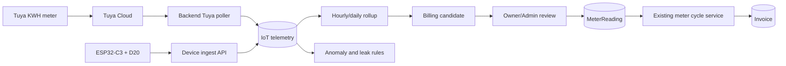

# IoT — Spesifikasi, Inventaris Perangkat, dan Arsitektur

Tanggal: 2026-09-23
Status: aktif (pengembangan ditunda — IOT-LATER)
Tujuan: spesifikasi IoT KOST48 — inventaris perangkat Tuya, arsitektur integrasi, kontrak ingest device, aturan alert, batas telemetry/billing, dan rencana implementasi yang ditunda
Rujukan: [operasional.md](operasional.md) · [keuangan.md](keuangan.md) · [harga.md](harga.md) · [M15 (pointer)](../M15_IOT.md) · [KEPUTUSAN-OWNER](../KEPUTUSAN-OWNER.md)

> Migrasi dari docs/M15_IOT.md (B8 Tahap 3, 23 Sep 2026) pada DOC-GOV-20260922; Part A dan Part B dipindah apa adanya, ditambah § Bagian 6 IoT dari `domain/operasional.md` — teks tidak diubah.
> Rencana implementasi (Part B) berstatus **ditunda** sesuai IOT-LATER (keputusan owner 22 Sep, [KEPUTUSAN-OWNER](../KEPUTUSAN-OWNER.md)); pemindahan dokumen ini bukan izin implementasi.
> Riwayat bertanggal dipisah ke [history/changelog/2026-07.md](../history/changelog/2026-07.md); prosedur ke [operations/iot-tuya-setup.md](../operations/iot-tuya-setup.md) dan [operations/iot-water-meter-esp32.md](../operations/iot-water-meter-esp32.md); handoff ke [operations/iot-handoff.md](../operations/iot-handoff.md).

## Part A — Inventaris Perangkat Tuya


> **Sumber:** Tuya IoT Console — ekspor 2026-07-10  
> **Total perangkat:** 27 (17 Online, 10 Offline)  
> **Terkait:** memory `iot-water-kwh-spec` (ESP32 water flow) · `domain/operasional.md` · `M10_PETA_SCOPE.md`

> **Update implementasi 2026-07-23:** fondasi IoT sudah dibuat dan masuk paket deploy. Telemetry tetap monitoring-only; tidak pernah otomatis menerbitkan tagihan. Status perangkat fisik pada tabel di bawah tetap snapshot Tuya 2026-07-10 dan wajib diverifikasi lagi saat go-live.

---

#### A. Ringkasan

| Kategori | Jumlah | Online | Offline | Produk Tuya |
|---|---|---|---|---|
| **KWH Meter per kamar** | 14* | 11 | 3 | WIFI 智能计量开关 / 保护款 |
| **CCTV BARDI IP Camera** | 5 | 3 | 2 | BARDI IP Camera Static Outdoor |
| **AC / 空调** | 3 | 0 | 3 | 空调 |
| **Smart IR Remote** | 2 | 0 | 2 | 万能遥控器WIFI+BLE / 佼茂T1 |
| **Smart Plug** | 1 | 0 | 1 | Smart plug |
| **Human Presence Sensor** | 1 | 0 | 1 | 000HPS01_5.8G |
| **Smart Lock** | 1 | 1 | 0 | SmartLock |

> \* 13 kamar unik — "KWH Kamar D" (offline) adalah unit lama yang digantikan "KWH Kmr D" (online).

---

#### B. KWH Meter — Per Kamar

**Produk:** WIFI 智能计量开关 (Smart Metering Switch WiFi)  
**Integrasi:** Tuya Cloud API → backend polling cron tiap 10 menit (lihat `iot-water-kwh-spec`)  
**Fungsi:** pantau pembacaan kWh terbaru per kamar; billing listrik bulanan tetap memakai `MeterReading` terverifikasi

| # | Device Name | Device ID | Status | Activated | Kamar |
|---|---|---|---|---|---|
| 1 | KWH Kmr A | `ebb45dcb6878c96529vjfe` | ✅ Online | 2025-12-27 | A |
| 2 | KWH Kmr B | `eb978d316fb9be79a1ed9k` | ✅ Online | 2025-12-27 | B |
| 3 | KWH Kmr C | `ebd46b4d391f079e2b4akm` | ✅ Online | 2025-12-20 | C |
| 4 | KWH Kmr D | `ebcafb5450a35bdaeciyii` | ✅ Online | 2025-12-20 | D |
| 5 | KWH Kmr G | `ebe076481e1e344ce95dkb` | ✅ Online | 2025-12-09 | G |
| 6 | KWH Kmr H | `eb693507851acf697fnmhj` | ✅ Online | 2025-12-09 | H |
| 7 | KWH Kmr i | `ebf39e59e1bb788173rzal` | ✅ Online | 2025-12-09 | I |
| 8 | KWH Kmr J | `eb8bc29c48b31bc433achz` | ✅ Online | 2025-12-09 | J |
| 9 | KWH Kmr K | `eb62ad9276b9da9c93hf8c` | ✅ Online | 2025-12-09 | K |
| 10 | KWH Kamar L | `eb2b7769c20fab47c2v8um` | ✅ Online | 2025-12-09 | L |
| 11 | Kamar M | `eb54cf1ee1dba020d6kfuy` | ✅ Online | 2025-12-09 | M |
| 12 | KWH Kmr F1 | `ebd9f624a02848fc8c8ift` | ⚠️ Offline | 2025-11-28 | F1 |
| 13 | KWH Kmr F2 | `eb7087736aa53084b8uxmd` | ⚠️ Offline | 2026-06-20 | F2 |
| ~ | ~~KWH Kamar D~~ | `ebac057249dcb85a58l0qc` | ❌ Offline | 2025-06-30 | D (lama) |

##### Catatan KWH

- **11 kamar online** (A, B, C, D, G, H, I, J, K, L, M) — siap di-polling via Tuya API
- **F1 & F2 offline** — perlu dicek fisik (mungkin mati daya / rusak), kedua device di lantai F
- **KWH Kamar D** adalah unit lama (2025-06-30) — sudah diganti `KWH Kmr D` (2025-12-20), abaikan saat integrasi
- **Naming inconsistency:** `KWH Kmr K` vs `KWH Kamar L` vs `Kamar M` — bersihkan saat mapping ke database (gunakan Room.code: A/B/C/D/.../M)

---

#### C. CCTV — BARDI IP Camera

**Produk:** BARDI IP Camera Static Outdoor  
**Fungsi:** keamanan 24/7, bisa diintegrasikan ke dashboard owner nanti (live view / snapshot)

| # | Device Name | Device ID | Status | Activated | Posisi |
|---|---|---|---|---|---|
| 1 | CCTV depan Jalan | `eb54211162106e4c5fvkoc` | ✅ Online | 2026-01-13 | Depan jalan (pintu gerbang) |
| 2 | CCTV Depan Hadap Rumah | `eb277da893cc2ddc6eoytp` | ✅ Online | 2026-01-13 | Depan hadap rumah |
| 3 | CCTV Dpn Kamar E | `eb7aa5dc361c36ac6dgfvw` | ✅ Online | 2025-06-30 | Depan kamar E |
| 4 | Kamera Belakang Kmr Mandi | `eb2617383fbef1393d6b7s` | ✅ Online | 2025-12-04 | Belakang kamar mandi |
| 5 | CCTV Belakang Lorong | `eb53d03570c2fe2669aj8i` | ⚠️ Offline | 2025-06-30 | Belakang lorong |

##### Catatan CCTV

- 4 dari 5 kamera online — cakupan depan (jalan, rumah), samping (kamar E), belakang (kamar mandi)
- CCTV Belakang Lorong offline sejak 2025-06-30 — perlu dicek
- **Belum prioritas integrasi** — simpan sebagai referensi untuk fase lanjutan

---

#### D. Perangkat Lain

##### AC / 空调 (3 device — semua offline)

| Device Name | Device ID | Activated | Catatan |
|---|---|---|---|
| Air | `ebaaf37c4b32a834e869cx` | 2025-12-27 | Mungkin AC kamar, offline |
| Air Conditioning 4 | `eb9eda6e21d7229255gnx7` | 2025-12-27 | Mungkin AC kamar, offline |
| Daikin Rumah Sememi | `ebd3001bee98f90304omea` | 2025-12-20 | AC rumah owner, offline |

> Semua AC offline — tidak perlu diintegrasikan. AC kos dikelola manual / via Smart IR.

##### Smart IR Remote (2 device — semua offline)

| Device Name | Device ID | Activated |
|---|---|---|
| Smart IR (万能遥控器WIFI+BLE) | `eb9bbd2f2f913c35a5bswp` | 2025-12-27 |
| Smart IR (佼茂T1 万能遥控器) | `eb32ffe1015cab80dbsohb` | 2025-12-20 |

> Keduanya offline — rencana awal untuk kontrol AC via IR, tapi belum jalan.

##### Lain-lain

| Device Name | Device ID | Produk | Status | Activated |
|---|---|---|---|---|
| Smart plug | `ebea186c0c10b05b840lby` | Smart plug | Offline | 2025-12-07 |
| Human Presence Sensor | `ebbe9e52b394d97029yyja` | 000HPS01_5.8G | Offline | 2025-11-28 |
| Smart_Lock | `57514000d8bfc056e66a` | SmartLock | ✅ Online | 2022-02-26 |

> **Smart Lock** online sejak 2022 — potensi integrasi akses pintu otomatis (fase lanjutan).

---

#### E. Rencana Integrasi — Prioritas

##### Fase 1: KWH Meter (PRIORITAS UTAMA)
- **Target:** 11 KWH meter online (A–M, kecuali F1/F2)
- **Metode:** Tuya Cloud API → polling cron tiap 10 menit → simpan ke `IotTelemetry`; `MeterReading` tetap snapshot billing terpisah.
- **Backend:** `backend/src/modules/iot/` sudah ada: `TuyaClientService`, `IotPollingService`, `IotService`, controller OWNER/ADMIN, dan polling tenant terikat.
- **Endpoint ops:** `POST /api/iot/tuya/cron` dengan `X-Iot-Cron-Token`; endpoint manual `POST /api/iot/tuya/sync-all` untuk OWNER/ADMIN.
- **Mapping room:** Device ID → Room.code via table di atas

##### Fase 2: Water Flow (ESP32-C3 + D20)
- **Target:** 2-3 unit ESP32-C3 dengan sensor D20 per kamar
- **Metode:** ESP32 → signed HTTP POST `/api/iot/v1/readings` (HMAC per device, bukan JWT pengguna)
- **Backend:** modul yang sama (`backend/src/modules/iot/`), `WaterIngestController` + `WaterIngestService` + registry/rotasi secret perangkat
- **Tidak terkait Tuya** — water flow via ESP32 terpisah

##### Fase 3 (nanti): CCTV + Smart Lock
- CCTV: embed snapshot di dashboard owner (Tuya API screenshot)
- Smart Lock: remote unlock / access log (Tuya API)

##### Tidak diintegrasikan
- AC (semua offline) — tidak bisa di-polling
- Smart IR (offline) — tidak berfungsi
- Smart Plug, Human Presence Sensor (offline) — tidak berfungsi

---

#### F. Credentials & Konfigurasi

**Tuya IoT Cloud** — credential disimpan di `backend/.env` (gitignored):

| Env Var | Keterangan |
|---|---|
| `TUYA_ACCESS_KEY` | Access ID / Client ID dari Tuya IoT Console |
| `TUYA_SECRET_KEY` | Access Secret / Client Secret |
| `TUYA_API_BASE` | `https://openapi.tuyaus.com` (US West, default) |

> ✅ Credentials sudah di-set di `backend/.env`. Template ada di `backend/.env.production.example`.

**Implementasi backend tersedia:**
- Prisma: `IotDevice`, `IotIngestMessage`, `IotTelemetry` serta enum provider/quality.
- Tuya: `TuyaClientService` (HMAC-SHA256, token cache, normalisasi) dan `IotPollingService`.
- API: `IotController` untuk overview/device/sync/probe/backfill dan `WaterIngestController` untuk ESP32 signed ingest. Portal tenant mengambil pembaruan secara berkala.
- Cron Tuya memakai `POST /api/iot/tuya/cron` + `X-Iot-Cron-Token`; aktifkan hanya setelah credential dan mapping device diverifikasi.

---

#### G. Cross-Reference

| Topik | Dokumen |
|---|---|
| Spek implementasi IoT | memory `iot-water-kwh-spec` |
| Peta scope role | `M10_PETA_SCOPE.md` § IoT & Monitoring |
| Operasional | `domain/operasional.md` § IoT Monitoring |
| Auto-ops / cron | `domain/operasional.md` § P5 Auto-Ops (audit/audit-operasional-2026-07.md) |
| Default data seed | `M11_DEFAULT_DATA.md` |
| Keamanan JWT device | memory `iot-water-kwh-spec` (beda dari user JWT) |

---

*Dibuat 2026-07-10 dari data Tuya IoT Console.*

---

## Part B — Rencana Implementasi


> Status: **Fondasi backend/firmware sudah diimplementasikan; rollout perangkat, mapping, dan UAT produksi masih diperlukan.**
> Tanggal: 2026-07-16
> Dokumen terkait: `M14_IOT_TUYA_DEVICES.md`, `M04_KEUANGAN.md`, `M05_SIKLUS_HUNI.md`, `domain/operasional.md`
> Runbook Tuya: `M15A_TUYA_KWH_SETUP_RUNBOOK.md`
> Spesifikasi meter air: `M15B_ESP32_C3_WATER_METER_SPEC.md`

#### 1. Hasil yang ingin dicapai

KOST48 memiliki satu pipeline IoT yang aman untuk:

1. membaca total energi kWh dan status kesehatan smart meter Tuya per kamar;
2. menerima pulse dan volume air dari ESP32-C3 + flow sensor D20;
3. menampilkan konsumsi dan kondisi perangkat kepada owner/admin;
4. mendeteksi perangkat offline, konsumsi tidak wajar, dan dugaan kebocoran;
5. menyiapkan angka kandidat billing tanpa merusak alur `MeterReading` dan invoice yang sudah aktif.

Target awal bukan kontrol jarak jauh. Integrasi Tuya fase pertama bersifat **read-only** dan perangkat air hanya mengirim telemetri. Relay listrik atau katup air tidak boleh dimatikan otomatis oleh sistem pada fase ini.

#### 2. Ground state aplikasi saat ini

| Area | Kondisi saat ini | Implikasi |
|---|---|---|
| Billing meter | Model `MeterReading` sudah aktif untuk `ELECTRICITY` dan `WATER` | Jangan simpan polling 10-menit langsung ke tabel ini |
| Penerbitan invoice | `POST /api/meter-readings/cycle` menghitung selisih, kuota gratis, tarif, lalu menerbitkan invoice | Angka IoT harus melalui tahap kandidat dan konfirmasi dahulu |
| Tarif | `OperationalSetting` memiliki tarif, kuota gratis, dan toggle water metering | Water billing tetap OFF selama pilot |
| Tuya | Inventaris device ID tersedia di `M14_IOT_TUYA_DEVICES.md`; konfigurasi lokal saat ini memakai endpoint US | Region harus dibuktikan dengan live connectivity test, bukan ditebak dari negara |
| Backend IoT | `backend/src/modules/iot/` sudah ada | Registry device, telemetry generik, Tuya polling, signed water ingest, dan pembaruan tenant terikat; rollout env/mapping tetap perlu |
| ESP32 | Firmware dan protokol device tersedia | Gunakan `firmware/esp32-c3-water-meter/` + kontrak di `M15B` sebagai sumber kebenaran |

#### 3. Keputusan arsitektur

##### 3.1 Pisahkan telemetri dari billing

`MeterReading` adalah snapshot bisnis yang dapat memicu tagihan. Telemetri adalah data mesin yang datang sering, bisa duplikat, terlambat, atau salah. Keduanya tidak boleh dicampur.



Aturan mutlak:

- polling atau upload device **tidak boleh langsung menerbitkan invoice**;
- payload device tidak boleh menentukan `roomId`; mapping device-ke-kamar dilakukan backend;
- promosi kandidat ke `MeterReading` memakai service domain yang menjaga urutan dan audit trail;
- data dengan kualitas buruk tetap boleh disimpan sebagai telemetri, tetapi tidak layak menjadi kandidat billing.

##### 3.2 Satu model telemetri untuk dua sumber

Gunakan model generik agar Tuya dan ESP32 memiliki pipeline observability yang sama.

Model Prisma yang disarankan:

```prisma
enum IotProvider {
  TUYA
  KOST48_ESP32
}

enum IotDeviceType {
  ELECTRICITY_METER
  WATER_FLOW_METER
}

enum IotReadingQuality {
  GOOD
  SUSPECT
  REJECTED
}

model IotDevice {
  id                     Int       @id @default(autoincrement())
  deviceCode             String    @unique
  provider               IotProvider
  deviceType             IotDeviceType
  roomId                 Int?
  externalDeviceId       String?
  productId              String?
  enabled                Boolean   @default(true)
  lastSeenAt             DateTime?
  lastSuccessfulSyncAt   DateTime?
  firmwareVersion        String?
  configVersion          Int       @default(1)
  metadata               Json?
  credentialCiphertext   String?
  credentialVersion      Int       @default(1)
  createdAt              DateTime  @default(now())
  updatedAt              DateTime  @updatedAt

  room                   Room?     @relation(fields: [roomId], references: [id], onDelete: SetNull)
  ingestMessages         IotIngestMessage[]

  @@unique([provider, externalDeviceId])
  @@index([roomId, deviceType])
}

model IotIngestMessage {
  id                 BigInt       @id @default(autoincrement())
  deviceId           Int
  messageId          String
  observedAt         DateTime
  receivedAt         DateTime     @default(now())
  sequence           BigInt?
  rawPayload         Json?
  diagnostics        Json?

  device             IotDevice    @relation(fields: [deviceId], references: [id], onDelete: Restrict)
  telemetry          IotTelemetry[]

  @@unique([deviceId, messageId])
  @@index([deviceId, observedAt])
}

model IotTelemetry {
  id                 BigInt            @id @default(autoincrement())
  ingestMessageId    BigInt
  metric             String
  valueDecimal       Decimal?          @db.Decimal(18, 6)
  valueText          String?
  unit               String
  observedAt         DateTime
  quality            IotReadingQuality @default(GOOD)
  qualityReason      String?

  ingestMessage      IotIngestMessage   @relation(fields: [ingestMessageId], references: [id], onDelete: Restrict)

  @@unique([ingestMessageId, metric])
  @@index([metric, observedAt])
}
```

Model lanjutan setelah pilot:

- `IotDailyRollup`: min/max/avg/delta per metric per hari;
- `IotAlert`: lifecycle alert `OPEN`, `ACKNOWLEDGED`, `RESOLVED`;
- `IotBillingCandidate`: angka meter yang diusulkan untuk suatu stay dan siklus;
- `IotDeviceCommand`: hanya jika suatu hari kontrol relay/valve benar-benar disetujui.

`IotIngestMessage` menyimpan envelope/raw payload satu kali, sedangkan `IotTelemetry` menyimpan metric terindeks. Jangan membuat `KwhReading` dan `FlowReading` yang menduplikasi struktur sama. Perbedaan domain diwakili oleh `deviceType` dan `metric`. Raw payload Tuya harus disanitasi dari token, `local_key`, lokasi, dan field sensitif sebelum disimpan.

##### 3.3 Nama metric kanonik

| Metric | Unit tersimpan | Sumber | Catatan |
|---|---|---|---|
| `electricity.energy_total_kwh` | `kWh` | Tuya | Angka kumulatif utama kandidat billing |
| `electricity.power_w` | `W` | Tuya | Telemetri, bukan billing |
| `electricity.voltage_v` | `V` | Tuya | Diagnostik |
| `electricity.current_a` | `A` | Tuya | Diagnostik |
| `water.pulse_total` | `pulse` | ESP32 | Kumulatif, tidak boleh reset diam-diam |
| `water.volume_total_l` | `L` | ESP32 | Kumulatif hasil kalibrasi |
| `water.flow_rate_lpm` | `L/min` | ESP32 | Deteksi kebocoran/aliran kontinu |
| `device.rssi_dbm` | `dBm` | keduanya bila tersedia | Kesehatan koneksi |

Nilai finansial tetap memakai `Decimal`, bukan floating point JavaScript.

#### 4. Jalur integrasi Tuya KWH

##### 4.1 Pola akses

1. Backend meminta access token Tuya dan menyimpannya di memory cache sampai mendekati expiry.
2. Poller membaca detail/status hanya untuk device aktif yang sudah dimapping.
3. Adapter per `productId` memetakan Tuya Data Point (DP) ke metric kanonik.
4. Nilai mentah, skala, unit, dan nilai normalisasi disimpan agar hasil dapat diaudit.
5. Gagal pada satu device tidak membatalkan polling device lain.

Endpoint dasar yang perlu diuji:

- `GET /v1.0/token?grant_type=1`
- `GET /v1.0/devices/{device_id}`
- `GET /v1.0/devices/{device_id}/status`

Kode DP seperti `add_ele`, `cur_power`, `cur_voltage`, atau `cur_current` hanya **kandidat umum**. Mapping final harus berasal dari respons aktual dan metadata product masing-masing; jangan hard-code sebelum discovery.

##### 4.2 Region Tuya

Konfigurasi lokal saat dokumen dibuat:

```dotenv
TUYA_API_BASE=https://openapi.tuyaus.com
```

Indonesia dipetakan ke Singapore Data Center untuk app account baru sejak 3 Juni 2025, tetapi account lama dapat tetap berada di data center sebelumnya. Karena itu:

- jangan otomatis mengganti endpoint lokal ke Singapore;
- uji endpoint yang tercatat di cloud project;
- keberhasilan `GET device detail` terhadap minimal satu device adalah bukti region benar;
- `1106 permission deny` harus diperiksa sebagai kemungkinan salah link account, service authorization, device ID, atau endpoint.

Endpoint Singapore saat diperlukan adalah `https://openapi-sg.iotbing.com`.

##### 4.3 Jadwal polling

Rekomendasi awal:

- status energi: setiap 10 menit;
- backoff saat Tuya error/rate limit: 1, 2, 5, 10, maksimal 30 menit dengan jitter;
- status offline: tidak dianggap `0 kWh`; simpan state offline dan pertahankan angka terakhir;
- alert offline: setelah 30 menit untuk meter listrik yang seharusnya selalu menyala;
- polling manual owner/admin tersedia, tetapi diberi cooldown 60 detik;
- setelah stabil, pertimbangkan Tuya Message Service untuk event cepat, sementara polling tetap sebagai rekonsiliasi.

##### 4.4 Proteksi billing

Kandidat kWh layak review hanya jika:

- device terhubung ke kamar yang benar;
- metric berasal dari DP yang tervalidasi;
- angka kumulatif tidak turun dari pembacaan sebelumnya;
- data tidak lebih tua dari batas yang disetujui, rekomendasi 30 menit;
- lonjakan masih dalam batas masuk akal atau telah dikonfirmasi;
- stay kamar aktif dan baseline meter sudah dipromosikan.

#### 5. Jalur integrasi meter air ESP32-C3

##### 5.1 Pola akses

ESP32 mengirim agregat via HTTPS ke backend KOST48. Perangkat tidak perlu masuk ekosistem Tuya.

```text
Sensor D20 -> pulse input -> ESP32 counter -> local cumulative state
           -> HTTPS signed payload -> IoT ingest -> telemetry -> alert/rollup
```

Default pengiriman:

- hitung pulse secara kontinu dengan GPIO edge interrupt yang sangat ringan; ESP32-C3 tidak memiliki peripheral PCNT;
- RMT RX dapat dievaluasi untuk pengukuran bentuk/durasi pulse, tetapi bukan diasumsikan sebagai pengganti drop-in PCNT;
- bila frekuensi pulse aktual terlalu tinggi untuk dihitung andal bersamaan dengan Wi-Fi, gunakan external hardware counter atau ganti ke varian ESP32 yang memiliki PCNT;
- hitung flow rate dalam window 1 detik;
- kirim agregat setiap 60 detik saat ada aliran;
- kirim event segera ketika aliran berhenti;
- heartbeat setiap 5 menit saat tidak ada aliran;
- simpan queue lokal ketika Wi-Fi/API tidak tersedia;
- retry dengan exponential backoff dan `messageId` yang sama agar idempoten.

##### 5.2 Device authentication

Jangan gunakan JWT user OWNER/ADMIN/TENANT di ESP32. Gunakan identitas device terpisah:

```text
X-Device-Id: water-A-01
X-Timestamp: 1784192400
X-Nonce: 2d3d...
X-Signature: hex(HMAC-SHA256(deviceSecret, canonicalRequest))
```

Canonical request versi 1:

```text
POST
/api/iot/v1/readings
<timestamp>
<nonce>
<lowercase sha256 hex of exact raw body>
```

Backend wajib:

- mengambil device berdasarkan `X-Device-Id`;
- mendekripsi secret memakai `IOT_MASTER_KEY`;
- memakai constant-time comparison;
- menolak skew waktu lebih dari 300 detik;
- menolak nonce yang pernah dipakai dalam jendela replay;
- rate-limit per device, bukan hanya per IP;
- tidak pernah menulis secret atau signature penuh ke log.

Provisioning secret dilakukan sekali melalui kabel/serial atau halaman admin lokal yang hanya aktif saat commissioning. Secret tidak dikirim kembali oleh API aplikasi.

#### 6. Kontrak ingest device

Endpoint yang disarankan:

```http
POST /api/iot/v1/readings
Content-Type: application/json
```

Contoh payload:

```json
{
  "schemaVersion": 1,
  "messageId": "water-A-01:8f1c4b:1042",
  "bootId": "8f1c4b",
  "sequence": 1042,
  "observedAt": "2026-07-16T10:30:00+07:00",
  "firmwareVersion": "0.1.0",
  "readings": [
    { "metric": "water.pulse_total", "value": "128994", "unit": "pulse" },
    { "metric": "water.volume_total_l", "value": "2579.880", "unit": "L" },
    { "metric": "water.flow_rate_lpm", "value": "4.210", "unit": "L/min" }
  ],
  "diagnostics": {
    "rssiDbm": -62,
    "uptimeSec": 86420,
    "queueDepth": 0,
    "resetReason": "power_on"
  }
}
```

Contoh respons:

```json
{
  "accepted": true,
  "duplicate": false,
  "serverTime": "2026-07-16T10:30:01+07:00",
  "configVersion": 3,
  "nextUploadSeconds": 60
}
```

Aturan validasi:

- maksimal body 16 KB;
- maksimal 20 readings per request;
- `messageId` wajib unik per device, tetapi request duplikat mengembalikan sukses idempoten;
- `value` dikirim sebagai string desimal;
- nilai kumulatif yang turun diberi `SUSPECT`, kecuali reset meter telah disetujui;
- `observedAt` adalah waktu perangkat, `receivedAt` selalu waktu server;
- `roomId`, tenant, tarif, dan nominal tagihan tidak diterima dari device.

#### 7. Aturan alert awal

Semua rule fase pertama membuat notifikasi/tiket; tidak melakukan pemutusan otomatis.

| Rule | Default awal | Aksi |
|---|---|---|
| Device offline | Tidak ada heartbeat/poll sukses 30 menit | Alert owner/admin |
| Continuous water flow | Flow > 0.3 L/min selama 30 menit | Dugaan keran terbuka/kebocoran |
| Night flow | Flow > 0.3 L/min selama 15 menit pada 23:00-05:00 | Alert dengan prioritas lebih tinggi |
| Empty-room flow | Flow > 0.1 L/min saat tidak ada stay aktif | Alert kritis operasional |
| Counter rollback | Total kumulatif turun | Tandai data `SUSPECT`; blok kandidat billing |
| KWH spike | Delta interval > batas teknis kamar atau > 2x baseline adaptif | Alert, jangan koreksi otomatis |
| Sensor stuck | Flow selalu nol tetapi pola hunian menunjukkan penggunaan, atau pulse tidak berubah 24 jam | Inspeksi perangkat |

Threshold harus owner-settable setelah data pilot tersedia. Nilai di atas adalah default observability, bukan bukti final kebocoran atau kecurangan.

#### 8. Billing dan aspek operasional

##### 8.1 Fase shadow billing

Selama minimal satu siklus penuh:

- `waterMeteringEnabled` tetap `false`;
- angka IoT dibandingkan dengan pembacaan manual;
- selisih dan alasan koreksi dicatat;
- invoice tetap memakai flow manual yang sekarang;
- UI menampilkan label **Estimasi IoT**, bukan angka final tagihan.

Promosi otomatis baru boleh dipertimbangkan jika:

- mapping kamar 100% benar;
- tidak ada counter rollback yang tidak terjelaskan;
- error meter air memenuhi target pilot pada beberapa laju aliran;
- loss data harian di bawah target;
- owner menyetujui SOP koreksi dan sengketa;
- persyaratan tera/metrologi untuk penggunaan komersial sudah dikonfirmasi dengan pihak berwenang/kompeten.

Sensor DIY ESP32 + D20 sebaiknya dianggap alat monitoring sampai kelayakan untuk billing dipastikan. Permendag 24 Tahun 2024 yang berstatus berlaku mengatur UTTP untuk konteks usaha/penentuan pungutan dan mencantumkan meter air dalam daftar tera/tera ulang. Konsultasikan apakah rancangan dan penggunaan aktual KOST48 memenuhi ketentuan tersebut kepada Unit Metrologi Legal setempat; dokumen teknis ini bukan opini hukum.

##### 8.2 Retensi data

Default yang disarankan:

- raw telemetry 10-menit/60-detik: 90 hari;
- hourly rollup: 2 tahun;
- daily rollup dan billing candidate: selama histori stay/invoice dibutuhkan;
- payload yang memuat diagnostik: tanpa data pribadi tenant;
- delete job berjalan bertahap dan teraudit.

#### 9. Tahapan implementasi dan exit gate

##### Fase 0 - Survey dan keputusan owner

- [ ] Pastikan topologi pipa: satu jalur air benar-benar hanya melayani satu kamar.
- [ ] Catat model lengkap, datasheet, tegangan, tipe output, dan pulse constant sensor D20.
- [ ] Tentukan board ESP32-C3 yang dipakai dan GPIO aman.
- [ ] Konfirmasi cloud project Tuya, data center, dan masa aktif service plan.
- [ ] Putuskan mode awal: **monitoring + shadow billing** (rekomendasi).

Exit gate: tidak ada perangkat yang ambigu kamar atau spesifikasinya.

##### Fase 1 - Tuya connectivity spike

- [ ] Implementasi client sign/token cache tanpa database mutation.
- [ ] Buktikan endpoint region dengan satu device online.
- [ ] Discovery DP untuk setiap `productId` meter.
- [ ] Ambil status 11 meter online dan simpan fixture tersanitasi untuk test.
- [ ] Dokumentasikan F1/F2 offline tanpa menganggap nilai nol.

Exit gate: total kWh terbaca konsisten dari minimal 3 kamar dan mapping skala tervalidasi.

##### Fase 2 - Fondasi backend IoT

- [ ] Migration additive `IotDevice` + `IotTelemetry`.
- [ ] Modul `backend/src/modules/iot/`.
- [ ] Adapter Tuya, poller, idempotency, quality flags, dan audit log.
- [ ] Endpoint read-only owner/admin untuk status dan histori.
- [x] Timer internal default OFF melalui `IOT_TUYA_POLL_ENABLED=false`; modul monitoring tetap tersedia. Tidak ada global `IOT_ENABLED`.

Exit gate: test unit, integration, dan migration lulus; modul dapat dimatikan tanpa mengganggu meter manual.

##### Fase 3 - Pilot polling KWH

- [ ] Mapping seluruh device aktif ke `Room.code`.
- [ ] Poll setiap 10 menit selama 7 hari.
- [ ] Dashboard kesehatan device dan last seen.
- [ ] Bandingkan dengan aplikasi Tuya dan pembacaan manual.

Exit gate: tidak ada salah kamar, counter rollback palsu, atau skala unit salah.

##### Fase 4 - Prototype ESP32 bench

- [ ] Wiring aman 3.3 V dan enclosure belum dipasang ke jalur kamar.
- [ ] GPIO pulse counting, NVS state, Wi-Fi reconnect, HTTPS verify, dan signed payload.
- [ ] Kalibrasi volume pada sedikitnya tiga laju aliran.
- [ ] Uji mati listrik, reboot, Wi-Fi putus, API down, dan retry duplikat.

Exit gate: cumulative total pulih setelah reboot dan request duplikat tidak menggandakan data.

##### Fase 5 - Pilot satu kamar

- [ ] Instalasi oleh teknisi/plumber dengan valve isolasi dan akses servis.
- [ ] Jalankan monitoring 7-14 hari tanpa billing.
- [ ] Bandingkan volume dengan wadah ukur/meter referensi.
- [ ] Tuning alert; ukur false positive.

Exit gate: instalasi tidak bocor, koneksi stabil, error terukur, dan SOP servis tersedia.

##### Fase 6 - Shadow billing satu siklus

- [ ] Buat kandidat meter tetapi owner/admin tetap input/konfirmasi.
- [ ] Jalankan rekonsiliasi 30 hari.
- [ ] Dokumentasikan koreksi, downtime, dan reset.
- [ ] Review metrologi dan komunikasi tenant.

Exit gate: owner menandatangani keputusan apakah data boleh menjadi basis tagihan.

##### Fase 7 - Rollout bertahap

- [ ] Maksimal 3-5 kamar per batch.
- [ ] Pantau 7 hari sebelum batch berikutnya.
- [ ] Rotate secret per device setelah commissioning.
- [ ] Update inventaris dan diagram jalur pipa.

#### 10. Struktur kode yang direncanakan

```text
backend/src/modules/iot/
  iot.module.ts
  controllers/
    iot-device-ingest.controller.ts
    iot-admin.controller.ts
  guards/
    device-signature.guard.ts
  services/
    iot-device.service.ts
    telemetry-ingest.service.ts
    telemetry-quality.service.ts
    billing-candidate.service.ts
  tuya/
    tuya-client.service.ts
    tuya-signature.service.ts
    tuya-token-cache.service.ts
    tuya-dp-adapter.service.ts
  dto/
    ingest-readings.dto.ts
    iot-query.dto.ts

backend/src/modules/auto-ops/sweeps/
  iot-polling-sweep.service.ts
  iot-alert-sweep.service.ts

frontend/src/api/
  iot.ts

frontend/src/pages/iot/
  IotOverviewPage.tsx
  IotDeviceDetailPage.tsx
```

Polling dapat dijalankan melalui scheduler yang sudah ada, tetapi harus memakai advisory lock berbeda dan jangan membuat kegagalan Tuya menggagalkan sweep uang/booking. Lebih aman menjalankan IoT sweep terisolasi dari `runAll()` utama.

#### 11. Test minimum

Backend:

- signature Tuya memakai known fixture;
- token cache refresh sebelum expiry;
- endpoint/region dapat dikonfigurasi;
- DP scale dan unit normalization;
- satu device gagal tidak membatalkan batch;
- duplicate `messageId` idempoten;
- replay nonce ditolak;
- out-of-order, rollback, future timestamp, dan stale data diberi quality yang benar;
- tenant tidak dapat mengakses device kamar lain;
- telemetri tidak pernah membuat invoice tanpa review service.

Firmware:

- pulse count pada tiga flow rate;
- reboot/power loss tanpa kehilangan cumulative total di atas toleransi;
- Wi-Fi reconnect;
- TLS certificate verification aktif;
- API down dan queue replay;
- secret tidak tercetak ke serial log produksi;
- watchdog pulih dari network hang.

End-to-end:

- Tuya status -> normalized metric -> chart;
- ESP payload -> idempotent telemetry -> alert;
- kandidat -> owner approval -> existing `MeterReading` -> invoice test environment;
- hentikan cron IoT, pastikan `IOT_TUYA_POLL_ENABLED=false`, lalu disable perangkat melalui registry bila integrasi perlu dihentikan; flow meter manual tetap normal.

#### 12. Definition of done

Integrasi dianggap siap produksi hanya jika:

- [ ] setiap device memiliki kode fisik, room mapping, foto pemasangan, dan tanggal commissioning;
- [ ] secret tidak ada di git, frontend bundle, URL query, atau log;
- [ ] health dashboard menunjukkan last seen dan error yang dapat ditindaklanjuti;
- [ ] raw telemetry dan billing snapshot terpisah;
- [ ] retry idempoten dan counter kumulatif tahan reboot;
- [ ] SOP offline, reset, ganti sensor, pindah kamar, dan koreksi tersedia;
- [ ] shadow billing satu siklus selesai;
- [ ] owner menyetujui kebijakan billing dan aspek metrologi;
- [x] rollback terdokumentasi tanpa flag fiktif: stop cron + timer internal OFF + disable device bila perlu; bundle LKG wajib sudah bebas SSE dan flow manual tetap aktif.

#### 13. Keputusan yang masih diperlukan dari owner

| Keputusan | Rekomendasi awal |
|---|---|
| Tujuan meter air | Monitoring + deteksi bocor dahulu |
| Billing air | OFF sampai shadow billing dan review metrologi selesai |
| Jumlah pilot | 1 kamar yang jalur pipanya paling mudah diisolasi |
| Interval upload ESP32 | 60 detik saat mengalir; heartbeat 5 menit |
| Konfirmasi meter | Owner/admin review dahulu |
| Kontrol relay/valve | Tidak termasuk fase awal |
| Retensi raw data | 90 hari |
| Framework firmware | ESP-IDF stabil direkomendasikan; Arduino dapat dipakai untuk prototype cepat |

#### 14. Referensi resmi

Tuya:

- [Cloud project dan linking device](https://developer.tuya.com/en/docs/iot/Platform_Configuration_smarthome?id=Kamcgamwoevrx)
- [Request structure dan endpoint data center](https://developer.tuya.com/en/docs/iot/api-request?id=Ka4a8uuo1j4t4)
- [Cloud request signing HMAC-SHA256](https://developer.tuya.com/en/docs/iot/new-singnature?id=Kbw0q34cs2e5g)
- [Device management API](https://developer.tuya.com/en/docs/cloud/device-management?id=K9g6rfntdz78a)
- [Mapping app account dan data center](https://developer.tuya.com/en/docs/iot/oem-app-data-center-distributed?id=Kafi0ku9l07qb)
- [Tuya Message Service](https://developer.tuya.com/en/docs/iot/manage-messages?id=Ka49p7loog3ze)

Espressif:

- [ESP32-C3 getting started](https://docs.espressif.com/projects/esp-idf/en/latest/esp32c3/get-started/index.html)
- [ESP32-C3 API reference](https://docs.espressif.com/projects/esp-idf/en/stable/esp32c3/api-reference/index.html)
- [ESP32-C3 RMT receiver](https://docs.espressif.com/projects/esp-idf/en/release-v5.4/esp32c3/api-reference/peripherals/rmt.html)
- [Espressif FAQ: ESP32-C3 tidak mendukung PCNT](https://docs.espressif.com/projects/esp-faq/en/latest/software-framework/peripherals/pcnt.html)
- [ESP HTTP client dan TLS](https://docs.espressif.com/projects/esp-idf/en/stable/esp32c3/api-reference/protocols/esp_http_client.html)
- [Arduino ESP32 Wi-Fi API](https://docs.espressif.com/projects/arduino-esp32/en/latest/api/wifi.html)
- [Arduino ESP32 Preferences/NVS](https://docs.espressif.com/projects/arduino-esp32/en/latest/api/preferences.html)

Metrologi:

- [Permendag 24 Tahun 2024 - Kegiatan Tera dan Tera Ulang Metrologi Legal](https://jdih.kemendag.go.id/peraturan/peraturan-menteri-perdagangan-nomor-24-tahun-2024-tentang-kegiatan-tera-dan-tera-ulang-alat-ukur-alat-timbang-dan-alat-perlengkapan-metrologi-legal-1)

---

## Bagian 6 — IoT Monitoring (KWH Tuya + Water Flow ESP32)

> **Fondasi implementasi selesai (2026-07-23); rollout hardware dan UAT masih gate.** Spek lengkap: `M15_IOT_KWH_WATER_IMPLEMENTATION_PLAN.md` + `M14_IOT_TUYA_DEVICES.md`. Telemetry tidak pernah otomatis membuat tagihan.

**Update quota energi:** aturan kanonik quota listrik ada di [keuangan.md](keuangan.md) § Quota Utilitas Berbasis Periode Sewa Lunas — **tidak diulang di sini** (dedup D-01, keputusan owner 23 Sep 2026). Catat meter/renewal tetap jalur bisnis yang menerbitkan invoice, bukan polling Tuya.

### Hardware Terpasang

| Jenis | Jumlah | Status | Integrasi |
|---|---|---|---|
| **KWH Meter Tuya per kamar** | 13 (snapshot: 11 online) | Tuya Cloud API | Polling cron 10 menit → `IotTelemetry` (bukan `MeterReading` billing) |
| **CCTV BARDI IP Camera** | 5 (4 online) | Tuya Cloud | Fase lanjutan (snapshot dashboard) |
| **Smart Lock** | 1 (online) | Tuya Cloud | Fase lanjutan (remote unlock) |
| **Water Flow D20 + ESP32-C3** | 2-3 unit (rollout hardware) | Signed HTTP POST | `/api/iot/v1/readings` (HMAC per device) |

### Arsitektur Backend (aktif)

```
ESP32-C3+D20 → signed POST /api/iot/v1/readings → IotIngestMessage + IotTelemetry
Tuya KWH Meter → Tuya Cloud API → IotPollingService (interval/cron 10 menit) → IotTelemetry
Tenant/owner → overview dan history dengan pembaruan berkala; billing tetap memakai MeterReading terpisah
```

- **1 backend** (tidak bikin backend baru — hemat RAM shared hosting)
- **Tanpa MQTT**; Tuya dipoll melalui REST dan portal tenant memakai polling terikat agar worker shared hosting tidak tertahan koneksi panjang.
- **Kredensial ESP32** disimpan terenkripsi per device dan request ditandatangani HMAC; bukan JWT pengguna.
- Endpoint cron Tuya: `POST /api/iot/tuya/cron` dengan header `X-Iot-Cron-Token`.

### Model Prisma (aktif)

- `IotDevice` — registry ESP32/Tuya, mapping kamar, credential terenkripsi
- `IotIngestMessage` — envelope idempoten/replay-safe per event atau poll
- `IotTelemetry` — metrik dinormalisasi dari water flow maupun Tuya, lengkap kualitas data
- `MeterReading` — tetap satu-satunya snapshot yang dipakai billing

### Polling dan tindak lanjut

| Sweeper | Trigger | Aksi |
|---|---|---|
| **IotPollingService** | Interval always-on atau cron tiap 10 menit | Polling perangkat Tuya aktif → simpan telemetry |
| **Anomali/kebocoran** | Belum diaktifkan sebagai auto-action | Tetap kandidat observability; perlu threshold, UAT sensor, dan keputusan operasional sebelum alert otomatis |

### Referensi

| Topik | Dokumen |
|---|---|
| Inventaris device + Device ID | `docs/M15_IOT.md` |
| Spek implementasi | memory `iot-water-kwh-spec` |
| Peta scope | `docs/product/scope.md` § A6. SYSTEM / IoT |
| Proposal meter pascabayar | `docs/M06_OPERASIONAL.md` § Bagian 5 (M-1..M-5 ✅) |
